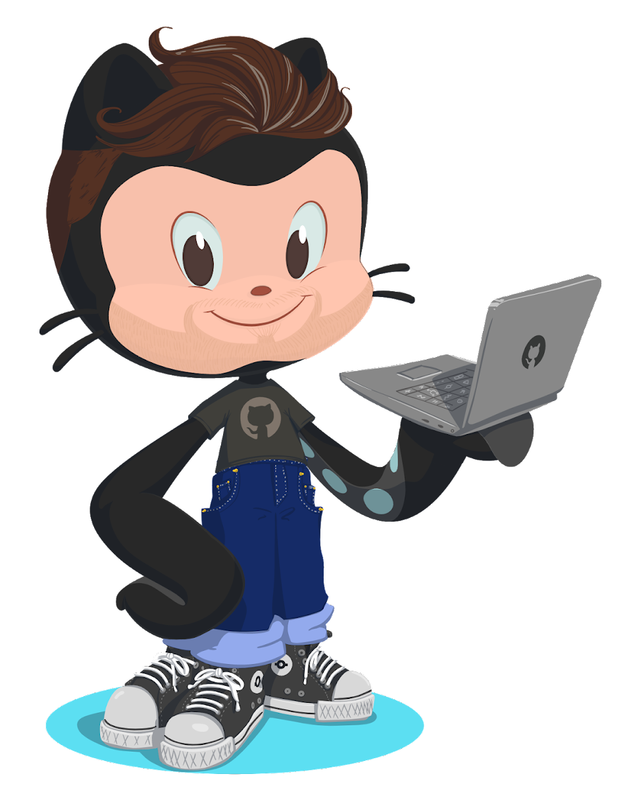

<p align="center">
  <a href="https://joseluisgs.github.io/" target="_blank">
    
  </a>
</p>

<p align="center"> 
  
  
  
  
</p>

#  👋 Hola, soy José Luis González 💻 

Soy [**Dr. en Informática especializado en desarrollo de software y sistemas interactivos**](https://joseluisgs.github.io/docs/info/investigacion/tesis.html) 👨‍🎓 y [**Profesor de Secundaria**](https://www.iesluisvives.es/) en Formación Profesional de grado superior de [DAM](https://www.todofp.es/que-como-y-donde-estudiar/que-estudiar/familia/loe/informatica-comunicaciones/des-aplicaciones-multiplataforma.html)/[DAW](https://www.todofp.es/que-como-y-donde-estudiar/que-estudiar/familia/loe/informatica-comunicaciones/des-aplicaciones-web.html)/[ASIR](https://www.todofp.es/que-como-y-donde-estudiar/que-estudiar/familia/loe/informatica-comunicaciones/admin-sist-informaticos-red.html) 💻. Además, soy [**Kotlin Trainer Certified by JetBrain**](https://www.jetbrains.com/es-es/company/partners/kotlin/), [**GitHub Campus Advisor**](https://education.github.com/teachers/advisors) y [**GitKraken Ambassador**](https://www.gitkraken.com/invite/wdJ7HntT) 👨‍💻.

Estoy interesado en aplicaciones multiplataforma, web y móviles desde el servidor ⚙️ hasta el cliente 📱. Imparto docencia en distintos programas de máster, doctorado y cursos de especialización/formación ya sea de diseño, desarrollo y evaluación de productos software. Me encanta el ecosistema de Kotlin y Vue.js 💓.

A parte de enseñar y desarrollar, disfruto con la música, especialmente todo tipo de música rock :musical_note: , me encanta el tenis 🎾, tocar la guitarra 🎸, jugar a videojuegos 🎮, leer 📚 , ver series/películas/anime 📺 y compartir buenos momentos (¿una caña y una buena charla?🍺). Me encanta seguir aprendiendo y seguir avanzando.

Este es mi **repositorio personal**, úsalo como quieras siempre que respetes su [licencia CC](https://joseluisgs.dev/docs/license/). En ellos subo proyectos que aplico a temas personales/profesionales o de clase 🛠. Generalmente están sobrecomentados y a veces no realizados de la manea más óptima, porque son para fines didácticos (usados en clase o en mis tutoriales). El objetivo es que sepas entenderlos con solo leerlos sin ejecutarlos ... o eso intento. Si te gusta algo de aquí déjame una estrella, sígueme y sobre todo dame ideas para mejorar 💪.

También puedes acceder a mi <a href="https://joseluisgs.dev/" target="_blank">🚀 página web</a> donde poco a poco podrás conocerme un poco más 🔍.

Me siento orgulloso de ser [**Kotlin Trainer Certified by JetBrain**](https://www.jetbrains.com/es-es/company/partners/kotlin/), [**GitHub Campus Advisor**](https://education.github.com/teachers/advisors) y [**GitKraken Ambassador**](https://www.gitkraken.com/invite/wdJ7HntT). Actualmente soy uno de los responsables de contenidos en [**Hyperskill**](https://hyperskill.org/)/[**Jetbrains Academy**](https://www.jetbrains.com/academy/) para tecnologías relacionadas con Kotlin. Te puedo ayudar  a aplicar super poderes para desarrollar nuestro código o cómo aplicarlas a la docencia. Será un placer echarte un cable con ello. ¡Cuenta conmigo! 💪

<p align="center">
  <a href="https://www.jetbrains.com/es-es/company/partners/kotlin/" target="_blank"> 
    
  </a> &nbsp;
 <a href="https://education.github.com/teachers/advisors" target="_blank"> 
    
  </a> &nbsp;
  <a href="https://gitkraken.link/joseluisgs" target="_blank"> 
    
  </a>
</p>

> “Programa siempre tu código como si el tipo que va a tener que mantenerlo en el futuro fuera un violento psicópata que sabe dónde vives”. Martin Goldin


<h2 align="center">📫 Contacto</h2>
<p align="center">
  Cualquier cosa que necesites házmelo saber por si puedo ayudarte 💬.
</p>
<p align="center">
    <a href="https://joseluisgs.dev/" target="_blank">
        
    </a>&nbsp;
    <a href="https://github.com/joseluisgs" target="_blank">
        
    </a>&nbsp;
    <a href="https://x.com/JoseLuisGS_" target="_blank">
        
    </a>&nbsp;
    <a href="https://www.linkedin.com/in/joseluisgonsan" target="_blank">
        
    </a>&nbsp;
    <a href="https://www.instagram.com/joseluisgs.dev/" target="_blank">
        
    </a>&nbsp;
     <a href="https://g.dev/joseluisgs" target="_blank">
        &nbsp;
    </a>
    <a href="https://www.youtube.com/@joseluisgs" target="_blank">
        
    </a>  
</p>

<h2 align="center">⚡ Tecnologías favoritas</h2>
<p align="center">
Estas son solo algunas de las tecnologías 💻 que más suelo usar/trabajar o colaboran conmigo a nivel personal/profesional y a las cuales les agradezco su confianza y apoyo.
<br>👉 Ni son todas las que están, ni están todas las que son 🤔
</p>

<p align="center">
  
  
  
  
  
  
  
  
  
  
  
  
  
</p>

<p align="center">
 
  
  
  
  
  
   
   
  
  
  
  
  
</p>

<p align="center">
 
 
   
  
  
  
  
  
  
  
  
  
  
</p>


<h2 align="center">📕 Mi web: últimas entradas </h2>

<!-- BLOG-POST-LIST:START -->
 - ✏️ [**Regreso a .NET en DAW. 20 razones para el cambio**](https://joseluisgs.dev/blogs/2025/2025-12-31-csharpnet_docencia_daw.html) *31 Dec 2025* 

 - ✏️ [**Desarrollo Web en Entornos Servidor 02 - Servicios Web con JVM y Spring Boot**](https://joseluisgs.dev/blogs/2025/2025-10-24-dwes_ud_02_servicios_jvm_springboot.html) *24 Oct 2025* 

 - ✏️ [**Entornos de Desarrollo 03 - Sistema de Control de Versiones con Git y GitHub**](https://joseluisgs.dev/blogs/2025/2025-10-20-ed_ud_03_sistemas_control_versiones.html) *20 Oct 2025* 

 - ✏️ [**Despliegue de Aplicaciones Web 03 - Arquitectura Web y Fundamentos**](https://joseluisgs.dev/blogs/2025/2025-10-20-daw_ud_03_arquitectura_web_despliegue.html) *20 Oct 2025* 

 - ✏️ [**Programación 03 - Aplicación de Estructuras de Almacenamiento Estáticas**](https://joseluisgs.dev/blogs/2025/2025-10-20-prog_ud_03_estrecturas_estaticas.html) *20 Oct 2025* 
<!-- BLOG-POST-LIST:END -->

➡️ [Leer más...](https://joseluisgs.github.io/categories/Blog/)


<h2 align="center">📈 Mi Actividad</h2>

<p align="center">
  <a href="https://github-readme-stats.vercel.app/api?username=joseluisgs&show_icons=true&theme=github_dark&show_icons=true&rank_icon=github"></a>
<a href="https://github-readme-activity-graph.vercel.app/graph?username=joseluisgs&theme=react-dark"></a>
</p>

<p align="center">
</img>
 </img>
 </p>

<!--START_SECTION:waka-->

```txt
From: 26 January 2026 - To: 25 February 2026

Total Time: 60 hrs 32 mins

C#               30 hrs 7 mins         🟩🟩🟩🟩🟩🟩🟩🟩🟩🟩🟩🟩🟨⬜⬜⬜⬜⬜⬜⬜⬜⬜⬜⬜⬜   49.49 %
Markdown         27 hrs 39 mins        🟩🟩🟩🟩🟩🟩🟩🟩🟩🟩🟩🟨⬜⬜⬜⬜⬜⬜⬜⬜⬜⬜⬜⬜⬜   45.44 %
Text             34 mins               ⬜⬜⬜⬜⬜⬜⬜⬜⬜⬜⬜⬜⬜⬜⬜⬜⬜⬜⬜⬜⬜⬜⬜⬜⬜   00.93 %
Kotlin           27 mins               ⬜⬜⬜⬜⬜⬜⬜⬜⬜⬜⬜⬜⬜⬜⬜⬜⬜⬜⬜⬜⬜⬜⬜⬜⬜   00.74 %
Razor            25 mins               ⬜⬜⬜⬜⬜⬜⬜⬜⬜⬜⬜⬜⬜⬜⬜⬜⬜⬜⬜⬜⬜⬜⬜⬜⬜   00.71 %
```

<!--END_SECTION:waka-->

<p align="center">
<a href="https://wakatime.com/@32eb50dd-eea7-4883-8349-298accb92677"></a>
<a href="https://wakatime.com/@32eb50dd-eea7-4883-8349-298accb92677"></a>
</p>

<p align="center">

<!--SNAKE-->
   
</p>

  <!--START_SECTION:activity-->
1. ❌ Closed PR [#31](https://github.com/joseluisgs/TiendaDawWeb-SpringBoot/pull/31) in [joseluisgs/TiendaDawWeb-SpringBoot](https://github.com/joseluisgs/TiendaDawWeb-SpringBoot)
  <!--END_SECTION:activity-->


<p align="center">
 <a href="https://github.com/ryo-ma/github-profile-trophy"></a>
</p>


<!--


-->
<!--
Recursos
https://github.com/anuraghazra/github-readme-stats/blob/master/themes/README.md
https://rahuldkjain.github.io/gh-profile-readme-generator/
**joseluisgs/joseluisgs** is a ✨ _special_ ✨ repository because its `README.md` (this file) appears on your GitHub profile.

Here are some ideas to get you started: a tener en cuenta

- 🔭 I’m currently working on ...
- 🌱 I’m currently learning ...
- 👯 I’m looking to collaborate on ...
- 🤔 I’m looking for help with ...
- 💬 Ask me about ...
- 📫 How to reach me: ...
- 😄 Pronouns: ...
- ⚡ Fun fact: ...
-->
