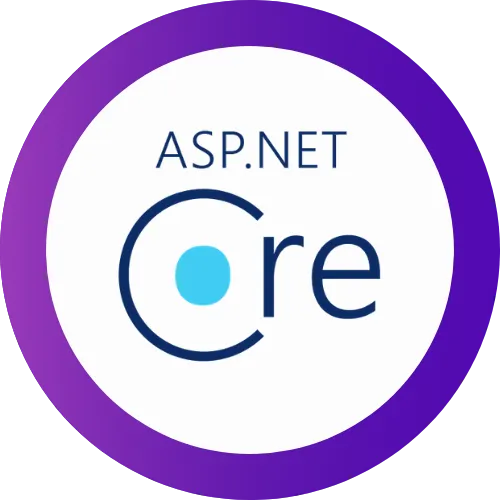

  

 
  
  
  

# 👋 Hola, soy José Luis González 💻 

Soy [**Dr. en Informática especializado en desarrollo de software y sistemas interactivos**](https://joseluisgs.github.io/docs/info/investigacion/tesis.html) 👨‍🎓 y [**Profesor de Formación Profesional**](https://www.iesluisvives.es/) especializado en **Desarrollo de Software** 💻. Además, soy [**Kotlin Trainer Certified by JetBrain**](https://www.jetbrains.com/es-es/company/partners/kotlin/) y [**GitHub Campus Advisor**](https://education.github.com/teachers/advisors) 👨‍💻.

Mi foco principal es el desarrollo de **aplicaciones web y multiplataforma**, desde el servidor ⚙️ hasta el cliente 📱. Imparto docencia en máster, doctorado y cursos de especialización en diseño, desarrollo y evaluación de productos software. Me apasiona el ecosistema de **Kotlin**, **.NET** y **Vue.js** 💓.

A parte de enseñar y desarrollar, disfruto con la música, especialmente todo tipo de música rock :musical_note: , me encanta el tenis 🎾, tocar la guitarra 🎸, jugar a videojuegos 🎮, leer 📚 , ver series/películas/anime 📺 y compartir buenos momentos (¿una caña y una buena charla?🍺). Me encanta seguir aprendiendo y seguir avanzando.

### 🛠️ Proyectos como Apuntes y Recursos Didácticos 
Bienvenido a mi repositorio personal. Estos proyectos nacen principalmente de mi labor docente: **apuntes de clase** extensamente comentados y legibles, pensados para que puedas entender la arquitectura y la lógica sin ejecutar el código. **No intenta ser código de producción**. Ya seas un **alumno** o **docente**, **si te ayuda, ¡una ⭐️ es la mejor forma de apoyarlo!**

### 🎓 Colaboración con JetBrains & GitHub
Como **Kotlin Trainer Certified by JetBrains** y **GitHub Campus Advisor**, me apasiona ayudar a otros a potenciar su carrera como desarrolladores o a innovar en la docencia. Actualmente soy responsable de contenidos en **JetBrains Academy/Hyperskill** para el ecosistema Kotlin. Si necesitas un cable para aplicar "superpoderes" a tu código o quieres integrar estas herramientas y metodologías modernas en tus clases, **¡cuenta conmigo! 💪**

🚀 **También puedes conocerme un poco más en mi página web:** [**joseluisgs.dev**](https://joseluisgs.dev/)

> “Programa siempre tu código como si el tipo que va a tener que mantenerlo en el futuro fuera un violento psicópata que sabe dónde vives”. Martin Goldin

<h2 align="center">📫 Contacto</h2>

  Cualquier cosa que necesites házmelo saber por si puedo ayudarte 💬.

    &nbsp;
    &nbsp;
    &nbsp;
    &nbsp;
    &nbsp;
    

<h2 align="center">🦾 Mi Stack Tecnológico</h2>

  Actualmente lo que más uso en mi día a día 🚀

<table>
  <tr>
    <td align="center"><b>🚀 Desarrollo Backend</b> 
      
      
      
      
    </td>
    <td align="center"><b>🌐 Desarrollo Frontend</b> 
      
      
      
      
    </td>
  </tr>
  <tr>
    <td align="center"><b>🗄️ Infraestructura</b> 
      
      
      
      
    </td>
    <td align="center"><b>🛠️ Productividad</b> 
      
      
      
      
    </td>
  </tr>
</table>

<h2 align="center">📕 Mi web: últimas entradas </h2>

<!-- BLOG-POST-LIST:START -->
 - ✏️ [**Regreso a .NET en DAW. 20 razones para el cambio**](https://joseluisgs.dev/blogs/2025/2025-12-31-csharpnet_docencia_daw.html) *31 Dec 2025* 

 - ✏️ [**Desarrollo Web en Entornos Servidor 02 - Servicios Web con JVM y Spring Boot**](https://joseluisgs.dev/blogs/2025/2025-10-24-dwes_ud_02_servicios_jvm_springboot.html) *24 Oct 2025* 

 - ✏️ [**Entornos de Desarrollo 03 - Sistema de Control de Versiones con Git y GitHub**](https://joseluisgs.dev/blogs/2025/2025-10-20-ed_ud_03_sistemas_control_versiones.html) *20 Oct 2025* 

 - ✏️ [**Despliegue de Aplicaciones Web 03 - Arquitectura Web y Fundamentos**](https://joseluisgs.dev/blogs/2025/2025-10-20-daw_ud_03_arquitectura_web_despliegue.html) *20 Oct 2025* 

 - ✏️ [**Programación 03 - Aplicación de Estructuras de Almacenamiento Estáticas**](https://joseluisgs.dev/blogs/2025/2025-10-20-prog_ud_03_estrecturas_estaticas.html) *20 Oct 2025* 
<!-- BLOG-POST-LIST:END -->

➡️ [Leer más...](https://joseluisgs.github.io/categories/Blog/)

<h2 align="center">📈 Mi Actividad</h2>

<table>
  <tr>
    <td align="center"></td>
    <td align="center"></td>
  </tr>
</table>

<!-- PAC-MAN (Comecocos) con soporte Modo Oscuro -->

  <picture>
    <source media="(prefers-color-scheme: dark)" srcset="https://raw.githubusercontent.com/joseluisgs/joseluisgs/output/pacman-contribution-graph-dark.svg">
    <source media="(prefers-color-scheme: light)" srcset="https://raw.githubusercontent.com/joseluisgs/joseluisgs/output/pacman-contribution-graph.svg">
    
  </picture>

<!-- SNAKE (Serpiente - Comentado)

   

-->

