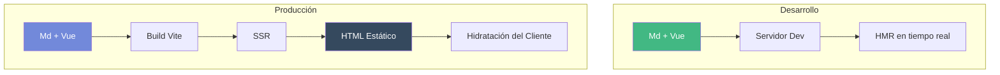
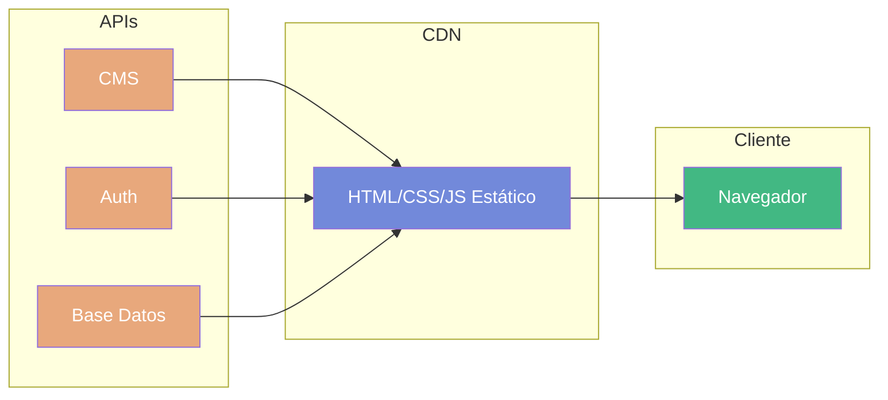
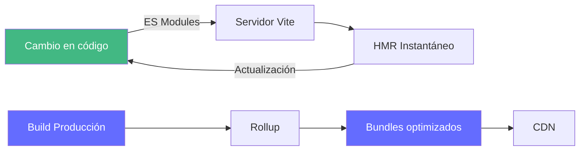
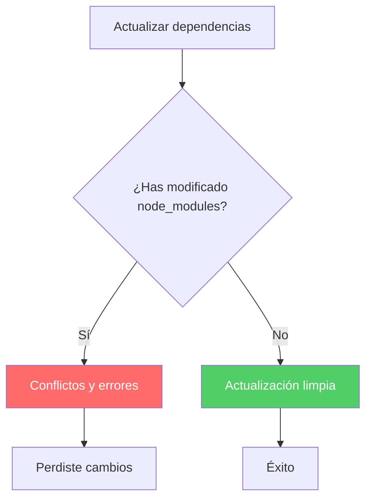
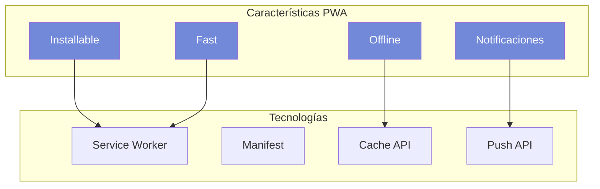
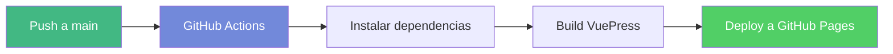

A lo largo de los años, mi sitio web ha sido un espacio de aprendizaje, experimentación y compartición de conocimientos. Sin embargo, con el paso del tiempo, la tecnología que sustentaba mi web se volvió obsoleta, lo que me llevó a tomar la decisión de realizar una migración completa a una nueva versión. Esta nueva versión no solo representa una actualización tecnológica, sino también una renovación visual y funcional que busca ofrecer una mejor experiencia a los visitantes y a mis alumnos de Formación Profesional les servirá como un recurso educativo de cómo construir una web moderna usando distintas tecnologías de desarrollo y despliegue.

<!-- more -->

## De dónde partíamos: VuePress 1 y el tema Reco

Durante mucho tiempo, mi blog ha funcionado con **VuePress 1** combinado con el tema **Reco**. Esta configuración, aunque funcional en su momento, fue quedándose obsoleta con el paso del tiempo.

### Los problemas de la obsolescencia

Con el tiempo, surgieron varias dificultades:

1. **Compatibilidad con Node.js**: El tema Reco requería versiones antiguas de Node.js que ya no recibían soporte.
2. **Falta de mantenimiento**: El tema Reco dejó de recibir actualizaciones activas, lo que complicaba la incorporación de nuevas funcionalidades.
3. **Rendimiento**: Webpack, aunque potente, resultaba lento en los procesos de desarrollo.
4. **Dependencias**: Cada actualización de paquetes planteaba riesgos de romper la configuración existente.
5. **Limitaciones de personalización**: Modificar el tema Reco requería tocar `node_modules`, lo que era insostenible a largo plazo.

## El gran salto tecnológico: VuePress 2 con Vite y Hope Theme

La solución pasaba por migrar a tecnologías modernas que ofrecieran mayor flexibilidad y rendimiento. Así, decidí adoptar **VuePress 2** junto con el tema **vuepress-theme-hope**, y utilizar **Vite** como herramienta de construcción. La idea es no salir del ecosistema Vue, pero aprovechar las mejoras que estas nuevas herramientas ofrecen y que además se integran perfectamente con la arquitectura **Jamstack** y el renderizado del lado del servidor (SSR) que VuePress 2 implementa de forma nativa. Vue.js es una tecnología que domino y que me permite crear componentes personalizados para enriquecer la experiencia de los usuarios.

### ¿Qué es VuePress y cómo funciona?

VuePress es un generador de sitios web estáticos que combina **Markdown** con **Vue.js**. Cada página que escribes en Markdown se convierte en una aplicación Vue completa, lo que permite:

- Utilizar componentes Vue dentro del contenido Markdown.
- Personalizar cualquier aspecto del sitio con Vue.
- Generar sitios web estáticos de alto rendimiento.
- Implementar funcionalidades avanzadas como SSR, PWA y SEO de forma nativa.

### ¿Qué es el renderizado del lado del servidor (SSR)?

El **SSR (Server-Side Rendering)** es una técnica que permite renderizar las páginas en el servidor antes de enviarlas al navegador del usuario. VuePress utiliza esta arquitectura híbrida:




**Beneficios del SSR:**

- **SEO mejorado**: Los motores de búsqueda pueden indexar el contenido directamente.
- **Carga más rápida**: El usuario recibe HTML listo para mostrar.
- **Mejor experiencia**: La página es visible antes de que Vue tome el control.
- **Accesibilidad**: Mejor soporte para lectores de pantalla.

### ¿Qué es Jamstack?

**Jamstack** es una arquitectura moderna para crear sitios web rápidos y seguros. El nombre proviene de:

- **J**avaScript: Lógica del cliente
- **A**PI: Funcionalidad del servidor
- **M**arkup: Contenido estático



**Ventajas de Jamstack:**

- **Seguridad**: No hay servidor que atacar.
- **Escalabilidad**: Servir archivos estáticos es muy económica.
- **Rendimiento**: CDN distribuida globalmente.
- **Experiencia de desarrollador**: Flujo de trabajo moderno con Git.
- **Flexibilidad**: Cualquier backend o API puede ser integrado.

VuePress es perfectamente compatible con esta arquitectura, generando archivos estáticos que pueden desplegarse en cualquier CDN.

### Ventajas de Jamstack en detalle

Implementar una arquitectura Jamstack (JavaScript, API & Markup) utilizando un ecosistema basado en Vue, VuePress y Markdown ofrece beneficios significativos en términos de rendimiento, seguridad y experiencia de desarrollo. Aquí tienes las ventajas clave de esta combinación:

#### 1. Velocidad de Carga Extrema (Performance)

Al usar VuePress, el sitio se pre-renderiza como HTML estático durante el tiempo de compilación. Sin base de datos: No hay consultas a una base de datos en tiempo real cuando un usuario visita la página. Hidratación de Vue: Una vez que el HTML carga, Vue "hidrata" la página, convirtiéndola en una Single Page Application (SPA) reactiva. Esto permite transiciones instantáneas entre rutas sin recargar el navegador.

#### 2. Flujo de Trabajo Basado en Contenido (Markdown)

Markdown es el corazón de esta configuración, lo que facilita enormemente la gestión de contenido:

- **Simplicidad**: Escribes en archivos .md, lo que elimina la necesidad de un CMS complejo para blogs o documentación.
- **Componentes Vue en Markdown**: VuePress permite insertar componentes de Vue directamente dentro de tus archivos Markdown. Puedes tener un texto explicativo y, justo debajo, un widget interactivo o un gráfico dinámico.

#### 3. SEO Superior

A diferencia de las SPAs tradicionales que renderizan todo en el cliente (lo que puede dificultar el rastreo de algunos buscadores), Jamstack con VuePress entrega contenido estático ya renderizado. Los motores de búsqueda indexan el contenido de inmediato. La estructura de metadatos (Frontmatter) se gestiona fácilmente en la parte superior de cada archivo Markdown:

```markdown
---
title: Ventajas de Jamstack
lang: es-ES
meta:
  - name: description
    content: Guía sobre Jamstack con VuePress
---
```

#### 4. Seguridad y Escalabilidad

Al no tener un servidor de aplicaciones ni una base de datos expuesta:

- **Seguridad**: Se reduce drásticamente la superficie de ataque (no hay inyecciones SQL ni vulnerabilidades de servidor comunes).
- **Escalabilidad**: El sitio puede servirse a través de una CDN (Content Delivery Network). Esto significa que el sitio se replica en servidores de todo el mundo, reduciendo la latencia y soportando picos de tráfico masivos sin coste adicional de infraestructura.

#### Comparativa: Jamstack vs. Tradicional

| Característica | Jamstack (VuePress/MD) | Tradicional (WordPress/PHP) |
|--------------|----------------------|---------------------------|
| Alojamiento | CDN (Netlify, Vercel, S3) | Servidor dedicado / Hosting compartido |
| Velocidad | Instantánea (Pre-renderizado) | Depende del servidor y caché |
| Mantenimiento | Casi nulo (Serverless) | Actualizaciones de plugins/servidor |
| Control de versiones | Git (Todo es código) | Base de datos externa |

#### 5. Experiencia del Desarrollador (DX)

El desarrollo es mucho más ágil:

- **Hot Reload**: Los cambios en Markdown o Vue se ven reflejados al instante en el navegador.
- **Despliegue Atómico**: Cada vez que haces un push a Git, el sitio se construye de nuevo. Si algo falla, el sitio anterior sigue online, evitando caídas durante la actualización.

### ¿Por qué Vite?

**Vite** es la herramienta de construcción de nueva generación que ha revolucionado el desarrollo frontend. Ha sido diseñada para ser rápida, eficiente y fácil de usar, superando las limitaciones de herramientas anteriores como Webpack. Vite utiliza ES Modules nativos en el navegador durante el desarrollo, lo que permite un arranque instantáneo y una experiencia de desarrollo fluida. Además, ha sido desarrollada por el mismo creador de Vue.js, lo que garantiza una integración perfecta con VuePress y Vue.js.



**Ventajas principales:**

| Característica | Webpack (antes) | Vite (ahora) |
|----------------|-----------------|--------------|
| Inicio del servidor | 30-60 segundos | Menos de 1 segundo |
| HMR (Hot Module Replacement) | Lento | Instantáneo |
| Build de producción | Minutos | Segundos |
| Configuración | Compleja y verbosa | Mínima e intuitiva |
| Experiencia de desarrollo | Frustrante | Disfrutable |

### ¿Por qué Hope Theme?

El tema **vuepress-theme-hope** representa la opción más completa para VuePress 2 que más se adapta a mis necesidades. Ofrece una gran cantidad de funcionalidades listas para usar, una personalización total sin necesidad de tocar `node_modules`, y un diseño moderno y atractivo que se alinea con la identidad visual que quería para mi sitio.

- **Configuración zero**: Funciona prácticamente sin configuración.
- **Personalización total**: Permite modificar aspectos sin tocar `node_modules`.
- **Funcionalidades integradas**: Blog, documentación, presentaciones y barras laterales.
- **Plugins incluidos**: Búsqueda, SEO, PWA, RSS y comentarios.
- **Accesibilidad**: Soporte completo para lectores de pantalla.
- **Multidioma**: Sistema i18n integrado.

### La importancia de no tocar node_modules

Uno de los principios fundamentales de esta migración ha sido **no modificar nunca `node_modules`**. ¿Por qué es tan importante?




**Problemas de modificar node_modules:**

1. **Pérdida de cambios**: Las actualizaciones sobrescriben todo.
2. **Incompatibilidades**: Cambios pueden romper dependencias.
3. **Dificultad de mantenimiento**: Nadie sabe qué se cambió.
4. **Seguridad**: Dependencias desactualizadas son vulnerables.

**Solución:** VuePress 2 y Hope Theme permiten personalizar todo mediante:

- Archivos de configuración (`.ts`).
- Componentes personalizados en `components/`.
- Estilos en `styles/`.
- Slots y temas hijos.

## Mejoras implementadas

### Diseño Deep Navy Discord basado en mis raquetas Yonex

Se ha establecido una identidad visual distintiva con una paleta de colores inspirada en Kotlin y .NET, tecnologías con las que me siento más identificado ahora. Me vino inspirada por los colores de mis raquetas Yonex. El modelo 2022 de esta raqueta tiene un diseño en tonos oscuro, deep navy que ha marcado el fondo. El modelo 2025 de Yonex ha aportado los distintos azules vibrantes que se han utilizado como acentos en la nueva web tanto en el modo claro, como en el modo oscuro, muy parecidos al Blurple. Es un color que me gusta mucho. Si me gusta en la pista y fuera de la pista se queda en la web.


Esta paleta se basa en tonos oscuros y acentos vibrantes, creando un contraste atractivo y moderno:

```scss
--vp-c-bg: #010c18;        // Fondo principal (Azul noche profundo)
--vp-c-bg-soft: #011221;    // Fondo de tarjetas
--vp-c-accent: #7289da;    // Color de acento (Blurple de Discord)
--vp-c-border: #142d44;    // Bordes
```

Esta paleta se complementa con tipografía **Ubuntu** de Google Fonts.

### Scrollbar personalizado

El scrollbar del navegador también ha sido personalizado, siguiendo la misma estética:

- Tamaño: 10px
- Color del pulgar: `#7289da` (acento Discord/Yonex)

### Sistema de cookies conforme al RGPD

Se ha implementado un sistema completo de consentimiento de cookies. La idea es que el alumnado, al ser un público joven y digitalmente activo, entienda la importancia de la privacidad y el consentimiento informado. Además, es una buena práctica que se alinea con las normativas actuales.

- Consentimiento previo a la carga de cookies analíticas.
- Opción de rechazar cookies no esenciales.
- Posibilidad de revocar el consentimiento desde el pie de página.
- Google Analytics solo se carga si el usuario acepta las cookies.
- Persistencia de la elección del usuario en localStorage.

### Componentes personalizados

Se han creado componentes utilizando la **API de composición de Vue 3**:

- **CookiesBanner.vue**: Banner funcional con persistencia en localStorage.
- **ReposPinned.vue**: Utiliza la API de Deno para mostrar repositorios de GitHub.
- **LoadingPage.vue**:Pantalla de carga personalizada con diseño Deep Navy Discord.

### ¿Por qué crear componentes propios?

La posibilidad de crear componentes Vue personalizados ofrece ventajas enormes:

1. **Reutilización**: Un componente se usa en múltiples páginas sin duplicar código.
2. **Mantenimiento**: Si cambias algo, se actualiza en todos los sitios donde se usa.
3. **Personalización total**: Puedes modificar cualquier aspecto sin depender de terceros.
4. **Integración con Markdown**: Puedes usar componentes dentro de tus archivos .md directamente.

Los componentes se encuentran en `src/.vuepress/components/` y se pueden usar directamente en el contenido Markdown.

## Sistema de búsqueda con Algolia

### ¿Qué es Algolia?

**Algolia** es un motor de búsqueda como servicio que permite implementar búsquedas rápidas y relevantes en aplicaciones web. A diferencia de usar un simple filtro en el contenido, Algolia ofrece:

- Búsqueda en tiempo real (los resultados aparecen mientras escribes)
- Tolerancia a errores tipográficos (encuentra "jose" aunque escribas "jozse")
- Búsqueda facetada y filtros
- Relevancia configurable
- Analytics de búsquedas

### ¿Por qué Algolia y no otro sistema?

Para esta web evalué varias opciones:

| Opción | Ventajas | Inconvenientes |
|--------|----------|----------------|
| **Algolia DocSearch** | Gratis para documentación/blog, fácil integración | Límite de registros |
| Elasticsearch | Potente, autoalojado | Complejo, costoso |
| Fuse.js | Gratis, local | Lento con mucho contenido |
| Simple JSON | Gratis | Sin relevancia, sin características |
| SlimSearch | Gratis, fácil | Sin relevancia, sin características |

**DocSearch de Algolia** es la opción ideal porque:
1. **Es gratis** para sitios de documentación y blogs personales
2. **Indexación automática** mediante un crawler configurable
3. **Sin mantenimiento** - Algolia lo gestiona todo
4. **Integración con VuePress** mediante plugin oficial

### ¿Qué ofrece esta web con Algolia?

1. **Búsqueda global**: Accesible desde cualquier página
2. **Resultados relevantes**: Ordenados por título, secciones y contenido
3. **Navegación rápida**: Al hacer clic en un resultado, se muestra la sección exacta
4. **Accesibilidad**: Funciona con teclado y lectores de pantalla
5. **Multiidioma**: Configurado para español e inglés

### Configuración del crawler

El crawler de Algolia usa selectores CSS para extraer el contenido:

- **Títulos de página**: `.vp-page-title h1`
- **Secciones**: `#markdown-content h2`, `#markdown-content h3`
- **Contenido**: `#markdown-content p`, `#markdown-content li`

Los atributos buscables se priorizan en este orden:
1. Jerarquía de nivel 0 (categoría)
2. Jerarquía de nivel 1 (título de página)
3. Jerarquía de nivel 2-3 (secciones)
4. Contenido

### Beneficios para el visitante

- Encontrar información rápidamente sin navegar por menús
- Búsqueda accesible desde cualquier dispositivo
- Resultados relevantes que muestran el contexto

## Aplicación Web Progresiva (PWA)

### ¿Qué es una PWA?

Una **Aplicación Web Progresiva (PWA)** es una aplicación web que utiliza tecnologías modernas para ofrecer una experiencia similar a una aplicación nativa. Con ello se busca que los usuarios puedan acceder a la web de forma rápida, incluso sin conexión, y con funcionalidades avanzadas como notificaciones push.



### ¿Qué ofrece esta web como PWA?

1. **Instalable**: Los usuarios pueden installar la web en su dispositivo (móvil o escritorio) como una aplicación más.
2. **Funcionamiento sin conexión**: Gracias al service worker, el contenido previamente visitado está disponible sin internet.
3. **Inicio rápido**: El service worker cachea los recursos para carga instantánea.
4. **Actualizaciones automáticas**: Cada vez que hay nuevos contenidos, se actualiza automáticamente.

### Beneficios para el alumnado

- Acceso offline a los materiales de clase.
- Experiencia de aplicación nativa en el móvil.
- No requiere usar navegador tradicionales.

## Despliegue con GitHub Actions

### ¿Qué es GitHub Actions?

GitHub Actions es un sistema de automatización que permite crear flujos de trabajo directamente en GitHub. Lo que buscamos es integrar un proceso de **CI/CD (Integración Continua y Despliegue Continuo)** para que cada vez que se haga un push a la rama principal, el sitio se construya y despliegue automáticamente en GitHub Pages.




### ¿Qué obtenemos con este sistema?

1. **Despliegue automático**: Cada vez que se hace push a la rama principal, el sitio se construye y despliega automáticamente.
2. **Integración continua**: Se verifica que el build funciona antes de desplegar.
3. **Historial de despliegues**: Registro completo de cada despliegue.
4. **SSL gratuito**: GitHub Pages ofrece certificados SSL automáticamente.
5. **Dominio personalizado**: Se puede usar un dominio propio (joseluisgs.dev).

### Ventajas para mantener la web actualizada

- **Sin intervención manual**: No hay que ejecutar comandos localmente.
- **Revisión de cambios**: Cada despliegue deja un registro en GitHub.
- **Rollback fácil**: Se puede revertir a versiones anteriores si hay problemas.

## Valor didáctico para el alumnado

Esta web no es solo un blog personal; es una **herramienta educativa** para mis alumnos de Formación Profesional en los módulos de Desarrollo Web en Entornos Servidor y Despliegue de Aplicaciones Web. La idea es que puedan ver en acción las tecnologías que se enseñan en clase, y que además puedan usar el código como referencia para sus propios proyectos.

### Recursos para el alumnado

En la página principal se muestran proyectos educativos organizados por módulos que actualmente imparto, con enlaces a los repositorios de GitHub donde pueden encontrar el código completo, los apuntes y ejemplos relacionados con cada módulo:

| Módulo | Descripción | Enlace |
|--------|-------------|--------|
| **Programación** | Apuntes y ejemplos de 1º DAW | GitHub |
| **Entornos de Desarrollo** | Apuntes y ejemplos de 1º DAW | GitHub |
| **Desarrollo Web en Entornos Servidor** | Apuntes y ejemplos de 2º DAW | GitHub |
| **Despliegue de Aplicaciones Web** | Apuntes y ejemplos de 2º DAW | GitHub |
| **Tienda Daw Api** | Ejemplo de Servicios y APIs | GitHub |
| **Tienda Daw Web** | Ejemplo de Marketplace ASP.NET | GitHub |

### ¿Qué aporta al alumnado?

1. **Material de apoyo**: Apuntes y ejemplos actualizados para cada módulo.
2. **Código real**: Proyectos completos que pueden usar como referencia.
3. **Buenas prácticas**: El propio sitio web es un ejemplo de arquitectura moderna.
4. **Transparencia**: Todo el código está disponible en GitHub para aprender del proceso.

### La web como ejemplo de aprendizaje

Esta web también sirve para enseñar conceptos como:

- **Generadores de sitios estáticos**: Cómo funcionan y por qué son útiles.
- **Vue.js**: Componentes, composición API, reactivity.
- **SSR y Jamstack**: Arquitecturas modernas de desarrollo web.
- **CI/CD**: Despliegue automático con GitHub Actions.
- **PWA**: Service workers y manifest.
- **Markdown**: Documentación técnica.

## Comparativa técnica

| Aspecto | VuePress 1 + Reco | VuePress 2 + Hope |
|---------|-------------------|-------------------|
| Node.js | v12-v14 (obsoleto) | v18+ (actual) |
| Herramienta de build | Webpack | Vite |
| Tiempo de build | 2-3 minutos | 15-20 segundos |
| Tema | Reco (sin mantenimiento) | Hope (activo) |
| node_modules | Difícil de mantener | Sin tocar |
| Personalización | Limitada | Total |
| SEO | Básico | Completo |
| PWA | No | Sí |
| RSS | No | Sí |
| SSR | Básico | Completo |
| Jamstack | Parcial | Total |

## Bienvenidos a la versión 2.0

Esta versión 2.0 representa una base sólida para incorporar nuevas funcionalidades:

- Expansión de contenidos para más módulos de Formación Profesional.
- Integración con más APIs de servicios educativos.
- Mejora continua de la experiencia de usuario.
- Comunidad de estudiantes contribuyendo al proyecto.

Este salto representa mucho más que actualizar dependencias. Es un compromiso con:

- **Calidad**: Código limpio y mantenible.
- **Innovación**: Utilizando las mejores herramientas disponibles.
- **Accesibilidad**: Una web para todos.
- **Educación**: Compartiendo conocimiento de forma abierta.
- **Futuro**: Preparado para lo que venga.

Gracias por acompañarme en este viaje. La web sigue evolucionando, y esto es solo el principio.

**¡Bienvenidos a la versión 2.0!**

---

*¿Tienes alguna pregunta sobre esta migración? ¿Quieres saber más sobre alguna tecnología mencionada? Deja tu comentario.*
