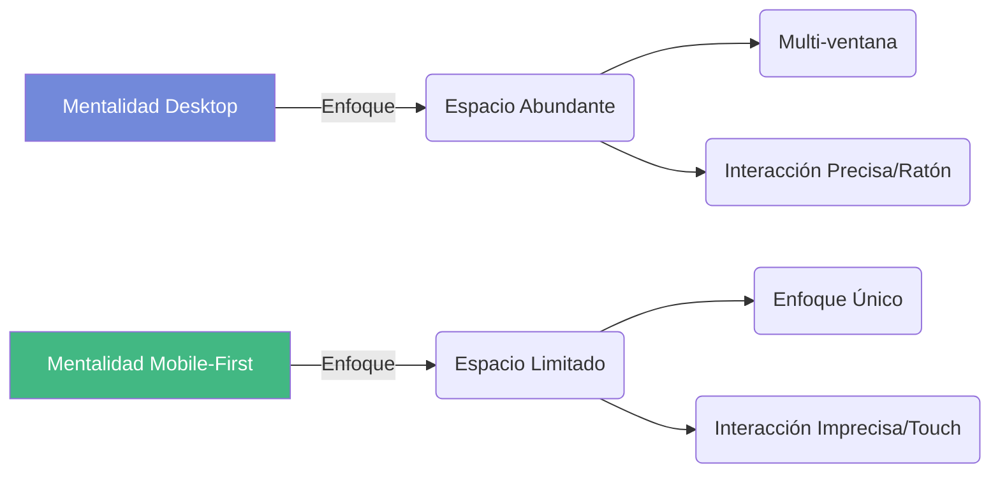
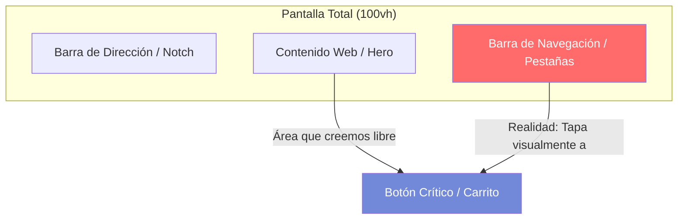
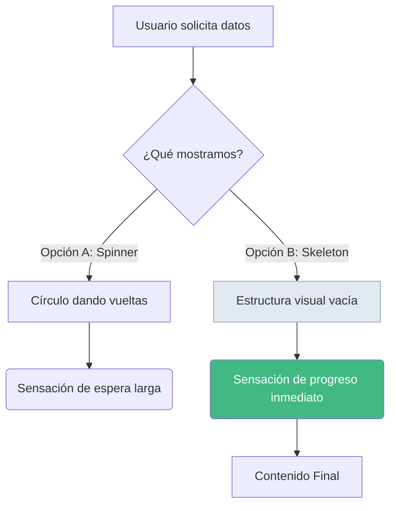

Quienes me seguís sabéis que mi hábitat natural no son los píxeles, sino los bits. Me siento mucho más cómodo diseñando microservicios en .NET, usando corrutinas en Kotlin o peleándome con una API reactiva que eligiendo el padding perfecto de un botón. Soy, por definición, un "tío de Backend". Pero como especialista en IPO, sé perfectamente que tu UX puede fracasar estrepitosamente por tu falta de atención al detalle, y en esta entrada te explicaré por qué el **Mobile-First** sigue siendo la gran asignatura pendiente de la industria, a pesar de que llevamos años hablando de ello.

<!-- more -->

En pleno 2026, la frontera entre el "detrás de las cámaras" y lo que el usuario toca con el pulgar se ha vuelto invisible. Para alguien que vive entre logs y excepciones, si mi backend falla, tengo un error 500 que me dice dónde está el cadáver; pero en la interfaz reina la entropía y sus consecuencias pueden ser devastadoras para la experiencia del usuario.

Imaginad a Marta. Está intentando comprar sus productos para el "Método Curly" y, al cambiar del portátil al móvil, la web se vuelve "tímida": la cesta de la compra ha desaparecido, el menú se solapa y las notificaciones han huido de la pantalla. Entonces Marta me mira y me suelta la pregunta de fuego: "Oye, tú que sabes de esto... ¿por qué pasa esto? ¿Por qué se ve así dependiendo del dispositivo?".

Y ahí se me queda cara de póquer 🫤 (y no porque no sepa la respuesta, que la sé, sino por lo que me pasa por la cabeza al ver ciertos desarrollos).

En el backend, si se perdiesen campos en un JSON según el dispositivo que me consulta, o si no se administraran bien los permisos y los datos se esfumaran, sería una negligencia criminal. Pero en el front, a veces parece que aceptamos como "normal" que las cosas decidan no estar donde deberían o no funcionen correctamente.

De nada sirve que mi servidor responda en 10ms si un usuario no puede realizar una acción porque un botón se ha escondido bajo la barra del navegador. Eso sí, no te preguntes luego por qué no vendes ni un producto o tus usuarios desconfían de tu tienda y se van a la competencia. 

La tecnología debe estar al servicio de la experiencia. Por eso, hoy os hablo de mi aventura maquetando esta web y por qué el Mobile-First sigue siendo la asignatura pendiente, incluso cuando creemos que lo tenemos todo bajo control. Como ya comenté en el post sobre la [nueva versión de mi web](/posts/2026/2026-04-20-nueva_version_web.html), el "mimo" técnico marca la diferencia.

## El mito del Mobile-First en 2026

Muchos alumnos (y no pocos profesionales) creen que el *Mobile-First* consiste simplemente en "hacer que la web se vea en el móvil". Error. Eso es simplemente hacerla *responsive*. El **Mobile-First** es una filosofía de diseño que prioriza el contexto, las limitaciones y las capacidades del dispositivo móvil antes de siquiera pensar en la versión de escritorio. 

En 2026, nos enfrentamos a una paradoja: tenemos más potencia de cálculo que nunca en el bolsillo, pero el espacio visual es un recurso cada vez más fragmentado y caótico.



### El problema de las "Interfaces Fantasma"

Uno de los mayores retos actuales es que los navegadores modernos (Safari en iOS o Chrome en Android) intentan maximizar el espacio de lectura ocultando y mostrando barras de herramientas dinámicamente. Esto crea un conflicto con la unidad clásica de CSS: el `100vh`.

Si defines que tu portada (Hero) mida `100vh`, el navegador calculará el 100% de la altura de la pantalla, pero no tendrá en cuenta que su propia barra de pestañas está pisando los últimos píxeles del área visible.



## La anatomía del desastre: Por qué fallan los diseños

Incluso con las mejores intenciones, existen puntos donde la UX suele romperse en dispositivos móviles y iPads:

### 1. El iPad: El Gran Olvidado
Muchos desarrolladores prueban en "Móvil" (muy alargado) y en "Escritorio". El iPad, con su proporción 4:3, se queda en tierra de nadie. Lo que funciona en un Pixel 7 falla en el iPad porque el contenido "sube" y pisa los elementos de navegación. Si no ajustas la altura restando el navbar, el desastre está asegurado.

### 2. Touch Targets: La ley del pulgar
En backend hablamos de IDs y punteros; en UX móvil hablamos de **Touch Targets**. Un botón debe tener, como mínimo, **44x44 píxeles** de área interactiva. Es una cuestión de física: el dedo es mucho menos preciso que un puntero láser de 1px.

### 3. El "Peaje" de los elementos fijos (Sticky)
Cada vez que dejamos algo fijo (navbar, avisos, botones flotantes), le estamos cobrando un "peaje" de píxeles al usuario. En una pantalla de escritorio sobra espacio, pero en móvil, tres elementos `sticky` pueden reducir el área de lectura a una pequeña rendija. **Menos es más.**

### 4. Visibilidad en exteriores (Contraste)
El móvil se usa en la calle, con sol directo. Aquí es donde el "mimo" por el contraste se vuelve crítico. Un texto gris claro sobre fondo blanco puede ser elegante en tu monitor de 27", pero es **invisible** en una parada de autobús a las 12 del mediodía.

## Ingeniería visual: Unidades dinámicas y Áreas Seguras

Como gente de backend, nos gusta la precisión. Por suerte, el estándar CSS ha evolucionado para darnos herramientas que solucionan este caos de los navegadores. Si estás maquetando hoy, debes conocer estas unidades:

| Unidad | Nombre completo | Comportamiento en 2026 |
|--------|-----------------|-------------------------|
| **`svh`** | Small Viewport Height | La altura mínima (con todas las barras desplegadas). Es la apuesta más segura. |
| **`lvh`** | Large Viewport Height | La altura máxima (cuando las barras se ocultan). Útil para fondos full-screen. |
| **`dvh`** | Dynamic Viewport Height | Se ajusta en tiempo real. Ideal para Heros y portadas interactivas. |

### Caso práctico 1: El botón del Hero en esta web

En esta misma web, tenía un botón para invitar al usuario a deslizar hacia abajo. La solución fue aplicar ingeniería y unidades relativas al área segura:

```css
.vp-blog-hero {
  /* Restamos la altura del navbar y usamos altura dinámica */
  height: calc(100dvh - var(--navbar-height)) !important;
  /* Añadimos aire para que el texto no pise al botón */
  padding-bottom: 5rem;
}

.vp-hero-slide-down-button {
  /* Respetamos el 'safe-area' de los dispositivos modernos */
  bottom: calc(5rem + env(safe-area-inset-bottom)) !important;
}
```

::: tip
No te limites a probar en vertical. El verdadero reto del `dvh` aparece al girar el dispositivo: en modo **landscape**, el espacio vertical se reduce drásticamente y es donde descubrirás si tu botón está pisando el texto o desapareciendo por completo.
:::

### Caso práctico 2: El Footer y el ruido visual

A menudo, el pie de página es el "cajón de sastre" donde tiramos todo lo que no sabemos dónde poner. En mi propia web, inicialmente tenía iconos para cada tecnología utilizada. Al analizarlos bajo el prisma de la UX, me di cuenta de dos cosas:

1. **Ruido Visual**: Saturar el footer con logos técnicos distraía del objetivo principal: que el usuario encuentre mis redes o se suscriba al feed.
2. **Consistencia Semántica**: Al unificar los iconos en una sola fila con un separador sutil (`|`) y renombrar las clases internas de `.tech` a `.utils`, logramos que la web "respire" y el código sea más coherente.

Es el ejemplo perfecto de **"Menos es Más"**. Al final, todo influye: desde el `gap` entre iconos hasta el `aria-label` en el idioma correcto.

::: tip
La accesibilidad es el "Backend" del diseño. Al unificar iconos, asegúrate de que cada uno tenga un `aria-label` descriptivo y en el idioma del sitio. Un usuario con lector de pantalla debe recibir la misma claridad semántica que un usuario visual.
:::

### Caso práctico 3: Skeleton Screens en el portfolio

¿Recordáis el clásico spinner (círculo dando vueltas) mientras carga una lista de elementos? En esta web lo usaba para mostrar mis repositorios de GitHub. Aplicando la filosofía de 2026, lo he sustituido por un **Skeleton Screen**.

```css
.skeleton-item {
  background: linear-gradient(90deg, var(--vp-c-bg-soft) 25%, var(--vp-c-border) 50%, var(--vp-c-bg-soft) 75%);
  background-size: 200% 100%;
  animation: shimmer 2s infinite linear;
}
```

Al mostrar 6 tarjetas "fantasma" con una animación de brillo (*shimmer*) mientras los datos viajan desde la API de GitHub:
1.  **Reducimos la ansiedad**: El usuario ve la estructura de lo que va a aparecer.
2.  **Eliminamos el CLS**: La página ya ha reservado el espacio exacto, por lo que nada "salta" cuando la carga finaliza.

::: tip
Para que un Skeleton Screen sea efectivo, debe imitar no solo la forma, sino también el **ritmo de carga**. Usa animaciones *shimmer* suaves y asegura que el contenedor tenga una altura mínima (`min-height`) para evitar que el contenido "empuje" al resto de la página al llegar.
:::

## Más allá de los píxeles: El rendimiento es UX

Como desarrolladores de backend, estamos obsesionados con los tiempos de respuesta de la base de datos o el rendimiento de una consulta LINQ. Pero en Mobile-First, el rendimiento no es solo un número en el log, es una **sensación**.

### El drama del contenido que "salta" (CLS)
¿Alguna vez has intentado pulsar un enlace en el móvil y, justo en ese milisegundo, la página se ha movido y has pulsado publicidad? Eso es el **Cumulative Layout Shift (CLS)**. En móviles, con conexiones 4G/5G inestables, esto ocurre cuando no reservamos el espacio para las imágenes o anuncios.

**Mi receta técnica:**
- Usar formatos de imagen modernos como **WebP** o **AVIF**.
- Implementar **Lazy Loading** nativo.
- Definir siempre el `aspect-ratio` en el CSS para que el navegador sepa cuánto va a medir la imagen antes de descargarla.

## La psicología de la espera: UX Perceptiva

Aquí es donde el Backend y el Frontend se dan la mano. El usuario de móvil es impaciente por naturaleza. Si tu API tarda 2 segundos en responder, el usuario creerá que la web está rota.

### De Spinners a Skeleton Screens
En 2026, el clásico círculo de carga (spinner) es un generador de ansiedad. La tendencia Mobile-First dicta el uso de **Skeleton Screens** (pantallas de esqueleto). Estas muestran una estructura grisácea que imita el contenido final mientras los datos viajan desde nuestro servidor.



Al usar un Skeleton Screen, el cerebro del usuario interpreta que la carga ya ha comenzado y que la información está "a punto de aparecer", reduciendo la tasa de abandono drásticamente.

## El Modo Oscuro: Salud visual y eficiencia
No quería cerrar este análisis sin mencionar el **Modo Oscuro** (como el diseño *Deep Navy* de esta web). En dispositivos móviles con pantallas OLED, el modo oscuro no es solo una preferencia estética:
1. **Ahorro de batería**: Los píxeles negros están apagados físicamente.
2. **Menos fatiga**: Reduce la luz azul en entornos de baja luminosidad.

Como ingenieros, debemos diseñar sistemas que cuiden tanto el hardware (batería) como el "bioware" (los ojos del usuario).


## Herramientas de comprobación (y sus limitaciones)

Seguro que usáis el "Modo Dispositivo" de Chrome DevTools. Es una herramienta maravillosa para un primer vistazo, pero **no es 100% fiable**. Para un control real, yo recomiendo este stack:

1. **[Responsively App](https://responsively.app/) / Responsively Helper**: Una herramienta brutal que te permite ver tu web en múltiples dispositivos simultáneamente, sincronizando el scroll y las interacciones. Es fundamental para detectar problemas de coherencia visual.
2. **Chrome DevTools**: Para depuración rápida de CSS, pero ignorando su gestión de barras dinámicas.
3. **Simuladores de Xcode/Android Studio**: Muy precisos para temas de *Safe Areas*, pero pesados de ejecutar.
4. **Dispositivos Reales**: La prueba de fuego definitiva. Tocar, no solo mirar.

## El "Mimo" como ventaja competitiva

A veces, como desarrolladores de backend, pecamos de pragmáticos: *"Si los datos llegan bien y el log no da error, el trabajo está hecho"*. Pero el software es una experiencia completa. 

Un poco de esfuerzo y atención al detalle en la maquetación y la UX puede marcar la diferencia entre un producto mediocre y uno excelente. No hace falta ser un artista del diseño, hace falta ser un **ingeniero consciente** de que el estándar visual perfecto no existe, y que nuestra misión es garantizar la visibilidad y accesibilidad en cualquier circunstancia.

En pleno 2026, la tecnología nos da las herramientas. Usarlas es nuestra responsabilidad para que la experiencia del usuario sea tan robusta como nuestro código de servidor.

---

*Y tú, ¿has comprobado hoy cómo se ve tu web en un iPad con las pestañas abiertas? ¿Eres de los que sufre con el CSS o prefieres quedarte en el refugio del Backend? Cuéntamelo en los comentarios.*
