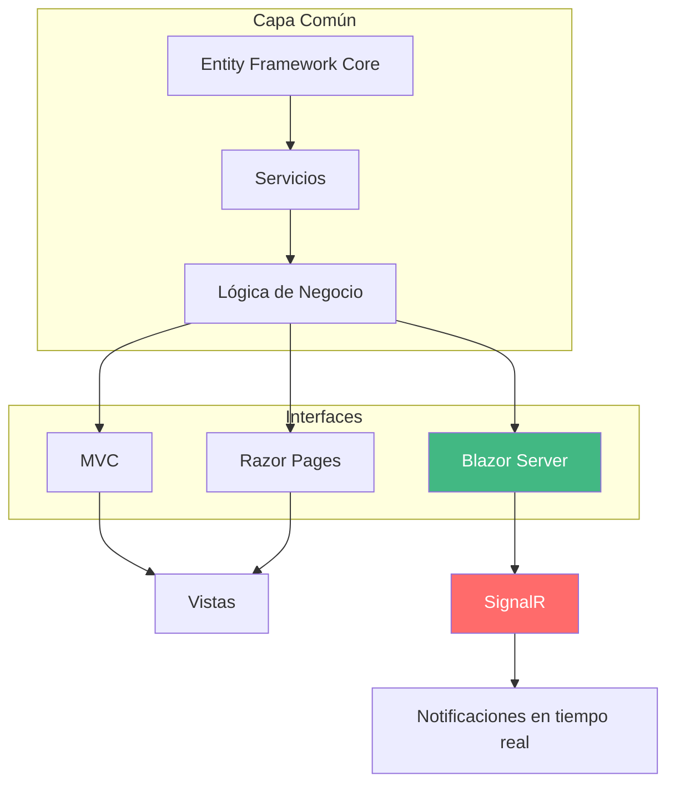

Como profesor del ciclo de DAW, me gusta que el alumnado trabaje con proyectos completos que les ayuden a entender cómo funcionan las cosas en el mundo real. No siempre es fácil, pero algo que sí puedo hacer es facilitarles ejemplos funcionales que cubran el currículo y les den una base sólida. Hoy os traigo **WalaDaw**, un marketplace en **.NET** que usa MVC, Razor Pages y Blazor Server. 

<!-- more -->

Imaginad a Víctor, un alumno de 2º DAW que en marzo está buscando empresa. Tiene su CV con las prácticas en empresa, pero necesita algo que le diferencie. Cuando muestra este proyecto en una entrevista técnica, no solo demuestra que sabe hacer un CRUD: demuestra que entiende **arquitectura**, **testing**, **seguridad** y **tiempo real**. Eso es lo que marca la diferencia.

En esta serie de post vamos a mostrar distintos proyectos que he desarrollado para mis clases, cada uno con un enfoque diferente. Este es el primero, y uno de los que más me gusta. ¡Vamos allá!

## Aprendizaje Basado en Proyectos: Por qué este enfoque

Antes de nada, quiero explicar por qué hago esto. No soy fan de las clases donde explico teoría durante una hora y luego los alumnos hacen ejercicios sueltos. En DAW, eso no funciona. Un desarrollador web no aprende a hacer una tienda online resolviendo ejercicios de MVC sueltos. Aprende **haciendo una tienda**.

El **Aprendizaje Basado en Proyectos (ABP)** consiste en eso: aprender haciendo un proyecto real, con problemas reales, donde las tecnologías se usan porque son necesarias, no porque yo lo diga.

### Mi metodología en clase

Así funciona una sesión típica conmigo:

1. **Planteo un problema**: "Necesitamos que el usuario pueda filtrar productos por categoría sin recargar la página"
2. **Exploramos soluciones**: ¿Ajax? ¿JavaScript puro? ¿Blazor?
3. **Implementamos**: Los alumnos trabajan en su copia del proyecto
4. **Revisamos**: Analizamos qué ha funcionado y qué no
5. **Mejoramos**: Entre todos buscamos una solución mejor

No soy el que tiene todas las respuestas. Soy el que guía el proceso.

### ¿Qué aporta este proyecto como ejemplo?

1. **Es real, no artificial**: No es un ejercicio fabricado artificialmente para aprender "el tema 3". Es una aplicación que funciona, con datos que se persistentes, usuarios que se registran, carritos que funcionan.

2. **Cada tecnología tiene su momento**: Cuando enseño MVC, el alumno ve por qué existe. Cuando llega Blazor, entiende qué problema resuelve. No son palabras vacías.

3. **Sirve como apuntes**: El código del proyecto es el mejor material de estudio. No hace falta mis transparencias cuando tienes el proyecto completo con todo documentado en el repo.

4. **Pueden partir de aquí**: Los alumnos pueden tomar este proyecto como base para sus propios trabajos. Les ahorro el "desde cero" y les reto a mejorarlo.

5. **Errores controlados**: En un sistema real, un error puede tener consecuencias graves. En aprendizaje, los errores son oro. Este proyecto tiene fallos intentionalmente placed para que los detecten y aprendan a evitarlos.

::: tip
En FP no tenemos tiempo de hacer "la teoría primero y la práctica después". El ABP funde ambas: aprendes la teoría cuando la necesitas para avanzar. Eso es lo que pasa en el mundo real, y eso es lo que preparamos.
:::

## Estructura del módulo DWES

En mi metodología para **DWES (Desarrollo Web en Entornos Servidor)**, divido el curso en dos grandes bloques:

1.  **Bloque de Servicios y APIs**: Nos centramos en la lógica de negocio, el acceso a datos y los servicios RESTful.
2.  **Bloque de Páginas Web Dinámicas**: Recuperamos esa lógica y le damos vida mediante distintas tecnologías de renderizado.

**WalaDaw** es el puente entre ambos bloques, demostrando la versatilidad de **.NET** para dominar ambas etapas con un único lenguaje: C#, aunque se centra sobre todo en la segunda parte: la construcción de la interfaz con MVC, Razor Pages y Blazor Server, es decir, páginas web dinámicas con distintas tecnologías.

Si quieres ver el proyecto en acción, échale un vistazo al **[demo en Render](https://tiendadawweb-netcore.onrender.com/)**. Y si te interesa el código, todo está en **[GitHub](https://github.com/joseluisgs/TiendaDawWeb-NetCore)**.

::: warning Una aclaración importante
Este proyecto es **código de aprendizaje, no código de producción**. No pretende ser un sistema real de comercio electrónico. Es un ejemplo didáctico que muestra cómo aplicar las tecnologías del currículo de DWES. 

**Los fallos son intencionados**: forman parte del aprendizaje. Un alumno que solo ve código "perfecto" no aprende a detectar problemas. En clase analizamos estos "fallos" y discutimos cómo mejorarían en un sistema real.
:::

## Tecnología: .NET

Este proyecto usa **.NET**, la versión más reciente. ¿Por qué? Ofrece un ecosistema completo para desarrollo web, con herramientas de primera clase para cada capa:
- **Backend**: ASP.NET Core con MVC, Razor Pages y Blazor Server
- **Data Access**: Entity Framework Core con SQLite In-Memory
- **Testing**: NUnit para unit e integración, bUnit para componentes Blazor, Playwright para E2E
- **Contenerización**: Docker para desarrollo y despliegue

::: tip
Trabajar con la última versión de .NET no es "por usar lo último". Es porque las empresas lo demandan y porque las nuevas versiones trae mejoras reales en rendimiento y sintaxis.
:::

## La Arquitectura Híbrida: MVC, Razor Pages y Blazor

Lo que hace especial a este proyecto es su **arquitectura híbrida**: comparte el núcleo (servicios, repositorios, modelos) pero despliega tres aproximaciones distintas para la interfaz.

En clase, explico esto así: "Imaginad que vais a construir una casa. Podéis usar ladrillo, bloques de hormigón o madera. Cada material tiene sus ventajas. Un buen arquitecto sabe cuándo usar cada uno. Aquí pasa igual: MVC, Razor y Blazor son herramientas diferentes para problemas diferentes."

### 1. ASP.NET Core MVC: La separación clásica

El patrón **Model-View-Controller** es la aproximación más conocida. Separa claramente la lógica de tres partes:

- **Model**: Los datos y reglas de negocio
- **View**: Lo que ve el usuario (vistas Razor)
- **Controller**: Coordina todo, recibe peticiones y decide qué devolver

**¿Cuándo usarlo?** Cuando necesitas una estructura clara para aplicaciones grandes y empresariales. Enseña al alumno a pensar en términos de responsabilidades.

::: tip Enseño MVC así: primero les hago crear un controlador que devuelva texto plano. Les parece raro. Luego le añadido una vista Razor. Y alors "¡ah, ya veo!". El "click" viene cuando ven que pueden controlar exactamente qué se renderiza.
:::

### 2. Razor Pages: La agilidad centrada en página

**Razor Pages** agrupa la lógica y la vista en el mismo archivo. Es como si cada página fosse "su propia mini-app".

**¿Cuándo usarlo?** Para páginas más independientes (sobre nosotros, contacto, políticas). Reduce el "boilerplate" y es más rápido de desarrollar.

Mi truco: Uso Razor Pages para las páginas "estáticas con dinamismo" - las que apenas necesitan lógica pero necesitan datos (aviso legal con datos de empresa, página de contacto con horarios).

### 3. Blazor Server: La interactividad en tiempo real

Aquí está el salto cualitativo. **Blazor Server** permite escribir componentes interactivos **todo en C#** - nada de JavaScript. Usa **SignalR** para comunicación en tiempo real entre el navegador y el servidor.

**¿Qué aporta?**
- Filtros de productos que se actualizan sin recargar
- Dashboard de admin con gráficos en vivo
- Notificaciones push del servidor


La primera vez que pongo un ejemplo de Blazor en clase, los alumnos se quedan mirando. "¿Esto es JavaScript?" - "No, es C#. El servidor está ejecutando código C# en el navegador del usuario". Hay un momento de confusión, luego de interés, luego de "¿esto funciona de verdad?". Y sí, funciona.

::: tip
Blazor no es "JavaScript hecho en C#". Es una forma diferente de pensar: el servidor mantiene una conexión con el navegador y envía actualizaciones. Eso tiene implicaciones importantes en seguridad y rendimiento.
:::



## Comparativa: ¿Cuándo usar cada enfoque?

| Característica          | MVC                 | Razor Pages        | Blazor Server         |
| ----------------------- | ------------------- | ------------------ | --------------------- |
| **Paradigma**           | Separación estricta | Página como unidad | Componentes           |
| **Curva aprendizaje**   | Media               | Baja               | Media                 |
| **Estado**              | Sin estado          | Sin estado         | Con estado (circuito) |
| **Interactividad**      | JavaScript          | JavaScript/AJAX    | C# nativo             |
| **Rendimiento inicial** | Alto                | Alto               | Medio                 |
| **Uso típico**          | Apps grandes        | CMS, páginas       | Apps reactivas        |

## Testing: La pirámide completa

Un proyecto "de referencia" no puede fallar. La suite de pruebas incluye:

| Nivel | Tipo        | Herramienta         |
| ----- | ----------- | ------------------- |
| **1** | Unit Tests  | NUnit               |
| **2** | Integration | NUnit + SQLite      |
| **3** | Component   | bUnit (para Blazor) |
| **4** | E2E         | Playwright          |

::: tip
Enseñar testing no es solo "saber escribir tests". Es entender la pirámide: muchos tests pequeños y rápidos (unit), algunos de integración, y muy pocos E2E (lentos).
:::

## Seguridad Empresarial

El proyecto implementa **ASP.NET Core Identity** con:

- Autenticación con cookies segura
- Roles: ADMIN, USER, MODERADOR
- Claims para información adicional del usuario
- Password hashing automático
- Protección CSRF en todos los formularios
- Authorization a nivel de controlador y acción
- Security headers (HSTS, X-Frame-Options)

### Por qué la seguridad es clave en DWES

En desarrollo web, la seguridad no es opcional. Cualquier aplicación que maneje datos de usuarios necesita protección. Pero en FP suele costar vender esto. "¿Por qué necesito seguridad si hago una tienda de libros?" - Les dejo probar a hacer un panel de admin sin protección y en 5 minutos tienen un desastre: cualquier usuario puede entrar, borrar lo que quiere, ver datos de otros. Entonces lo entienden.

### Roles vs Claims: ¿cuándo usar cada uno?

En clase explico la diferencia así: los **roles** son como el carnet de identidad (admin, usuario, moderador), y los **claims** son como los datos de ese carnet (nombre, email, preferencias).

- **Roles**: Para control de acceso grosso ("solo los admins pueden entrar aquí")
- **Claims**: Para información específica ("mostrar solo los pedidos de este usuario")

En la práctica se usan ambos: `[Authorize(Roles = "ADMIN")]` para proteger rutas, y claims para personalizar la experiencia.

### Password hashing

Identity usa **BCrypt** por defecto, que incluye salt automático. En clase explico: no es lo mismo que cifrar. El hash es unidireccional: puedes convertir "password123" en un hash, pero no puedes recuperar "password123" a partir del hash. Se guarda el hash, nunca la contraseña. Cuando el usuario inicia sesión, se hashea lo que escribe y se compara con el hash guardado. Si coincide, acceso concedido.

Además, BCrypt es adaptive: permite aumentar el coste computacional con el tiempo. Esto significa que un ataque de fuerza bruta se vuelve cada vez más lento y costoso. Los sitios que usan BCrypt hace 10 años pueden aumentar el "work factor" y seguir protegidos.

::: tip
La seguridad en FP suele parecer "aburrida". Pero este proyecto hace que sea tangible: cada feature de Identity protege algo real. Los alumnos ven el resultado. "Si no pongo [Authorize], cualquiera entra al dashboard" - y lo ven funcionando.
:::

## Persistencia con SQLite In-Memory

Usamos **SQLite In-Memory** para desarrollo y testing:

- Sin instalación: no necesitas MySQL ni PostgreSQL
- Base de datos volátil: ideal para demos y tests
- Todo en RAM: rendimiento máximo
- Transacciones reales con Entity Framework Core

## Docker y Despliegue

Todo el sistema está **contenedorizado**:

```bash
docker-compose up -d --build
```

El proyecto está desplegado en **[Render](https://tiendadawweb-netcore.onrender.com/)** y el código disponible en **[GitHub](https://github.com/joseluisgs/TiendaDawWeb-NetCore)**.

Esto enseña al alumno que el despliegue es parte del desarrollo, no algo que viene después.

## CI/CD con GitHub Actions

Cada cambio ejecuta los tests automáticamente y se despliega en **Render**, cerrando el ciclo de vida profesional del software.

## Análisis Curricular (Módulo 0613)

El proyecto está diseñado para cubrir el 100% del currículo. Pero, ¿qué significa esto en la práctica? Aquí te explico cómo se mapea cada resultado de aprendizaje con el proyecto:

| RA | Criterios | Aplicación en WalaDaw |
|---|-----------|----------------------|
| **1. Arquitecturas y tecnologías web** | a-g | Server-side (Razor) vs client-side (Blazor), Kestrel, Docker. Los alumnos ven cómo el mismo código se ejecuta de forma diferente según la tecnología. |
| **2. Inserción de sentencias en lenguajes de marcas** | a-h | Tag Helpers, `@inject`, `@model`, gestión de variables en vistas. Todo lo que se puede hacer en una vista Razor. |
| **3. Creación de bloques de sentencias** | a-g | Lógica de negocio en controladores y servicios, formularios con validación, recuperación de datos vía POST/GET. |
| **4. Aplicaciones web embebidas** | a-f | Cookies y sesiones para el carrito de compra, sistema completo de Identity con login/registro. |
| **5. Separación lógica/presentación** | a-h | Implementación pura del patrón MVC, inyección de dependencias, servicios testeables con NUnit. |
| **6. Acceso a almacenes de datos** | a-g | Entity Framework Core con SQLite In-Memory, migraciones, transacciones, relaciones entre entidades. |
| **7. Servicios web reutilizables** | a-h | Web APIs RESTful consumidas desde el frontend, devuelve JSON, expone endpoints. |
| **8. Frameworks de desarrollo** | a-g | Blazor Server con SignalR para interactividad en tiempo real, sin necesidad de JavaScript. |
| **9. Aplicaciones web híbridas** | a-h | Uso de librerías NuGet, localización i18n, integración de gráficos con ApexCharts, análisis básico de datos. |

::: tip
En clase uso esta tabla para que los alumnos vean exactamente qué están aprendiendo en cada fase del proyecto. No es solo "hacer una tienda", es ir cubriendo objetivos concretos del currículo mientras la делаешь.
:::

## Documentación

A lo largo del proyecto, cada commit incluye documentación técnica detallada. Desde la configuración de Docker hasta la implementación de Identity, cada paso está documentado en el repo en formato Markdown, con explicaciones claras y enlaces a recursos adicionales en el directorio `docs/`.

::: tip
Estos documentos son apuntes vivos. No son solo para el proyecto, sino para que los alumnos los usen como referencia en sus propios proyectos. La documentación es parte del aprendizaje y la construimos juntos a medida que avanzamos.
:::

## Reflexiones Finales

No construimos solo "páginas", construimos **sistemas**. La capacidad de .NET para combinar MVC (estructura), Razor Pages (agilidad), Blazor Server (interactividad en tiempo real) y testing profesional con NUnit, es una ventaja competitiva brutal.

> "La tecnología cambia, pero el mimo por el código limpio y la arquitectura sólida es lo que te define como profesional. No construyas solo webs, construye sistemas robustos que hablen de tu capacidad como ingeniero."

**¡Bienvenidos a esta serie de proyectos! El código no se escribe solo, y el futuro se construye commit a commit.** 🚀

---

*¿Qué tecnología te gustaría que profundizáramos? Deja tu comentario.*