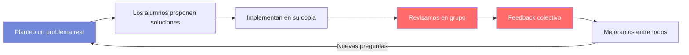
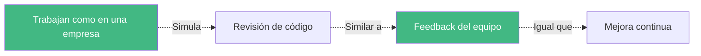
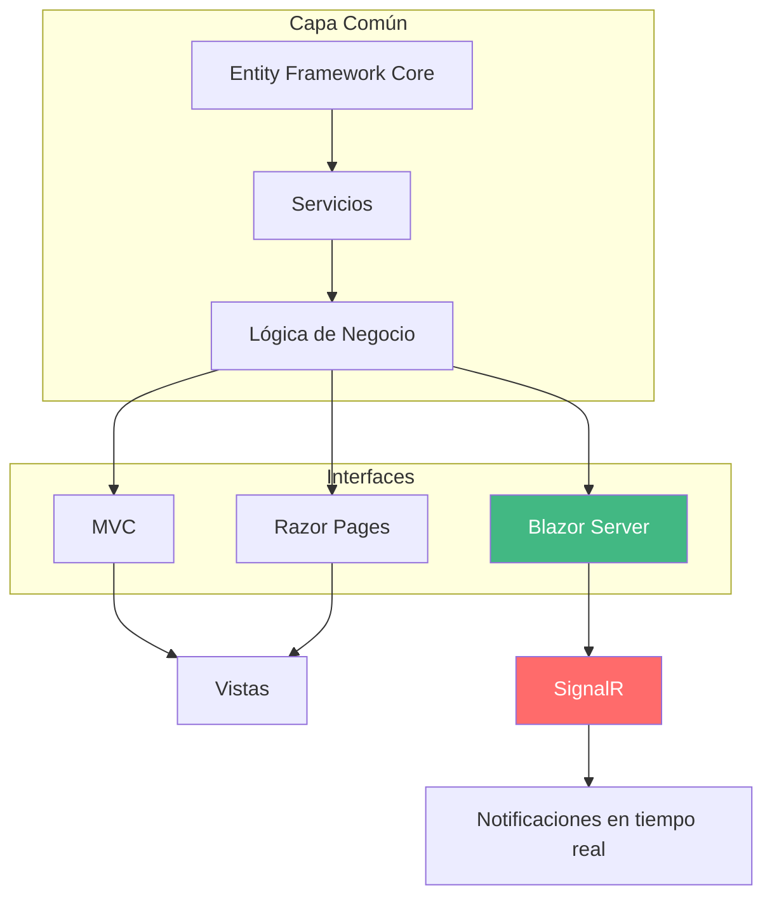

Como profesor del ciclo de DAW, me gusta que el alumnado trabaje con proyectos completos que les ayuden a entender cómo funcionan las cosas en el mundo real. No siempre es fácil, pero algo que sí puedo hacer es facilitarles ejemplos funcionales que cubran el currículo y les den una base sólida. Hoy os traigo **WalaDaw**, un marketplace en **.NET** que usa MVC, Razor Pages y Blazor Server. 

<!-- more -->

::: warning Una aclaración importante
Este proyecto es **código de aprendizaje, no código de producción**. No pretende ser un sistema real de comercio electrónico. Es un ejemplo didáctico que muestra cómo aplicar las tecnologías del currículo de DWES. 

**Los fallos son intencionados**: forman parte del aprendizaje. Un alumno que solo ve código "perfecto" no aprende a detectar problemas. En clase analizamos estos "fallos" y discutimos cómo mejorarían en un sistema real.
:::

Imaginad a Víctor, un alumno de 2º DAW que en marzo está buscando empresa. Tiene su CV con las prácticas en empresa, pero necesita algo que le diferencie. Cuando muestra este proyecto en una entrevista técnica, no solo demuestra que sabe hacer un CRUD: demuestra que entiende **arquitectura**, **testing**, **seguridad** y **tiempo real**. Eso es lo que marca la diferencia.

En esta serie de post vamos a mostrar distintos proyectos que he desarrollado para mis clases, cada uno con un enfoque diferente. Este es el primero, y uno de los que más me gusta. ¡Vamos allá!

## Aprendizaje Basado en Proyectos: Por qué este enfoque

Antes de nada, quiero explicar por qué hago esto. No soy fan de las clases donde explico teoría durante una hora y luego los alumnos hacen ejercicios sueltos. En DAW, eso no funciona. Un desarrollador web no aprende a hacer una tienda online resolviendo ejercicios de MVC sueltos. Aprende **haciendo una tienda**.

El **Aprendizaje Basado en Proyectos (ABP)** consiste en eso: aprender haciendo un proyecto real, con problemas reales, donde las tecnologías se usan porque son necesarias, no porque yo lo diga.

### Mi metodología en clase

Así funciona una sesión típica conmigo:

1. **Planteo un problema**: "Necesitamos que el usuario pueda filtrar productos por categoría sin recargar la página"
2. **Exploramos soluciones**: ¿Ajax? ¿JavaScript puro? ¿Blazor?
3. **Implementamos**: Los alumnos trabajan en su copia del proyecto
4. **Revisamos**: Analizamos qué ha funcionado y qué no
5. **Mejoramos**: Entre todos buscamos una solución mejor

No soy el que tiene todas las respuestas. Soy el que guía el proceso.

**Ciclo ABP en el aula:**




**Relación con el mundo profesional:**




::: tip
El feedback en clase no es "corregir errores". Es un diálogo donde analizamos qué ha pasado y por qué. Esto es exactamente lo que hacen las empresas en las revisiones de código. Los alumnos no solo aprenden a programar, aprenden a recibir feedback y a mejorar basándose en él.
:::

### ¿Qué aporta este proyecto como ejemplo?

1. **Es real, no artificial**: No es un ejercicio fabricado artificialmente para aprender "el tema 3". Es una aplicación que funciona, con datos que se persistentes, usuarios que se registran, carritos que funcionan.

2. **Cada tecnología tiene su momento**: Cuando enseño MVC, el alumno ve por qué existe. Cuando llega Blazor, entiende qué problema resuelve. No son palabras vacías.

3. **Sirve como apuntes**: El código del proyecto es el mejor material de estudio. No hace falta mis transparencias cuando tienes el proyecto completo con todo documentado en el repo.

4. **Pueden partir de aquí**: Los alumnos pueden tomar este proyecto como base para sus propios trabajos. Les ahorro el "desde cero" y les reto a mejorarlo.

5. **Errores controlados**: En un sistema real, un error puede tener consecuencias graves. En aprendizaje, los errores son oro. Este proyecto tiene fallos para que los detecten y aprendan a evitarlos.

::: tip
En FP no tenemos tiempo de hacer "la teoría primero y la práctica después". El ABP funde ambas: aprendes la teoría cuando la necesitas para avanzar. Eso es lo que pasa en el mundo real, y eso es lo que preparamos.
:::

## Estructura del módulo DWES

En mi metodología para **DWES (Desarrollo Web en Entornos Servidor)**, divido el curso en dos grandes bloques:

1.  **Bloque de Servicios y APIs**: Nos centramos en la lógica de negocio, el acceso a datos y los servicios RESTful.
2.  **Bloque de Páginas Web Dinámicas**: Recuperamos esa lógica y le damos vida mediante distintas tecnologías de renderizado.

**WalaDaw** es el puente entre ambos bloques, demostrando la versatilidad de **.NET** para dominar ambas etapas con un único lenguaje: C#, aunque se centra sobre todo en la segunda parte: la construcción de la interfaz con MVC, Razor Pages y Blazor Server, es decir, páginas web dinámicas con distintas tecnologías.

Si quieres ver el proyecto en acción, échale un vistazo al **[demo en Render](https://tiendadawweb-netcore.onrender.com/)**. Y si te interesa el código, todo está en **[GitHub](https://github.com/joseluisgs/TiendaDawWeb-NetCore)**.

## Tecnología: .NET

Este proyecto usa **.NET**, la versión más reciente. ¿Por qué? Ofrece un ecosistema completo para desarrollo web, con herramientas de primera clase para cada capa:
- **Backend**: ASP.NET Core con MVC, Razor Pages y Blazor Server
- **Data Access**: Entity Framework Core con SQLite In-Memory
- **Testing**: NUnit para unit e integración, bUnit para componentes Blazor, Playwright para E2E
- **Contenerización**: Docker para desarrollo y despliegue
- **Internacionalización**: Soporte para múltiples idiomas (i18n)

## La Arquitectura Híbrida: MVC, Razor Pages y Blazor

Lo que hace especial a este proyecto es su **arquitectura híbrida**: comparte el núcleo (servicios, repositorios, modelos) pero despliega tres aproximaciones distintas para la interfaz.

En clase, explico esto así: "Imaginad que vais a construir una casa. Podéis usar ladrillo, bloques de hormigón o madera. Cada material tiene sus ventajas. Un buen arquitecto sabe cuándo usar cada uno. Aquí pasa igual: MVC, Razor y Blazor son herramientas diferentes para problemas diferentes."

### 1. ASP.NET Core MVC: La separación clásica

El patrón **Model-View-Controller** es la aproximación más conocida. Separa claramente la lógica de tres partes:

- **Model**: Los datos y reglas de negocio
- **View**: Lo que ve el usuario (vistas Razor)
- **Controller**: Coordina todo, recibe peticiones y decide qué devolver

**¿Cuándo usarlo?** Cuando necesitas una estructura clara para aplicaciones grandes y empresariales. Enseña al alumno a pensar en términos de responsabilidades.


### 2. Razor Pages: La agilidad centrada en página

**Razor Pages** agrupa la lógica y la vista en el mismo archivo. Es como si cada página fosse "su propia mini-app".

**¿Cuándo usarlo?** Para páginas más independientes (sobre nosotros, contacto, políticas). Reduce el "boilerplate" y es más rápido de desarrollar.

Mi truco: Uso Razor Pages para las páginas "estáticas con dinamismo" - las que apenas necesitan lógica pero necesitan datos (aviso legal con datos de empresa, página de contacto con horarios).

### 3. Blazor Server: La interactividad en tiempo real

Aquí está el salto cualitativo. **Blazor Server** permite escribir componentes interactivos **todo en C#** - nada de JavaScript. Usa **SignalR** para comunicación en tiempo real entre el navegador y el servidor.

**¿Qué aporta?**
- Filtros de productos que se actualizan sin recargar
- Dashboard de admin con gráficos en vivo
- Notificaciones push del servidor


La primera vez que pongo un ejemplo de Blazor en clase, los alumnos se quedan mirando. "¿Esto es JavaScript?" - "No, es C#. El servidor está ejecutando código C# en el navegador del usuario". Hay un momento de confusión, luego de interés, luego de "¿esto funciona de verdad?". Y sí, funciona.

::: tip
Blazor no es "JavaScript hecho en C#". Es una forma diferente de pensar: el servidor mantiene una conexión con el navegador y envía actualizaciones. Eso tiene implicaciones importantes en seguridad y rendimiento.
:::





## Comparativa: ¿Cuándo usar cada enfoque?

| Característica          | MVC                 | Razor Pages        | Blazor Server         |
| ----------------------- | ------------------- | ------------------ | --------------------- |
| **Paradigma**           | Separación estricta | Página como unidad | Componentes           |
| **Curva aprendizaje**   | Media               | Baja               | Media                 |
| **Estado**              | Sin estado          | Sin estado         | Con estado (circuito) |
| **Interactividad**      | JavaScript          | JavaScript/AJAX    | C# nativo             |
| **Rendimiento inicial** | Alto                | Alto               | Medio                 |
| **Uso típico**          | Apps grandes        | CMS, páginas       | Apps reactivas        |

## Testing: La pirámide completa

Un proyecto "de referencia" no puede fallar. La suite de pruebas incluye:

| Nivel | Tipo        | Herramienta         |
| ----- | ----------- | ------------------- |
| **1** | Unit Tests  | NUnit               |
| **2** | Integration | NUnit + SQLite      |
| **3** | Component   | bUnit (para Blazor) |
| **4** | E2E         | Playwright          |

### ¿Qué es Playwright y por qué es importante?

En clase explico Playwright así: "Unit tests prueban funciones sueltas. Los tests E2E prueban como un usuario real: abre el navegador, hace clic, navega, rellena formularios." Playwright hace exactamente eso: automatiza un navegador real (Chrome, Firefox, Safari) y simula interacciones de usuario.

**¿Por qué es importante?**
- **Prueba lo que el usuario ve**: No basta con que el código funcione; el usuario debe poder usarlo. Playwright detecta problemas visuales y de interacción que los tests unitarios no ven.
- **Detecta regresiones**: Si cambias algo y rompes algo, Playwright lo detecta antes de que el usuario lo vea.
- **Automatización real**: Es lo mismo que hacen las herramientas de integración continua (CI/CD). Si funciona en Playwright, funciona en producción.

**En el proyecto:**
- Tests de login: ¿el usuario puede iniciar sesión?
- Tests de navegación: ¿los menús funcionan?
- Tests de carrito: ¿se añaden productos correctamente?

::: tip
Enseñar testing no es solo "saber escribir tests". Es entender la pirámide: muchos tests pequeños y rápidos (unit), algunos de integración, y muy pocos E2E (lentos). Los unit tests se ejecutan en milisegundos, los E2E pueden tardar minutos. Por eso la pirámide tiene muchos abajo y pocos arriba.
:::

## Seguridad Empresarial

El proyecto implementa **ASP.NET Core Identity** con:

- Autenticación con cookies segura
- Roles: ADMIN, USER, MODERADOR
- Claims para información adicional del usuario
- Password hashing automático
- Protección CSRF en todos los formularios
- Authorization a nivel de controlador y acción
- Security headers (HSTS, X-Frame-Options)

### Por qué la seguridad es clave en DWES

En desarrollo web, la seguridad no es opcional. Cualquier aplicación que maneje datos de usuarios necesita protección. Pero en FP suele costar vender esto. "¿Por qué necesito seguridad si hago una tienda de libros?" - Les dejo probar a hacer un panel de admin sin protección y en 5 minutos tienen un desastre: cualquier usuario puede entrar, borrar lo que quiere, ver datos de otros. Entonces lo entienden.

### Roles vs Claims: ¿cuándo usar cada uno?

En clase explico la diferencia así: los **roles** son como el carnet de identidad (admin, usuario, moderador), y los **claims** son como los datos de ese carnet (nombre, email, preferencias).

- **Roles**: Para control de acceso grosso ("solo los admins pueden entrar aquí")
- **Claims**: Para información específica ("mostrar solo los pedidos de este usuario")

En la práctica se usan ambos: `[Authorize(Roles = "ADMIN")]` para proteger rutas, y claims para personalizar la experiencia.

### Password hashing

Identity usa **BCrypt** por defecto, que incluye salt automático. En clase explico: no es lo mismo que cifrar. El hash es unidireccional: puedes convertir "password123" en un hash, pero no puedes recuperar "password123" a partir del hash. Se guarda el hash, nunca la contraseña. Cuando el usuario inicia sesión, se hashea lo que escribe y se compara con el hash guardado. Si coincide, acceso concedido.

Además, BCrypt es adaptive: permite aumentar el coste computacional con el tiempo. Esto significa que un ataque de fuerza bruta se vuelve cada vez más lento y costoso. Los sitios que usan BCrypt hace 10 años pueden aumentar el "work factor" y seguir protegidos.

::: tip
La seguridad en FP suele parecer "aburrida". Pero este proyecto hace que sea tangible: cada feature de Identity protege algo real. Los alumnos ven el resultado. "Si no pongo [Authorize], cualquiera entra al dashboard" - y lo ven funcionando.
:::

## Persistencia con SQLite In-Memory

Usamos **SQLite In-Memory** para desarrollo y testing:

- Sin instalación: no necesitas MySQL ni PostgreSQL
- Base de datos volátil: ideal para demos y tests
- Todo en RAM: rendimiento máximo
- Transacciones reales con Entity Framework Core

## Docker y Despliegue

Todo el sistema está **contenedorizado** con Docker:

```bash
docker-compose up -d --build
```

### ¿Por qué es importante el despliegue en FP?

En clase insisto: "Un desarrollador que solo sabe programar pero no sabe desplegar está incompleto." El despliegue es donde el código se convierte en producto. Los alumnos aprenden que el desarrollo no termina cuando el código funciona en su máquina.

**El proyecto incluye:**
- **Docker**: Contenedores para desarrollo y producción
- **GitHub**: Todo el código está en un repositorio público, con historial de cambios, ramas e incidencias
- **Render**: Despliegue automático y continuo

### GitHub: Más que un lugar para el código

El repositorio de GitHub no es solo donde se guarda el código. Es:
- **Historial de cambios**: Cada commit cuenta una historia de lo que se ha hecho
- **Colaboración**: Los alumnos aprenden a trabajar en equipo con ramas y pull requests
- **Documentación**: El README, los documentos en la carpeta doc/, todo está versionado
- **Portfolio**: Cuando buscan trabajo, tienen algo tangible que mostrar

El proyecto está desplegado en **[Render](https://tiendadawweb-netcore.onrender.com/)** y el código disponible en **[GitHub](https://github.com/joseluisgs/TiendaDawWeb-NetCore)**.

::: tip
En clase les digo: "Tu GitHub es tu CV técnico. Un repositorio ordenado, con commits claros y buena documentación dice mucho de ti como profesional."
:::

## CI/CD con GitHub Actions

Cada vez que alguien hace un push a la rama principal, pasa esto:

1. **Se ejecutan los tests**: NUnit, bUnit y Playwright
2. **Si pasan**: Se construye la aplicación
3. **Si la build funciona**: Se despliega automáticamente en Render

Esto cierra el ciclo de vida profesional del software. Los alumnos ven cómo se trabaja en el mundo real: el código no se sube "a mano", se automatiza todo.

::: tip
Enseñar CI/CD desde el principio cambia la mentalidad del alumno. Ya no es "escribo código y lo subo", sino "escribo código, pasan los tests, y se despliega solo".
:::

## Orientaciones Pedagógicas del Currículo

El currículo del módulo 0613 define varias **líneas de actuación** para el proceso de enseñanza-aprendizaje. Aquí te explico cómo este proyecto cubre cada una:

### 1. Análisis de los métodos de generación dinámica de documentos web

El proyecto muestra **tres formas distintas** de generar HTML dinámico:
- **ASP.NET Core MVC**: El servidor genera HTML ejecutando controladores y devolviendo vistas
- **Razor Pages**: Cada página es una unidad que combina lógica y presentación
- **Blazor Server**: El servidor genera componentes que se actualizan en tiempo real

En clase comparamos los tres métodos y analizamos cómo cada uno produce HTML diferente según los datos y el contexto.

### 2. Integración del lenguaje de marcas con el código ejecutable en el servidor web

Las vistas Razor (.cshtml) son el ejemplo perfecto: HTML con código C# embebido. Los alumnos ven cómo las etiquetas `@Model`, `@if`, `@foreach`, `@inject` mezclan el lenguaje de marcas con la lógica de programación. No es teoría: es código que ejecutan y ven funcionar.

### 3. Análisis, diferenciación y clasificación de características y funcionalidades de entornos y lenguajes de programación de servidores web

El proyecto usa **.NET 10 con C#** como único lenguaje para servidor y cliente (Blazor). Los alumnos ven que pueden hacer todo - desde controladores hasta componentes interactivos - con el mismo lenguaje. Esto les ayuda a entender la ventajas de un ecosistema integrado.

### 4. Utilización de características y funcionalidades específicas de los lenguajes de programación seleccionados

C# en este proyecto usa características modernas: sintaxis moderna con type safety, LINQ para consultas, async/await para operaciones asíncronas, patrón MVC con inyección de dependencias. Los alumnos no solo aprenden la teoría, usan estas características en código real.

### 5. Modificación del código existente y análisis de datos en soluciones web heterogéneas para su adaptación a entornos específicos

El proyecto está diseñado para que los alumnos puedan partir de él y modificarlo. No es "código cerrado": pueden cambiar funcionalidades, añadir características, adaptar el proyecto a sus necesidades. Les retamos a mejorar lo que ya existe.

### 6. Análisis y utilización de funcionalidades aportadas por frameworks de programación web en entorno servidor

El proyecto usa **ASP.NET Core** como framework principal, pero también incluye:
- **Entity Framework Core** para acceso a datos
- **ASP.NET Core Identity** para seguridad
- **SignalR** para tiempo real

Los alumnos analizan qué aporta cada framework y cuándo usarlo.

### 7. Utilización de frameworks para incorporar interactividad a los documentos web generados de forma dinámica

Aquí es donde **Blazor Server** brilla. No es necesario escribir JavaScript para tener interactividad: los componentes Blazor actualizan el contenido sin recargar la página. Los filtros de productos, el carrito reactivo, el dashboard con gráficos en tiempo real son ejemplos de esto.

::: tip
Estas líneas de actuación no son apartados teóricos. Cada una se trabaja en clase mientras los alunos trabajan en el proyecto. No aprenden "sobre" interactividad: la implementan con Blazor.
:::

---

## Análisis Curricular (Módulo 0613)

El proyecto está diseñado para cubrir el 100% del currículo. Pero, ¿qué significa esto en la práctica? Aquí te explico cada resultado de aprendizaje y cómo se trabaja en el proyecto.

---

### RA1: Selecciona las arquitecturas y tecnologías de programación web en entorno servidor, analizando sus capacidades y características propias.

Este resultado aborda la comprensión de cómo funcionan las arquitecturas web. En clase, antes de escribir código, dedico tiempo a explicar "qué pasa cuando escribes una URL y le das a enter". Este proyecto permite ver todo eso en acción.

| CE | Descripción | Cómo se trabaja en WalaDaw |
|----|-------------|---------------------------|
| **a** | Se han caracterizado y diferenciado los modelos de ejecución de código en el servidor y en el cliente web | Las vistas Razor se ejecutan en servidor (servidor web Kestrel), los componentes Blazor también pero con SignalR, y el JavaScript resultante se ejecuta en navegador. Los alumnos ven la diferencia. |
| **b** | Se han reconocido las ventajas que proporciona la generación dinámica de páginas | Las páginas de productos muestran datos de la base de datos en tiempo real. No son HTML estático, se genera cada vez según los datos. |
| **c** | Se han identificado los mecanismos de ejecución de código en los servidores web | El proyecto usa Kestrel como servidor. Los controladores reciben peticiones HTTP, procesan y devuelven respuestas. |
| **d** | Se han reconocido las funcionalidades que aportan los servidores de aplicaciones y su integración con los servidores web | El proyecto se ejecuta sobre ASP.NET Core, que hace de servidor de aplicaciones integrándose con Kestrel. |
| **e** | Se han identificado y caracterizado los principales lenguajes y tecnologías relacionados con la programación web en entorno servidor | C# como lenguaje principal, Razor como motor de plantillas, Blazor como framework. |
| **f** | Se han verificado los mecanismos de integración de los lenguajes de marcas con los lenguajes de programación en entorno servidor | Las vistas Razor (HTML con código C# embebido) son el ejemplo perfecto. Etiquetas @model, @inject, @using. |
| **g** | Se han reconocido y evaluado las herramientas y frameworks de programación en entorno servidor | Visual Studio, dotnet CLI, GitHub Actions, Docker. Las herramientas reales del mercado. |

::: tip
Este RA se cubre con la propia arquitectura del proyecto. Los alumnos pueden comparar el código fuente de una página (ver > código fuente) con las vistas Razor del proyecto, viendo la diferencia entre lo que se ejecuta en servidor y lo que llega al navegador. La arquitectura híbrida (MVC + Razor Pages + Blazor) permite ver distintos modelos de ejecución.
:::

---

### RA2: Escribe sentencias ejecutables por un servidor web reconociendo y aplicando procedimientos de integración del código en lenguajes de marcas.

Aquí se trabaja la sintaxis básica de Razor: cómo escribir código C# dentro de HTML.

| CE | Descripción | Cómo se trabaja en WalaDaw |
|----|-------------|---------------------------|
| **a** | Se han reconocido los mecanismos de generación de páginas web a partir de lenguajes de marcas con código embebido | Todas las vistas Razor (.cshtml) son exactamente esto: HTML con código C# embebido. |
| **b** | Se han identificado las principales tecnologías asociadas | Sintaxis Razor, Tag Helpers, componentes de vista. |
| **c** | Se han utilizado etiquetas para la inclusión de código en el lenguaje de marcas | Las etiquetas Razor como `@{}`, `@Model`, `@{}`, `@Html`. |
| **d** | Se ha reconocido la sintaxis del lenguaje de programación que se ha de utilizar | Se usa C# dentro de las vistas. Los alumnos practican la sintaxis continuamente. |
| **e** | Se han escrito sentencias simples y se han comprobado sus efectos en el documento resultante | Mostrar variables (`@producto.Nombre`), condiciones (`@if`), bucles (`@foreach`). |
| **f** | Se han utilizado directivas para modificar el comportamiento predeterminado | `@model`, `@using`, `@namespace`, `_ViewImports.cshtml`. |
| **g** | Se han utilizado los distintos tipos de variables y operadores disponibles en el lenguaje | Variables de ViewData, ViewBag, Model, vistas fuertemente tipadas. |
| **h** | Se han identificado los ámbitos de utilización de las variables | Diferencia entre ViewData (por petición), TempData (entre peticiones), ViewBag (dinámico), Model (tipado). |

::: tip
El proyecto cubre este RA con ejemplos progresivos: desde mostrar variables simples (`@Model.Nombre`) hasta condiciones (`@if`) y bucles (`@foreach`). Todas las vistas del proyecto usan distintas combinaciones de estas estructuras, sirviendo como referencia práctica de la sintaxis Razor.
:::

---

### RA3: Escribe bloques de sentencias embebidos en lenguajes de marcas, seleccionando y utilizando las estructuras de programación.

Programación básica: condicionales, bucles, funciones, formularios.

| CE | Descripción | Cómo se trabaja en WalaDaw |
|----|-------------|---------------------------|
| **a** | Se han utilizado mecanismos de decisión en la creación de bloques de sentencias | `@if`, `@else`, `@switch` en todas las vistas. |
| **b** | Se han utilizado bucles y se ha verificado su funcionamiento | `@foreach` para listar productos, categorías, pedidos. |
| **c** | Se han utilizado matrices (arrays) para almacenar y recuperar conjuntos de datos | Listas de productos, colecciones de categorías. |
| **d** | Se han creado y utilizado funciones | Métodos en controladores, funciones en servicios, métodos en componentes Blazor. |
| **e** | Se han utilizado formularios web para interactuar con el usuario del navegador web | Formularios de login, registro, añadir producto, finalizar compra. |
| **f** | Se han empleado métodos para recuperar la información introducida en el formulario | Enlace de modelo en controladores, `[BindProperty]` en Razor Pages. |
| **g** | Se han añadido comentarios al código | El código incluye comentarios explicativos, y en la documentación se explica el por qué. |

::: tip
El proyecto usa constantemente bloques de decisión (`@if`, `@else`, `@switch`) y bucles (`@foreach`) en todas las vistas. Los listados de productos, las condiciones de visibilidad según el rol del usuario, y los formularios dinámicos son ejemplos concretos de este RA en acción.
:::

---

### RA4: Desarrolla aplicaciones web embebidas en lenguajes de marcas analizando e incorporando funcionalidades según especificaciones.

Aquí entran sesiones, cookies, autentificación y estado.

| CE | Descripción | Cómo se trabaja en WalaDaw |
|----|-------------|---------------------------|
| **a** | Se han identificado los mecanismos disponibles para el mantenimiento de la información que concierne a un cliente web concreto y se han señalado sus ventajas | El carrito de la compra necesita recordar qué productos ha seleccionado el usuario. Se usa sesión. |
| **b** | Se han utilizado mecanismos para mantener el estado de las aplicaciones web | Sesiones ASP.NET Core para el carrito, TempData para mensajes entre peticiones. |
| **c** | Se han utilizado mecanismos para almacenar información en el cliente web y para recuperar su contenido | Cookies para preferencias de idioma, localStorage para consentimientos de cookies. |
| **d** | Se han identificado y caracterizado los mecanismos disponibles para la autentificación de usuarios | ASP.NET Core Identity con cookies de autentificación. |
| **e** | Se han escrito aplicaciones que integren mecanismos de autentificación de usuarios | Todo el sistema de registro/login, protección de rutas con `[Authorize]`. |
| **f** | Se han utilizado herramientas y entornos para facilitar la programación, prueba y depuración del código | Visual Studio depurador, herramientas de desarrollo del navegador, logs con Serilog. |

::: tip
El proyecto implementa todo el manejo de estado: sesiones para el carrito de compra, cookies para preferencias de idioma, TempData para mensajes entre peticiones, y ASP.NET Core Identity para autentificación. Los alumnos pueden ver cómo funciona cada mecanismo en un caso real y tangible.
:::

---

### RA5: Desarrolla aplicaciones web identificando y aplicando mecanismos para separar el código de presentación de la lógica de negocio.

El corazón del módulo: el patrón MVC, inyección de dependencias, testing.

| CE | Descripción | Cómo se trabaja en WalaDaw |
|----|-------------|---------------------------|
| **a** | Se han identificado las ventajas de separar la lógica de negocio de los aspectos de presentación de la aplicación | El proyecto demuestra esto: servicios separados de las vistas, lógica de negocio en capa de servicios. |
| **b** | Se han analizado y utilizado mecanismos y frameworks que permiten realizar esta separación y sus características principales | El propio ASP.NET Core MVC con su flujo de procesamiento, inyección de dependencias nativa. |
| **c** | Se han utilizado objetos y controles en el servidor para generar el aspecto visual de la aplicación web en el cliente | Modelos de vista, Tag Helpers personalizados, Componentes de vista. |
| **d** | Se han utilizado formularios generados de forma dinámica para responder a los eventos de la aplicación web | Formularios que se generan según datos de la base de datos, validación dinámica. |
| **e** | Se han identificado y aplicado los parámetros relativos a la configuración de la aplicación web | appsettings.json, configuración de Identity, configuración de servicios en Startup/Program.cs. |
| **f** | Se han escrito aplicaciones web con mantenimiento de estado y separación de la lógica de negocio | El proyecto completo: estado gestionado por sesiones, lógica en servicios separados. |
| **g** | Se han aplicado los principios y patrones de diseño de la programación orientada a objetos | Clases, interfaces, herencia, encapsulamiento. Servicios que implementan interfaces. |
| **h** | Se ha probado y documentado el código | El proyecto incluye tests unitarios con NUnit para lógica de negocio, tests de integración con SQLite In-Memory, y tests E2E con Playwright. Además, el código usa XMLDoc en todos los métodos públicos: resúmenes (summary) que explican qué hace cada método, parámetros y valor de retorno. Esto permite generar documentación automática y aparece en IntelliSense. La documentación adicional está en la carpeta doc/. |

::: tip
El proyecto cubre este RA con separación total de responsabilidades: la lógica de negocio está en servicios separados, las vistas solo presentan datos, y todo se conecta mediante inyección de dependencias. Los tests unitarios con NUnit prueban cada servicio de forma aislada, los tests E2E con Playwright prueban flujos completos, y XMLDoc documenta cada método público. Esto es exactamente lo que se espera en un proyecto profesional.
:::


---

### RA6: Desarrolla aplicaciones web de acceso a almacenes de datos, aplicando medidas para mantener la seguridad y la integridad de la información.

Entity Framework Core, consultas, transacciones, seguridad.

| CE | Descripción | Cómo se trabaja en WalaDaw |
|----|-------------|---------------------------|
| **a** | Se han analizado las tecnologías que permiten el acceso mediante programación a la información disponible en almacenes de datos | Entity Framework Core como ORM, SQLite como base de datos. |
| **b** | Se han creado aplicaciones que establezcan conexiones con bases de datos | DbContext configurado, connection strings, contexto de base de datos. |
| **c** | Se ha recuperado información almacenada en bases de datos | Consultas LINQ, Include para relaciones, filtros where. |
| **d** | Se ha publicado en aplicaciones web la información recuperada | Las vistas muestran productos, categorías, pedidos desde la base de datos. |
| **e** | Se han utilizado conjuntos de datos para almacenar la información | Entity Framework carga entidades, LINQ procesa resultados. |
| **f** | Se han creado aplicaciones web que permitan la actualización y la eliminación de información disponible en una base de datos | CRUD completo: Create, Read, Update, Delete de productos, categorías, usuarios. |
| **g** | Se han probado y documentado las aplicaciones web | Tests de integración con SQLite In-Memory, documentación de Entity Framework. |

::: tip
Este RA se trabaja con Entity Framework Core y SQLite In-Memory. Los alumnos aprenden a hacer consultas LINQ (filtros, ordenaciones, agrupaciones), relaciones entre entidades (uno a muchos, muchos a muchos), y transacciones. El dashboard de admin con gráficos es un ejemplo práctico de análisis de datos (Big Data a pequeña escala).
:::

---

### RA7: Desarrolla servicios web reutilizables y accesibles mediante protocolos web, verificando su funcionamiento.

> ⚠️ **Este resultado de aprendizaje NO se cubre en este proyecto**.

Crear y consumir APIs RESTful es tan importante que merece su propio proyecto dedicado. WalaDaw se centra en la parte de "páginas web dinámicas", pero los servicios web los trataremos en otro proyecto: **TiendaDawApi-NetCore** ([GitHub](https://github.com/joseluisgs/TiendaDawApi-NetCore)), en ellos nos centramos en el desarrollo de servicios, apis RESTful, WebSockets, GraphQL, autenticación con JWT, documentación con Swagger, y testing de APIs, etc.

::: tip
¿Por qué un proyecto dedicado a APIs? Porque en el mercado actual, las APIs son fundamentales. Un desarrollador que sabe hacer páginas pero no sabe crear y consumir APIs está a medias. Por eso dedicamos un proyecto entero a esto. Desde mi punto de vista, es tan importante como el desarrollo de páginas web dinámicas o más en el contexto actual del desarrollo web.
:::

---

### RA8: Genera páginas web dinámicas analizando y utilizando tecnologías y frameworks del servidor web que añadan código al lenguaje de marcas.
 
Este resultado se trabaja con las tres tecnologías del proyecto: MVC, Razor Pages y Blazor Server, todas ellas generan código que se mezcla con el lenguaje de marcas (HTML) en el servidor.
 
| CE | Descripción | Cómo se trabaja en WalaDaw |
|----|-------------|---------------------------|
| **a** | Se han identificado las diferencias entre la ejecución de código en el servidor y en el cliente web | En MVC y Razor Pages, el código C# se ejecuta en el servidor y genera HTML que se envía al cliente. En Blazor Server, aunque hay interactividad, el código C# sigue ejecutándose en el servidor mediante SignalR. |
| **b** | Se han reconocido las ventajas de unir ambas tecnologías en el proceso de desarrollo de programas | Las tres tecnologías permiten combinar HTML con C# en el mismo archivo (.cshtml para MVC/Razor, .razor para Blazor), facilitando el desarrollo de páginas dinámicas. |
| **c** | Se han identificado las tecnologías y frameworks relacionadas con la generación por parte del servidor de páginas web con guiones embebidos | ASP.NET Core MVC (vistas Razor), Razor Pages y Blazor Server son las tecnologías utilizadas para generar páginas web con código embebido en el lenguaje de marcas. |
| **d** | Se han utilizado estas tecnologías y frameworks para generar páginas web que incluyan interacción con el usuario | En MVC y Razor Pages se usa JavaScript/jQuery para interactividad; en Blazor Server se usan componentes C# que actualizan la UI sin recargar la página (ej: filtros de productos). |
| **e** | Se han utilizado estas tecnologías y frameworks, para generar páginas web que incluyan verificación de formularios | Las tres tecnologías usan DataAnnotations para validación: en MVC y Razor Pages con atributos en los modelos, en Blazor Server con EditForm y Validations. |
| **f** | Se han utilizado estas tecnologías y frameworks para generar páginas web que incluyan modificación dinámica de su contenido y su estructura | En MVC/Razor Pages se logra mediante AJAX o form submissions; en Blazor Server mediante actualizaciones de estado en componentes que se reflejan en la UI. |
| **g** | Se han aplicado estas tecnologías y frameworks en la programación de aplicaciones web | El proyecto usa MVC para el catálogo de productos, Razor Pages para páginas informativas, y Blazor Server para el dashboard de admin. |
 
::: tip
En este RA, los alumnos experimentan cómo las tres tecnologías (MVC, Razor Pages y Blazor Server) permiten generar páginas web dinámicas al mezclar código C# con HTML. Cada una tiene sus ventajas: MVC ofrece separación clara de responsabilidades, Razor Pages es ideal para páginas centradas en la vista, y Blazor Server permite interactividad rica sin escribir JavaScript. La elección depende del caso de uso específico.
:::

---

### RA9: Desarrolla aplicaciones web híbridas seleccionando y utilizando tecnologías, frameworks servidor y repositorios heterogéneos de información.

Aquí entramos en librerías externas, Big Data básico, análisis.

| CE | Descripción | Cómo se trabaja en WalaDaw |
|----|-------------|---------------------------|
| **a** | Se han reconocido las ventajas que proporciona la reutilización de código y el aprovechamiento de información ya existente | El proyecto usa librerías NuGet ya existentes en lugar de reinventar la rueda. |
| **b** | Se han identificado tecnologías y frameworks aplicables en la creación de aplicaciones web híbridas | Blazor (híbrido servidor/cliente), Bootstrap (CSS), ApexCharts (gráficos). |
| **c** | Se ha creado una aplicación web que recupere y procese repositorios de información ya existentes | Consultas LINQ sobre la base de datos para obtener información de ventas, productos más vendidos, etc. |
| **d** | Se han creado repositorios específicos a partir de información existente en almacenes de información | Generación de informes y estadísticas a partir de datos existentes. |
| **e** | Se han utilizado librerías de código y frameworks para incorporar funcionalidades específicas a una aplicación web | NuGet packages: Blazor-ApexCharts para gráficos, Serilog para logging, y sistema de localización para soportar múltiples idiomas (i18n). |
| **f** | Se han programado servicios y aplicaciones web utilizando como base información y código generados por terceros | Librerías externas que se integran en la aplicación. |
| **g** | Se han analizado y utilizado librerías de código relacionadas con Big Data e inteligencia de negocios, para incorporar análisis e inteligencia de datos proveniente de repositorios | El dashboard de admin incluye gráficos de ventas usando LINQ para agregar datos. Consultas que analizan: productos más vendidos, ingresos por día, usuarios registrados. Esto es "Big Data" a pequeña escala: analizar datos para tomar decisiones. |
| **h** | Se han probado, depurado y documentado las aplicaciones generadas | Tests completos, código documentado, documentación del proyecto. |

::: tip
El RA9.g es uno de los favoritos de los alumnos. Les encanta hacer el dashboard de admin con gráficos. Escriben consultas LINQ que agrupan datos (group by), hacen sumas, cuentan, ordenan. Luego lo pintan en gráficos con ApexCharts. No es "Big Data" de verdad, pero es la base: transformar datos en información útil.
:::

## Documentación

A lo largo del proyecto, cada commit incluye documentación técnica detallada. Desde la configuración de Docker hasta la implementación de Identity, cada paso está documentado en el repo en formato Markdown, con explicaciones claras y enlaces a recursos adicionales en el directorio `docs/`.

::: tip
Estos documentos son apuntes vivos. No son solo para el proyecto, sino para que los alumnos los usen como referencia en sus propios proyectos. La documentación es parte del aprendizaje y la construimos juntos a medida que avanzamos.
:::

## Reflexiones Finales

Lo que más satisfacción me produce de este enfoque es ver cómo los alumnos pasan de "no sé qué es esto" a "esto lo sé aplicar". No aprenden tecnologías sueltas; aprenden a resolver problemas. Cuando un alumno puede explicar por qué usa Blazor en lugar de MVC para cierto caso, ha entendido algo que va más allá del código: ha aprendido a pensar como un desarrollador.

Este proyecto no pretende ser perfecto. Tiene fallos intencionados para que los detecten. Porque en la vida profesional no siempre tendrán código limpio; tendrán que mantener código de otros, arreglar desastres, entender decisiones que no tienen sentido. Este proyecto los prepara para eso.

**Lo que realmente aprenden:**
- A leer código de otros y entenderlo
- A recibir feedback y mejorar con él
- A documentar para que otros les entiendan
- A probar para confiar en su código
- A desplegar para que su trabajo sea visible

El módulo de Desarrollo Web en Entornos Servidor no es solo "aprender ASP.NET". Es aprender a construir aplicaciones web completas, desde la base de datos hasta la interfaz, pasando por seguridad, testing y despliegue. Este proyecto abarca todo eso, pero lo más importante es que los alumnos aprenden a aprender. Porque la tecnología cambia, pero saber resolver problemas no.

> "En DAW no formamos programadores que solo saben usar un framework. Formamos profesionales que pueden adaptarse a cualquier tecnología porque entienden los conceptos fundamentales."

**Este es el primero de varios proyectos que iré publicando**. Cada uno cubrirá diferentes aspectos del ciclo: APIs, servicios, despliegue, etc. Porque una aplicación web completa no se hace con un solo proyecto.

**El código no se escribe solo, y el futuro se construye commit a commit.** 🚀

---

*¿Qué aspecto del desarrollo web en entorno servidor te gustaría que profundizáramos en próximos artículos? Deja tu comentario.*