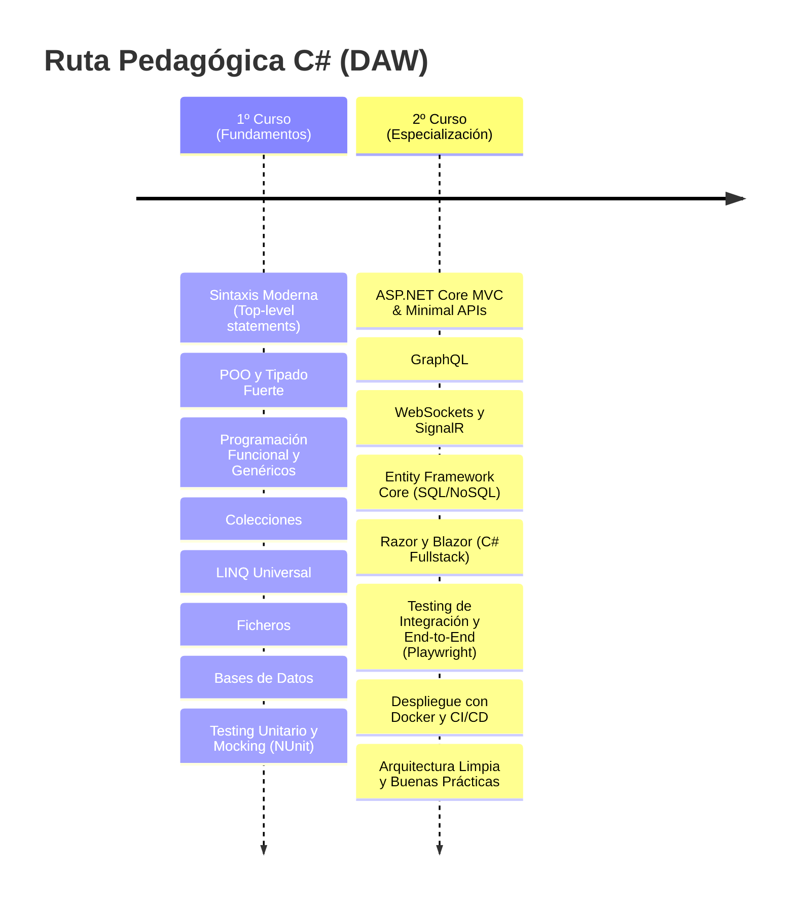
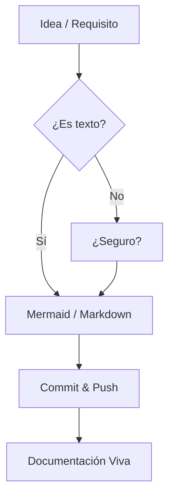

Dicen que lo único constante es el cambio, y en nuestro sector, esa máxima se cumple a rajatabla. Si 2025 fue el año de la transición y el regreso a ciertos pilares, este 2026 es el año de la consolidación. He ajustado piezas, he sustituido herramientas que se habían vuelto pesadas y he buscado, por encima de todo, la fluidez. Tanto en el aula como en mi tiempo libre.

Hoy quiero compartir con vosotros cómo ha quedado mi setup para este año. No es solo una lista de "cacharros", es una declaración de intenciones sobre cómo entiendo el desarrollo y la docencia hoy.

<!-- more -->

## El dilema del docente: De Kotlin a C# por responsabilidad

Si me seguís de hace tiempo, sabéis que Kotlin ha sido mi ojito derecho. Es un lenguaje magistral, elegante y moderno. Sin embargo, como profesor de DAM y DAW, mi prioridad no pueden ser mis gustos personales, sino la **formación integral y la empleabilidad** de mis alumnos.

Con la llegada de las **FFE (Formación en Empresa)** en primero, me topé con una realidad de mercado: en España, mucha gente aún desconoce el poder multiplataforma de Kotlin y lo encasillan únicamente en el desarrollo móvil (Android). En cambio, **C# y .NET** son el estándar de la industria, ofreciendo una robustez y una demanda que no podíamos ignorar. 

Kotlin a nivel docente es una maravilla y se ha demostrado que es un lenguaje que los alumnos aprenden con facilidad y ayuda a mejorar la transición a otros lenguajes. Sin embargo, la realidad es que el mercado laboral sigue siendo un factor decisivo, y C# ofrece una puerta de entrada a un ecosistema empresarial que no podemos pasar por alto. Es decir, estamos para formar, no para gustos personales, aunque a veces nos cueste un poquito soltar lo que nos gusta.

Dicho esto, la transición ha sido sorprendentemente fluida para el alumnado. C# ha evolucionado de una manera brillante, abrazando características modernas que lo hacen sentir mucho más ligero y potente que Java. Es, hoy por hoy, el equilibrio perfecto entre la potencia industrial y la agilidad de desarrollo. De hecho, lo veo más fluido que Java y que evoluciona mucho mejor por ahora.

Para saber más, mira y referencia el artículo de C# que hice: **[«Regreso a .NET en DAW»](../2025/2025-12-31-csharpnet_docencia_daw.md)**.

### La Ruta de Aprendizaje DAW: De 0 a Fullstack con C#

Este 2026 hemos consolidado una ruta pedagógica que permite al alumno evolucionar de manera orgánica dentro del mismo ecosistema:



1. **En 1º de DAW:** Nos centramos en los fundamentos. Gracias a los *Top-level statements*, eliminamos el ruido inicial y vamos directos a la lógica. El **tipado fuerte** de C# es nuestro mejor aliado para que el alumno entienda cómo fluyen los datos sin las ambigüedades de otros lenguajes.
2. **En 2º de DAW:** Damos el salto al desarrollo web dinámico. Aquí es donde **ASP.NET Core** brilla, permitiéndonos enseñar desde APIs minimalistas hasta aplicaciones interactivas con **Blazor**, donde el alumno usa C# en el cliente y el servidor, unificando conceptos y acelerando el aprendizaje.

## El superpoder de LINQ: Más allá de las colecciones

Si algo destaca en mi stack este año es **LINQ**. A menudo se explica como una forma de filtrar listas, pero es mucho más: es un lenguaje de consulta universal.

Lo usamos para todo: desde manipular colecciones en memoria hasta realizar consultas complejas a bases de datos con **Entity Framework Core**, o incluso tratar ficheros XML/JSON. Esa capacidad de escribir consultas legibles, tipadas y potentes que funcionan igual sobre diferentes fuentes de datos es, sencillamente, la leche. LINQ no es solo para colecciones, es para **todo**, incluso para hablar directamente con las bases de datos de una manera que los alumnos entienden a la primera.

```csharp
// LINQ: Potencia y legibilidad total
var topProductos = tienda.Productos
    .Where(p => p.Activo && p.Stock > 0)
    .OrderByDescending(p => p.Ventas)
    .Take(5)
    .Select(p => new { p.Nombre, p.Precio });
```

## El ecosistema Web: ASP.NET Core y la revolución de Blazor

En 2º de DAW, el peso de **ASP.NET Core** es total. Ofrece un equilibrio perfecto entre lo automatizado y lo manual que no encontraba en otros sitios. Complementa perfectamente lo que vemos en SpringBoot, pero con un toque más integrado.

Su modularidad y su enfoque en la productividad hacen que sea un placer enseñar y aprender: desde crear APIs RESTful, GraphQL, Websockets con SignalR, hasta construir interfaces interactivas con Razor y Blazor.

La gran revolución ha sido **Razor** (por su tipado fuerte frente a la flexibilidad de motores como el de Laravel, las vistas en SpringBoot) y, sobre todo, **Blazor**. Poder usar C# en el cliente para ciertos aspectos de interactividad sin salir del lenguaje es mágico.


## El IDE: JetBrains Rider como centro de mando

Seguimos en Jetbrains. Los mejores IDEs. Mismo corazón, distinto lenguaje. Aunque IntelliJ siempre ha sido mi casa, este año paso mucho más tiempo en **Rider**. No es solo por su integración con .NET, sino por las ventajas que aporta al flujo de trabajo:

- **Análisis estático brutal:** Te avisa de posibles errores o mejoras antes incluso de compilar.
- **Refactorización segura:** Mover lógica entre clases o cambiar firmas de métodos es casi quirúrgico.
- **El depurador de LINQ:** Poder visualizar gráficamente los resultados intermedios de una consulta es una herramienta docente imbatible. El alumno ve, literalmente, cómo se transforman los datos paso a paso. Es ver la magia en directo.

Además de eso, Rider vuela. Es mucho más ligero en la gestión de proyectos grandes y su integración con Docker y las bases de datos (Datagrip vive dentro de él) hace que no tenga que salir del IDE para casi nada.


## Documentación y Diseño: Mermaid como estándar

He abandonado las herramientas de dibujo pesado. En 2026, si no se puede versionar en Git, no me interesa. **Mermaid** se ha convertido en mi herramienta de referencia para diagramas. 

¿Por qué? Porque es texto. Es fácil de editar, fácil de visualizar y se integra de maravilla en este blog y en mis materiales de clase. 



## APIs sin fricción: De Postman a Bruno

He pasado a **Bruno** para todo lo relacionado con el testeo de APIs. Es ligero, de código abierto y sus colecciones son simples archivos en disco que puedo versionar en Git junto al proyecto. Sin nubes obligatorias ni registros innecesarios.

Además, su interfaz es tan limpia que hace que el proceso de testeo sea mucho más fluido, especialmente para los alumnos que están empezando a entender cómo funcionan las APIs REST. Es una herramienta que se integra perfectamente en el flujo de trabajo sin añadir complejidad. Su CLI también es un plus para automatizar pruebas o integrarlo en scripts de desarrollo. De hecho, lo uso para probar APIs y generar documentación de mis APIs directamente desde el código, lo que es un win total en términos de mantenimiento y claridad.


## Playwright: El nuevo estándar para testing de aplicaciones web

En el ámbito del testing, he dado el salto a **Playwright** desde Cypress para las pruebas de integración y end-to-end. Es una herramienta que ha revolucionado la forma en que abordamos el testing de aplicaciones web, ofreciendo una experiencia mucho más fluida y potente que otras opciones como Selenium o Cypress. Playwright es compatible con múltiples navegadores (Chromium, Firefox y WebKit) y permite escribir pruebas en varios lenguajes, incluido C#, lo que lo hace ideal para nuestro stack. Además, su capacidad para manejar escenarios complejos de interacción con la interfaz de usuario y su integración con herramientas de CI/CD lo convierten en una opción imprescindible para garantizar la calidad de nuestras aplicaciones web.


## Warp: La terminal inteligente que me ha ganado

Este año también he cambiado mi terminal por **Warp**. Es una terminal basada en GPU que incluye IA nativa para ayudarte con los comandos. Lo que más me gusta es cómo organiza la salida de los comandos en "bloques", permitiéndote copiar la salida de un comando o compartirlo de manera súper sencilla. Para dar clase es una maravilla, porque los alumnos ven claramente dónde empieza y termina cada ejecución. ¡Se acabó el scroll infinito buscando el principio de un log!

Me ha encantado su enfoque en la productividad desde ver los repositorios, control de versiones, hasta la integración con herramientas de desarrollo. Es una terminal que no solo es rápida, sino que también te ayuda a ser más eficiente con sus sugerencias inteligentes. Para alguien que pasa tanto tiempo en la terminal, es un cambio de juego total.


## Ecosistema IA: De Copilot a NotebookLM

La IA sigue siendo un pilar fundamental en mi día a día, pero su uso ha evolucionado. **GitHub Copilot** sigue siendo el estándar en el editor, pero este año la gran sorpresa ha sido **NotebookLM**.

Para el alumnado, **NotebookLM** se ha convertido en una herramienta de estudio revolucionaria. Les permite subir mis apuntes o el código de los proyectos y generar resúmenes, guías de estudio o incluso podcasts explicativos. Es una manera increíble de profundizar en los conceptos complejos de .NET o arquitecturas limpias de forma personalizada.

Además, he volcado mucho esfuerzo en mi **[canal de YouTube](https://www.youtube.com/@joseluisgs)**. He ido subiendo nuevos vídeos donde explico paso a paso todo este nuevo stack, desde cómo configurar Rider hasta el despliegue con Docker, integrando siempre consejos sobre cómo usar la IA de manera ética y productiva en el aula.

## Los clásicos que no fallan

Hay cosas que no cambian porque funcionan demasiado bien:
- **Docker:** El estándar para aislar entornos. No se entiende el despliegue moderno sin contenedores.
- **GitHub & Git:** Mi segunda casa y la de mis alumnos. Si no está en GitHub, no existe.
- **GitKraken:** Sigue siendo mi superpoder para visualizar ramas cuando la cosa se pone fea. Un clásico que nunca falta en mi barra de tareas.
- **VS Code:** Para proyectos rápidos o cuando quiero algo más ligero, sigue siendo mi editor de cabecera. 

::: info ¿Has visto la nueva web?
Hablando de web, este año hemos actualizado el sitio a la **Versión 2.0**. VuePress 2, Vite y una arquitectura Jamstack/SSR que vuela. Tienes todos los detalles técnicos en **[este post](2026-04-20-nueva_version_web.md)**.
:::

---

## No todo es código: El equilibrio entre trabajo y vida personal

El descanso y los hobbies son los que mantienen el cerebro fresco y seguir aprendiendo con ganas. Este año he hecho algunos cambios en mi setup personal, que eso también es importante.

### Tenis: El azul como identidad
El tenis es mi gran pasión. No es solo un deporte; es foco, estrategia y superación. Mi raqueta **Yonex Ezone 2025** no solo me da un toque más mullido y cómodo en la pista, sino que sus azules vibrantes han marcado mi identidad visual. Ese azul que ya asomaba en 2025 ha dado el salto definitivo este 2026, convirtiéndose en el color de acento de mi nueva web.

Yo creo que el tenis y la programación tienen mucho en común: ambos requieren práctica constante, análisis de patrones y una mentalidad de mejora continua. Además, el deporte me ayuda a desconectar y a mantener la mente ágil para afrontar los retos del desarrollo y la docencia con energía renovada.

El cambio no ha sido muy drástico en cuanto a modelo, porque yo usaba una Yonex Ezone 2022. Pero como sabéis, mis raquetas son **personalizadas** a medida: peso, balance e inercia ajustados para que se sientan como una extensión de mi brazo. La versión 2025 es más cómoda, más "mullida", lo que mi codo agradece después de horas pegando palos.

Este azul Yonex no es solo una elección estética para la pista. Es un color que transmite energía y precisión, y por eso decidí que debía ser el hilo conductor de mi presencia digital en 2026. Al final, tu setup es una extensión de tu personalidad, y el tenis es una parte fundamental de la mía.


### Música: La guitarra y el Quad Cortex
Cuando no estoy frente a la pantalla, suelo estar con una guitarra entre las manos. Me encanta la guitarra y la tecnología que la rodea. He sustituido el Kemper por el **Neural DSP Quad Cortex Mini**. 

¡Qué barbaridad de bicho! Es increíble tener tanta potencia en un formato tan compacto. Soy de pantallas táctiles para editar rápidamente y este cacharro te deja hacerlo con una fluidez que aburre. He podido clonar mi equipo real o usar lo que ya hay en su nube, aparte de sus propias capturas y modelados, que son crema pura. Si te descuidas, suena mejor que el amplificador real.

La capacidad de procesamiento de este Quad Cortex Mini es absurda para su tamaño. Puedes encadenar amplificadores, efectos y capturas sin que el sistema pestañee. Para un apasionado de la guitarra y la tecnología como yo, es el juguete definitivo.

La facilidad para crear "scenes" y cambiar entre ellas con un simple toque hace que centrarse en tocar sea lo único importante. Es como tener un estudio de grabación profesional que cabe en la funda de la guitarra. ¡Una auténtica locura tecnológica!


### Gaming: Nintendo Switch 2
La **Switch 2** es mi compañera ideal para esos ratos de desconexión total. Se nota el salto de potencia, y para los que viajamos o aprovechamos huecos entre clases, es una bendición. Es como pasar de un HDD a un SSD, ¡una vez que lo pruebas no puedes volver atrás!

Mejores gráficos. La portabilidad sigue siendo el punto fuerte. Es el dispositivo perfecto para "limpiar el caché" mental después de una jornada intensa de depuración de código o de corregir prácticas de alumnos. Además, la retrocompatibilidad me permite seguir disfrutando de mi biblioteca anterior, pero con tiempos de carga que parecen cosa de magia. De hecho, es lo que suelo usar cuando viajo; la PlayStation 5 se ha quedado en casa para esos momentos de gaming más "serio", porque además es demasiado grande y pesada para llevarla de un lado a otro.


::: info Mario Kart 🚗
Lo mejor esta siendo las partidas de Mario Kart en compañía. ¡Lo mejor siempre es compartirlo y con quien lo haces! 🐥😏
:::

Por cierto, nunca juego en el ordenador (ya paso bastante tiempo en él), salvo ahora con el port de **The Legend of Zelda: Twilight Princess** que han hecho para Windows. Es una maravilla poder jugar a este título de nuevo con gráficos mejorados. ¡Nintendo a qué esperas para hacerlo tú oficialmente!


---

## Conclusión

El 2026 está siendo un año de simplificación, potencia y, sobre todo, de **responsabilidad docente**. Elegir C# ha sido una decisión estratégica para mis alumnos, pero volver a este ecosistema me ha recordado por qué .NET sigue siendo un pilar tecnológico mundial.

Como decía aquella mítica canción de Metal Gear...

> **"The Best Is Yet To Come"**

La vida avanza, la tecnología evoluciona, y aquí seguiremos, adaptándonos y disfrutando de cada commit. Por cierto, ahora bebo más cerveza sin alcohol :)

---

### ¿Y tú?
*¿Cómo ha evolucionado tu setup este año? ¿Has sentido esa necesidad de simplificar o de adaptarte a nuevos estándares?* 
