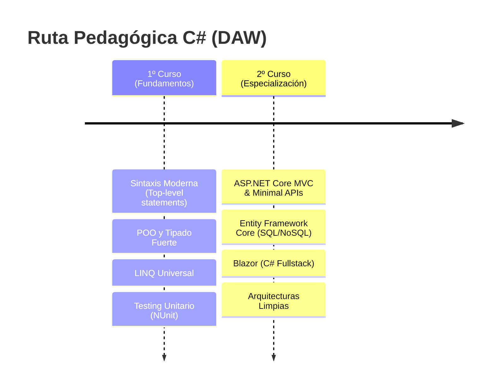

Dicen que lo único constante es el cambio, y en nuestro sector, esa máxima se cumple a rajatabla. Si 2025 fue el año de la transición y el regreso a ciertos pilares, este 2026 es el año de la consolidación. He ajustado piezas, he sustituido herramientas que se habían vuelto pesadas y he buscado, por encima de todo, la fluidez. Tanto en el aula como en mi tiempo libre.

Hoy quiero compartir con vosotros cómo ha quedado mi setup para este año. No es solo una lista de "cacharros", es una declaración de intenciones sobre cómo entiendo el desarrollo y la docencia hoy.

<!-- more -->

## El dilema del docente: De Kotlin a C# por responsabilidad

Si me seguís de hace tiempo, sabéis que Kotlin ha sido mi ojito derecho. Es un lenguaje magistral, elegante y moderno. Sin embargo, como profesor de desarrollo, mi prioridad no pueden ser mis gustos personales, sino la **formación integral y la empleabilidad** de mis alumnos.

Con la llegada de las **FFE (Formación en Empresa)** en primero, me topé con una realidad de mercado: en España, mucha gente aún desconoce el poder multiplataforma de Kotlin y lo encasillan únicamente en el desarrollo móvil (Android). En cambio, **C# y .NET** son uno de los estándares de la industria, ofreciendo una robustez y una demanda que no podíamos ignorar.

Kotlin a nivel docente es una maravilla y se ha demostrado que es un lenguaje que los alumnos aprenden con facilidad y ayuda a mejorar la transición a otros lenguajes. Sin embargo, la realidad es que el mercado laboral sigue siendo un factor decisivo, y C# ofrece una puerta de entrada a un ecosistema empresarial que no podemos pasar por alto.

Dicho esto, la transición ha sido sorprendentemente fluida para el alumnado. C# ha evolucionado de una manera brillante, abrazando características modernas que lo hacen sentir mucho más ligero y potente que Java a nivel multiparadigma. Es, hoy por hoy, el equilibrio perfecto entre la potencia industrial y la agilidad de desarrollo.

### La Ruta de Aprendizaje DAW: De 0 a Fullstack con C#

Este 2026 hemos consolidado una ruta pedagógica que permite al alumno evolucionar de manera orgánica dentro del mismo ecosistema:



1. **En 1º de DAW:** Nos centramos en los fundamentos. Gracias a los *Top-level statements*, eliminamos el ruido inicial y vamos directos a la lógica. El **tipado fuerte** de C# es nuestro mejor aliado para que el alumno entienda cómo fluyen los datos sin las ambigüedades de otros lenguajes.
2. **En 2º de DAW:** Damos el salto al desarrollo web dinámico. Aquí es donde **ASP.NET Core** brilla, permitiéndonos enseñar desde APIs minimalistas hasta aplicaciones interactivas con **Blazor**, donde el alumno usa C# en el cliente y el servidor, unificando conceptos y acelerando el aprendizaje.

## El superpoder de LINQ: Más allá de las colecciones

Si algo destaca en mi stack este año es **LINQ**. A menudo se explica como una forma de filtrar listas, pero es mucho más: es un lenguaje de consulta universal.

Lo usamos para todo: desde manipular colecciones en memoria hasta realizar consultas complejas a bases de datos con **Entity Framework Core**, o incluso tratar ficheros XML/JSON. Esa capacidad de escribir consultas legibles, tipadas y potentes que funcionan igual sobre diferentes fuentes de datos es, sencillamente, la leche.

```csharp
// LINQ: Potencia y legibilidad total
var topProductos = tienda.Productos
    .Where(p => p.Activo && p.Stock > 0)
    .OrderByDescending(p => p.Ventas)
    .Take(5)
    .Select(p => new { p.Nombre, p.Precio });
```

## El IDE: JetBrains Rider como centro de mando

Seguimos en Jetbrains. Los mejores IDEs. Mismo corazón, distinto lenguaje. Aunque IntelliJ siempre ha sido mi casa, este año paso mucho más tiempo en **Rider**. No es solo por su integración con .NET, sino por las ventajas que aporta al flujo de trabajo:

- **Análisis estático brutal:** Te avisa de posibles errores o mejoras antes incluso de compilar.
- **Refactorización segura:** Mover lógica entre clases o cambiar firmas de métodos es casi quirúrgico.
- **El depurador de LINQ:** Poder visualizar gráficamente los resultados intermedios de una consulta es una herramienta docente imbatible. El alumno ve, literalmente, cómo se transforman los datos paso a paso.


## APIs sin fricción: De Postman a Bruno

He pasado a **Bruno** para todo lo relacionado con el testeo de APIs. Es ligero, de código abierto y sus colecciones son simples archivos en disco que puedo versionar en Git junto al proyecto. Sin nubes obligatorias ni registros innecesarios.

Además, su interfaz es tan limpia que hace que el proceso de testeo sea mucho más fluido, especialmente para los alumnos que están empezando a entender cómo funcionan las APIs REST. Es una herramienta que se integra perfectamente en el flujo de trabajo sin añadir complejidad. Su CLI también es un plus para automatizar pruebas o integrarlo en scripts de desarrollo de hecho, lo uso para probar apis y generar documentación de mis APIs directamente desde el código, lo que es un win total en términos de mantenimiento y claridad.


## Playwright: El nuevo estándar para testing de aplicaciones web

En el ámbito del testing, he dado el salto a **Playwright** desde Cypress para las pruebas de integración y end-to-end. Es una herramienta que ha revolucionado la forma en que abordamos el testing de aplicaciones web, ofreciendo una experiencia mucho más fluida y potente que otras opciones como Selenium o Cypress. Playwright es compatible con múltiples navegadores (Chromium, Firefox y WebKit) y permite escribir pruebas en varios lenguajes, incluido C#, lo que lo hace ideal para nuestro stack. Además, su capacidad para manejar escenarios complejos de interacción con la interfaz de usuario y su integración con herramientas de CI/CD lo convierten en una opción imprescindible para garantizar la calidad de nuestras aplicaciones web.

---

## No todo es código: El equilibrio entre trabajo y vida personal

El descanso y los hobbies son los que mantienen el cerebro fresco y seguir aprendiendo con ganas. Este año he hecho algunos cambios en mi setup personal, que eso también es importante.

### Tenis: El azul como identidad
El tenis es mi gran pasión. No es solo un deporte; es foco, estrategia y superación. Mi raqueta **Yonex Ezone 2025** no solo me da un toque más mullido y cómodo en la pista, sino que sus azules vibrantes han marcado mi identidad visual. Ese azul que ya asomaba en 2025 ha dado el salto definitivo este 2026, convirtiéndose en el color de acento de mi nueva web.

Yo creo que el tenis y la programación tienen mucho en común: ambos requieren práctica constante, análisis de patrones y una mentalidad de mejora continua. Además, el deporte me ayuda a desconectar y a mantener la mente ágil para afrontar los retos del desarrollo y la docencia con energía renovada.

El cambio no ha sido muy drástico, porque yo usaba una Yonex Ezone 2022. Ademas, ambos modelos son personalizados a medida para mi estilo de juego, con un balance, peso e inercia ajustados a mis preferencias. La diferencia principal es que el modelo 2025 tiene una nueva tecnología de amortiguación que reduce aún más las vibraciones y el diseño del marco ha sido optimizado para ofrecer un mejor control y una mayor potencia y efecto en los golpes. Me ha venido genial para mejorar mi juego y seguir disfrutando de cada partido con la misma pasión que el primer día.


### Música: La guitarra y el Quad Cortex
Cuando no estoy frente a la pantalla, suelo estar con una guitarra entre las manos. Me encanta la guitarra y la tecnología que la rodea. He sustituido el Kemper por el **Neural DSP Quad Cortex Mini**. Es increíble tener tanta potencia en un formato tan compacto, con una pantalla táctil que me permite editar mis sonidos en segundos.


### Gaming y Estilo de Vida
La **Switch 2** es mi compañera ideal para esos ratos de desconexión total. Y como curiosidad personal, este año he hecho un cambio en mis hábitos: bebo mucho más **sin alcohol**. Se nota mucho en la energía diaria y en la claridad mental para afrontar los retos del aula.

---

## Conclusión

El 2026 está siendo un año de simplificación, potencia y, sobre todo, de **responsabilidad docente**. Elegir C# ha sido una decisión estratégica para mis alumnos, pero volver a este ecosistema me ha recordado por qué .NET sigue siendo un pilar tecnológico mundial.

Como decía aquella mítica canción de Metal Gear...

> **"The Best Is Yet To Come"**

La vida avanza, la tecnología evoluciona, y aquí seguiremos, adaptándonos y disfrutando de cada commit.

---

### ¿Y tú?
¿Cómo ha evolucionado tu setup este año? ¿Has sentido esa necesidad de simplificar o de adaptarte a nuevos estándares? ¡Hablemos en los comentarios!
