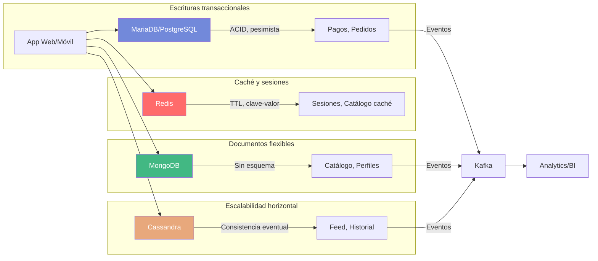
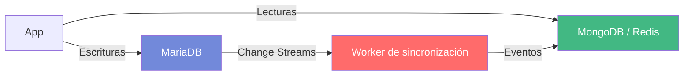

---
title: "Arquitectura de Datos: Por qué elegir mal tu base de datos puede costarte el éxito"
description: "La diferencia entre una app que funciona con 10 usuarios y una que funciona con 10 millones no es el lenguaje, es la arquitectura de datos"
date: 2026-07-20
category:
  - Blog
  - Docencia
tag:
  - Arquitectura de Datos
  - SQL
  - NoSQL
  - Redis
  - Consistencia
  - Netflix

icon: fa-solid fa-database

cover: https://i.imgur.com/fPgWTSo.jpg

comment: true
sidebar: false
footer: true
---

Quienes me seguís sabéis que mi hábitat natural es el backend: APIs, servicios, bases de datos, concurrencia. Me siento mucho más cómodo diseñando una arquitectura de microservicios que eligiendo el color perfecto de un botón. Pero hay algo que me he encontrado una y otra vez a lo largo de mi carrera, tanto en empresas como en el aula: **la arquitectura de datos es la gran olvidada**.

Todos queremos hablar del último framework de moda, del nuevo lenguaje que promete revolucionar todo, de si la consistencia es la correcta, o de qué pasa cuando tu base de datos se queda sin aire porque nadie pensó en escalarla.

Hoy quiero hablar de eso. De por qué un mal enfoque en la arquitectura de datos puede hacer fracasar un proyecto que, por lo demás, tiene todo lo demás correcto.

<!-- more -->

## Primero: ¿Qué demonios es la Arquitectura de Datos?

Antes de que te pongas nervioso con el nombre, voy a ponértelo fácil. **Arquitectura de datos** no es "elegir entre MySQL y MongoDB". Tampoco es "saber escribir consultas SQL". Es algo mucho más amplio y, francamente, más interesante.

Es la disciplina que define **cómo se recopilan, almacenan, organizan y protegen los datos** de una organización. Implica decidir:

- **Qué datos** se guardan
- **Dónde** se guardan
- **Cómo se replican** cuando hay varios servidores
- **Cuándo se cachean** para ir más rápido
- **Cómo se distribuyen** entre servicios
- **Qué garantías** ofrece cada decisión (¿es consistente en todo momento? ¿O tolera que haya un desfase de unos segundos?)

En resumen: es decidir **qué va dónde, por qué y con qué consecuencias**.

Un desarrollador que solo conoce la sintaxis de SQL escribe consultas. Un desarrollador que entiende arquitectura de datos **diseña sistemas que escalan, resisten fallos y evolucionan con el negocio**. Y créeme, eso es exactamente lo que diferencia una aplicación que funciona con 10 usuarios de una que funciona con 10 millones.

## El error que comete todo el mundo

Y aquí viene lo gordo. El error más habitual que veo es **empezar por la herramienta en lugar de por el problema**.

Es como si te dijeran "voy a construir una casa" y lo primero que hagas sea ir a comprar ladrillos, sin preguntar cuántas habitaciones necesitas, si hay riesgo de terremotos, o si el terreno es de barro o de roca. Pues eso es exactamente lo que hacemos cuando decimos "mi empresa usa MongoDB, luego yo uso MongoDB para todo".

No. No. Y no.

Cada base de datos tiene un **punto óptimo de uso** y un **punto donde empieza a fallar**. Conocer esos límites es la diferencia entre tomar una decisión informada y encontrar el cadáver en producción cuando ya es demasiado tarde para cambiar.

## Ninguna base de datos vive sola

Esta es otra de las grandes verdades que aprendes con la experiencia. En producción, **ninguna base de datos vive sola**.

Imagina un sistema real: MariaDB para la parte transaccional (pagos, pedidos), Redis para cachear consultas pesadas y gestionar sesiones, MongoDB para el catálogo de productos (porque cada producto tiene una estructura diferente), y Cassandra para el historial de reproducciones o el feed de actividad (porque escala horizontalmente sin problemas).

Todo convive. Todo se alimenta entre sí. Y si alguien te ha dicho que con una sola base de datos lo tienes todo cubierto... o miente o no ha trabajado en un sistema con tráfico de verdad.



::: tip
Ninguna de estas tecnologías vive aislada. En producción, los datos fluyen entre ellas: Redis cachéa consultas de MariaDB, MongoDB alimenta el catálogo que Cassandra replica, y Kafka recoge eventos de todas para alimentar el analítica. Si solo conoces una, estás a medias.
:::

Martin Fowler lo llama **aggregate-oriented database**: MongoDB organiza datos en agregados autocontenidos, mientras que SQL normaliza en tablas relacionales. Ambos enfoques son válidos. La clave es saber **cuándo usar cada uno**.

### Por qué separar lecturas de escrituras

Uno de los patrones que más me gustan y que menos se enseña es este: **usar una base de datos para escribir y otra distinta para leer**.

Suena a locura, pero tiene todo el sentido del mundo. Piensa en una tienda online:

- **Escrituras**: Cuando un usuario compra, necesitas integridad. ACID, transacciones, consistencia fuerte. MariaDB o PostgreSQL son perfectos para esto.
- **Lecturas**: Cuando el usuario navega el catálogo, necesitas velocidad. No te importa que el precio de un producto tenga 200ms de retraso en actualizarse. MongoDB o Redis son ideales.

La gracia es que **puedes mezclar paradigmas**: la parte transaccional en SQL (normalizada, con JOINs, consistente) y la parte de lectura en NoSQL (desnormalizada, sin JOINs, rápida). Cada una hace lo que mejor sabe hacer.



**¿Y qué pasa cuando los datos no están sincronizados?** Pues que tienes **consistencia eventual**. Durante unos milisegundos (o a veces unos segundos), la base de datos de lectura puede tener datos "antiguos". El usuario ve un precio que acaba de cambiar pero que aún no se ha reflejado.

En la mayoría de los casos, eso no importa. Si publicas un tweet y tus seguidores lo ven 2 segundos después, nadie muere. Pero si estás transfiriendo dinero, eso es inaceptable. Por eso separamos: lo crítico va a SQL, lo que puede tolerar un desfase va a NoSQL.

::: tip
Este patrón se llama **CQRS (Command Query Responsibility Segregation)**. Suena complicado, pero la idea es simple: separar las operaciones de escritura (commands) de las de lectura (queries). Cada una usa la herramienta que mejor se le da.
:::

Slack hace exactamente esto: las escrituras van a una base de datos transaccional, pero las lecturas (buscar mensajes, scroll infinito) se sirven de una réplica optimizada para consultas. Los Change Streams mantienen ambas sincronizadas con latencia de milisegundos.

## Los tres dilemas que debes conocer

### SQL vs NoSQL: No es cuál es mejor, sino cuál encaja

Vamos a ponernos prácticos. Imagina que tienes un sistema de ventas con clientes, pedidos, líneas de pedido y productos.

En **SQL** (MariaDB, PostgreSQL), lo modelarías con tablas normalizadas:

```sql
SELECT c.nombre, p.producto, l.cantidad
FROM clientes c
JOIN pedidos pe ON c.id = pe.cliente_id
JOIN lineas_pedido l ON pe.id = l.pedido_id
JOIN productos p ON l.producto_id = p.id
WHERE pe.fecha > '2026-01-01'
```

Tres JOINs. Integridad referencial. Transacciones ACID. Perfecto para pagos donde necesitas que todo sea consistente.

En **MongoDB**, el mismo problema se modelaría como un documento embebido:

```json
{
  "cliente": "Juan García",
  "pedido": {
    "fecha": "2026-07-15",
    "lineas": [
      { "producto": "Portátil ASUS", "cantidad": 1, "precio": 899 },
      { "producto": "Ratón Logitech", "cantidad": 2, "precio": 35 }
    ]
  }
}
```

Un documento. Sin JOINs. Rápido para leer. Pero cuidado: MongoDB tiene un límite de **16 MB por documento**. Si tu diseño es malo y embebes todo sin pensarlo, te vas a encontrar con sorpresas desagradables cuando tu catálogo crezca.

No hay una respuesta correcta universal. Hay una respuesta correcta **para tu caso de uso**.

### Consistencia vs Disponibilidad: El teorema CAP

Este es el que más cuesta de interiorizar, pero es fundamental.

En 2000, Eric Brewer formuló el **Teorema CAP**: en un sistema distribuido, solo puedes elegir dos entre:

- **Consistencia (C)**: Todos los nodos ven los mismos datos al mismo tiempo
- **Disponibilidad (A)**: El sistema siempre responde (aunque sea con datos "antiguos")
- **Tolerancia a partición (P)**: El sistema funciona aunque haya un corte de red entre nodos

En la práctica, siempre eliges tolerancia a partición (porque las redes fallan), así que la elección real es entre **consistencia fuerte** y **disponibilidad máxima**.

¿Y cómo se ve esto en el mundo real? Pues así:

Cuando publicas un tweet, tus seguidores no lo ven al instante en todos los dispositivos. En unos segundos se propaga. Eso es **consistencia eventual**: los datos acaban siendo iguales en todos los nodos, pero no inmediatamente.

Amazon, Instagram y Twitter operan así. Werner Vogels, CTO de Amazon, publicó en 2008 el artículo de referencia explicando por qué Dynamo usa consistencia eventual: en un catálogo de millones de productos, la disponibilidad (que el usuario pueda comprar) pesa más que la consistencia inmediata (que el precio refleje el último cambio en todos los dispositivos al mismo tiempo).

Cassandra te permite **configurar** el nivel de consistencia: ONE (máximo rendimiento, mínima consistencia), QUORUM (equilibrio) o ALL (máxima consistencia, menor rendimiento). Tú decides cuál necesitas en cada momento.

### Los IDs: Quién genera la clave primaria

Este es un tema que parece sencillo y es un **nido de problemas** cuando tu sistema crece.

Si usas `AUTO_INCREMENT` en MySQL, estás asumiendo que hay un solo nodo que genera los IDs. Funciona perfecto... hasta que necesitas escalar a múltiples servidores. Ahí el bloqueo `AUTO-INC` se convierte en un cuello de botella que serializa todos los inserts.

¿La solución? Hay varias, y cada una tiene su punto:

| Tecnología | Ordenable | Tamaño | Coordinación | Cuándo usarla |
|------------|-----------|--------|--------------|---------------|
| AUTO_INCREMENT | Sí | 4-8 bytes | Centralizada (cuello de botella) | Single-node, sin escalado |
| Snowflake | Sí (timestamp) | 8 bytes | Worker ID al arrancar | Sistemas distribuidos, alta escritura |
| UUID v4 | No | 16 bytes | Ninguna | IDs anónimos, sin orden necesario |
| UUID v7 | Sí (timestamp) | 16 bytes | Ninguna | Necesitas orden temporal |
| ULID | Sí (timestamp) | 16 bytes | Ninguna | Alternativa legible a UUID v7 |

**Discord** usa Snowflake para millones de IDs al día. Cada mensaje tiene un ID de 64 bits que contiene timestamp, worker ID y secuencia. Se genera localmente en cada servidor sin necesidad de consultar una base de datos central. Un UUID v4 aleatorio no serviría porque no es ordenable: no podrías paginar un historial de mensajes.

**YouTube** usa un enfoque diferente: cada vídeo tiene un ID de 11 caracteres que combina un contador incremental con bits aleatorios. Los IDs antiguos eran secuenciales, lo que permitía adivinar vídeos no publicados y generar votos fraudulentos. YouTube migró a IDs pseudoaleatorios que no siguen un patrón predecible.

Cuando un alumno busca un vídeo por URL, está usando un ID distribuido sin saberlo.

## La concurrencia: Optimista, pesimista o muerte

Aquí es donde las cosas se ponen interesantes. Y donde más errores veo en desarrollo.

Imagina que 500 personas están intentando comprar la última entrada para un concierto al mismo tiempo. ¿Qué pasa?

Hay tres enfoques para manejar esto:

**Pesimista**: Bloqueas el dato antes de tocarlo. `SELECT FOR UPDATE` en SQL. Nadie más puede tocar ese registro hasta que tú termines. Es seguro pero lento: si tienes 100 usuarios concurrentes, el rendimiento se desploma.

**Optimista**: No bloqueas nada. Dejas que todos lean y escriban, y al final compruebas si alguien modificó el dato mientras tú lo estabas tratando. Si hay conflicto, error y reintento. Es rápido pero requiere manejar colisiones.

**Mixto**: Usas lo mejor de cada mundo. Por ejemplo, un UPDATE atómico con `WHERE stock >= 1` que decrementa el stock solo si hay suficiente. Sin bloqueo previo, con validación atómica.

¿Y en el mundo real quién usa cada uno?

- **Ticketmaster** usa optimista: 500.000 personas seleccionan asientos sin bloqueo y el sistema valida al comprar. Si alguien lo compró antes, recibes un error (409 Conflict).
- **Los bancos** usan pesimista: `SELECT FOR UPDATE` sobre saldos para evitar sobregiros en transferencias SEPA/Bizum.
- **Wallapop y eBay** usan mixto: UPDATE atómico con `WHERE stock >= 1` en el momento del pago.

::: warning
El error más común es usar pesimista para todo por "prudencia". Con 100 usuarios concurrentes, tu sistema se convierte en un cuello de botella: todo espera a que todo el mundo termine. El optimista y el mixto existen por algo. Úsalos.
:::

Si el alumno ha vivido estas experiencias como usuario, ahora entiende qué hay detrás.

## Casos reales que lo demuestran

Si todavía no te lo terminas de creer, mira lo que hacen las grandes:

**Netflix** opera con al menos 5 tecnologías de datos:
- **MySQL** para pagos y facturación (ACID, pesimista)
- **Cassandra** para catálogo, perfiles e historial de reproducción (consistencia eventual, multi-región)
- **Redis/EVCache** para sesiones y recomendaciones (clave-valor, TTL)
- **Kafka** para eventos de reproducción en tiempo real
- **Spark/S3/Iceberg** para analítica batch (Top 10, horas vistas)

Cada tecnología resuelve un problema específico. No hay una base de datos que haga todo.

El problema más fascinante de Netflix es la **geolocalización de datos**. Las licencias de contenido se negocian por región: una serie puede estar completa en España pero solo tener 3 temporadas en Japón. Cada país tiene su propia vista del catálogo. El contenido audiovisual se sirve desde Open Connect CDN (más de 1000 ubicaciones en ISPs). Todo conecta fragmentación, réplica, consistencia y caché en un solo caso de uso.

**Discord** genera millones de IDs Snowflake al día. Cada mensaje tiene un ID de 64 bits que contiene timestamp, worker ID y secuencia. El worker ID permite depurar: si un servidor genera más IDs que otros, hay desbalance.

**Slack** usa CQRS para su chat: las escrituras van a una base de datos transaccional, pero las lecturas (buscar mensajes, scroll infinito) se sirven de una réplica optimizada para consultas. Los Change Streams mantienen ambas sincronizadas con latencia de milisegundos.

## La pregunta que debes hacerte antes de diseñar

Antes de escribir una sola línea de código, antes de elegir una base de datos, antes de diseñar un esquema, hazte estas preguntas:

1. **¿Qué tipo de consulta dominan?** ¿Lecturas o escrituras? Si tu app es mayoritariamente de lectura (como un catálogo), quizás necesites algo optimizado para eso. Si es de escritura (como un sistema de logs), la cosa cambia.

2. **¿Necesita consistencia fuerte o puede tolerar eventual?** Un banco necesita consistencia fuerte. Un feed de redes sociales puede tolerar un desfase de unos segundos.

3. **¿Escalabilidad horizontal o integridad de datos?** Si necesitas escalar a múltiples servidores y regiones, quizás necesites algo distribuido como Cassandra. Si la integridad es lo primero, SQL sigue siendo tu mejor aliado.

4. **¿Cuánta latencia puede tolerar el usuario?** Un usuario que compra en una tienda online no puede esperar 3 segundos a que se confirme el stock. Un usuario que mira un feed puede tolerar que el último like aparezca un segundo después.

No hay respuestas correctas universales. Hay respuestas correctas **para tu problema**.

::: tip
Si no sabes cuál es tu caso de uso, empieza por lo más simple. No necesitas Cassandra para una app con 100 usuarios. SQL con Redis de caché suele ser más que suficiente para empezar. Ya escalarás cuando lo necesites de verdad, no antes.
:::

## Reflexión final: La arquitectura como cimiento

Al principio decía que la arquitectura de datos es la gran olvidada. Y lo es. Porque no es vistosa. No sale en las tendencias de Twitter. Nadie hace un hilo viral hablando sobre niveles de consistencia en Cassandra.

Pero es **lo que sostiene todo lo demás**.

Un código sin arquitectura es como una casa sin cimientos: aguanta mientras hay pocos habitantes, pero se derrumba cuando llega la tormenta. Y en software, la tormenta siempre llega. El Black Friday, el pico de tráfico, el éxito inesperado de tu producto... ahí es donde la arquitectura de datos marca la diferencia entre escalar con éxito o colapsar espectacularmente.

Un alumno que entiende por qué Amazon usa `SELECT FOR UPDATE` en el pago pero `UPDATE` atómico en el carrito no solo sabe concurrencia: sabe arquitectura de datos. Un profesional que ha desplegado MongoDB en Docker, lo ha conectado con DataGrip y ha visto cómo Netflix usa la misma tecnología que acaba de aprender, se va con una visión de ecosistema, no de herramientas aisladas.

El valor real está en las **conexiones**. IDs distribuidos alimentan la consistencia eventual, que alimenta el caché en Redis, que alimenta la concurrencia. Todo está relacionado. Todo se sostiene entre sí. Y la habilidad no es memorizar sintaxis, sino saber qué buscar cuando aparece un problema nuevo.

Porque al final, arquitectura de datos no es memorizar sintaxis de cuatro bases de datos. Es saber **por qué** cada una existe, **cuándo** aporta valor y **dónde** empieza a ser un obstáculo.

Y todo esto, no se aprende en un fin de semana. Se aprende construyendo, equivocándose y, sobre todo, pensando antes de actuar.

---

*¿Y tú? ¿En qué punto de tu proyecto estás ahora? ¿Estás construyendo cimientos o ya estás pegando paredes sin saber si el terreno aguantará? Cuéntamelo en los comentarios.*
