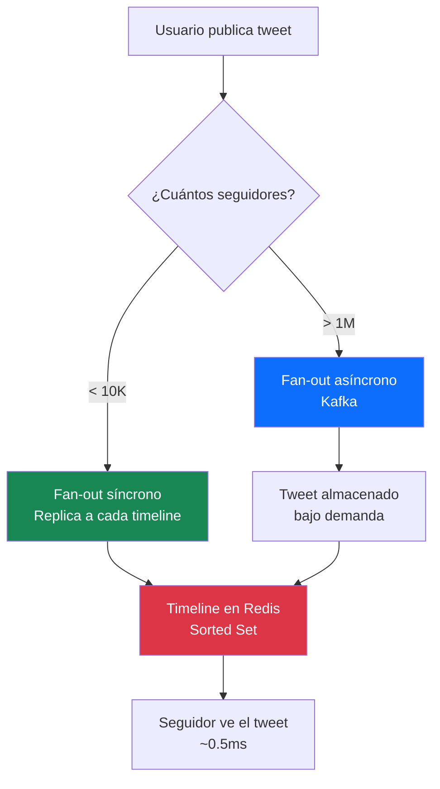
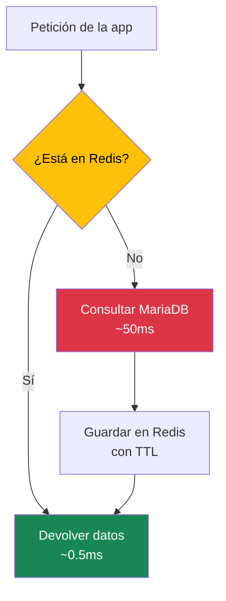
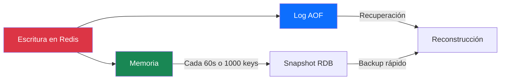

Tu servidor responde en 50 milisegundos. Tu usuario no notará la diferencia, ¿verdad?

Pues resulta que sí. Cada 100ms de latencia extra en Amazon cuesta un 1% de ventas. Un segundo de retraso en Google reduce las búsquedas en un 20%. Y si tu aplicación tarda más de 3 segundos en cargar, el 53% de los usuarios abandonan.

El problema no es tu código. No es tu base de datos. Es que estás consultando algo que podrías tener guardado a un paso.

Ahí es donde entra Redis.

<!-- more -->

## ¿Qué es Redis?

Redis es un almacén de datos en memoria. Eso es todo. No es una base de datos relacional, no es un sustituto de MariaDB, no es un sistema de archivos. Es una caja rápida donde guardar cosas que necesitas leer deprisa.

La diferencia con una base de datos tradicional es brutal: Redis opera en milisegundos cuando MariaDB opera en decenas de milisegundos. No es mejor ni peor. Es otra cosa. Y cuando entiendes esa diferencia, empiezas a ver problemas que no sabías que tenías.

| Operación | MariaDB (disco) | Redis (memoria) |
|-----------|----------------|-----------------|
| Lectura simple | 5-50ms | 0.1-1ms |
| Operaciones por segundo | 1.000-10.000 | 100.000-1.000.000 |
| Latencia p99 | 50-200ms | < 1ms |

Redis no guarda solo cadenas de texto. Tiene estructuras pensadas para problemas concretos: hashes para perfiles, listas para colas, conjuntos para tags, y sorted sets para rankings en tiempo real. Cada estructura es una herramienta distinta.

Pero lo verdaderamente interesante no es qué es Redis. Es lo que hace.

## Twitter: 100 millones de comandos por segundo

Twitter tiene uno de los mayores clusters Redis del mundo. Procesa entre 40 y 100 millones de comandos por segundo. Para que te hagas una idea, eso es como si cada persona en España hiciera una consulta a Redis cada dos segundos, sin parar.

¿Para qué usa Twitter Redis? Para las timelines.

Cada usuario tiene su timeline cacheada como un Sorted Set con los 800 posts más recientes. Cuando abres Twitter y haces scroll, no estás consultando una base de datos. Estás leyendo de Redis. Un `ZREVRANGE` te da los últimos 800 posts ordenados en milisegundos.

| Métrica | Valor |
|---------|-------|
| Timeline updates/día | 30 billion |
| Commands/segundo | 40M - 100M |
| IDs de timeline por usuario | 800 (máximo) |
| Factor de replicación | 3x (tolerancia a fallos) |

Cuando alguien twittea, ese post se replica a la timeline de todos sus seguidores. El proceso se llama **fan-out on write**: cuando publicas, tu tweet se escribe en la timeline de cada seguidor. Si tienes 500 seguidores, se escriben 500 copias. Es como si repartieras una hoja impresa a cada alumno de tu clase. Si la clase tiene 30 alumnos, no hay problema. Pero si tienes 10 millones de seguidores... ¿cómo repartes 10 millones de copias en menos de un segundo?



Twitter resuelve esto con un enfoque híbrido. Los usuarios normales (<10.000 seguidores) usan fan-out síncrono: el tweet se replica al instante a todas las timelines. Las celebridades (>1 millón de seguidores) usan fan-out asíncrono con Kafka: el tweet se almacena en un lado y se lee bajo demanda cuando el seguidor abre Twitter. No se replica a todas las timelines; se calcula en tiempo de lectura.

Para gestionar miles de instancias Redis, Twitter creó **Twemproxy**, un proxy que gestiona el sharding desde el cliente. El cliente no necesita saber en qué nodo está cada clave. Twemproxy lo calcula por él. La desventaja es que es un punto único de fallo, pero Twitter lo mitiga con replicación y failover automático.

Los usuarios inactivos (más de 30 días sin login) pierden su timeline de Redis. Twitter no puede mantener terabytes de RAM para usuarios que no vuelven. Cuando un usuario inactivo vuelve, su timeline se reconstruye desde la base de datos principal, lo cual puede tardar unos segundos.

El cálculo es simple: 16KB por timeline × cientos de millones de usuarios = terabytes de RAM. Pero la alternativa (consultar la base de datos en cada lectura) haría Twitter inutilizable.

::: warning
Si Twitter tuviera que consultar MySQL en cada scroll de timeline, la red estaría saturada. Redis resuelve esto guardando los datos más accedidos en memoria, donde el acceso es 100 veces más rápido.
:::

## Instagram: Stories que desaparecen solas

Instagram guarda las Stories con un TTL de 24 horas. Cuando publicas una Story, Redis ejecuta un `EXPIREAT` con la marca de tiempo actual más 86.400 segundos. Pasado ese tiempo, la Story desaparece de Redis automáticamente. No hay que borrar nada manualmente. No hay que ejecutar scripts de limpieza. Redis lo hace solo.

Los likes se gestionan con contadores atómicos. Cada like ejecuta un `INCR` en Redis, que es instantáneo. La persistencia en Cassandra ocurre de forma asíncrona. Si Redis cae un segundo, no pasa nada: el like se registra en memoria y se sincroniza después.

| Operación | Qué hace Redis | Frecuencia |
|-----------|----------------|------------|
| Like | Contador atómico con `INCR` | ~1M/día |
| Story view | Registro único con HyperLogLog | ~500M/día |
| Hashtag trending | Ranking ordenado con Sorted Set | ~100M/día |

Lo fascinante es el caso de los hashtags trending. Instagram mantiene un Sorted Set por cada hashtag. Cuando publicas una foto con #sunset, Redis ordena tu foto por timestamp dentro de ese hashtag. Cuando alguien busca #sunset, Instagram ejecuta un `ZREVRANGE` y obtiene las fotos más recientes en milisegundos. Con millones de fotos publicadas al día, esto sería imposible sin Redis.

Lo más impresionante es cómo Instagram cuenta las vistas de Stories. ¿500 millones de vistas al día? HyperLogLog usa solo ~12KB de memoria para contar elementos únicos con un error del 0.81%. Si 10 millones de personas ven tu Story, HyperLogLog te dirá que fueron 9.919.000. Una diferencia de 81.000 usuarios que a nadie importa, pero que ahorra terabytes de almacenamiento.

Instagram usa un enfoque híbrido para el feed, similar al de Twitter. Los usuarios normales (<100K seguidores) usan fan-out on write: las fotos se replican a las timelines de sus seguidores cuando se publican. Las celebridades (>100K seguidores) usan fan-out on read: las fotos se leen bajo demanda desde Cassandra cuando alguien abre el feed. Redis almacena los resultados como Sorted Sets con los 300 posts más recientes por usuario.

Para las Stories, Instagram usa HyperLogLog para rastrear quién ha visto cada Story sin almacenar una lista de millones de usuarios. Cuando abres una Story, Redis comprueba si tu ID está en el HyperLogLog. Si no está, cuenta como vista nueva. Es como si tuvieras una lista de asistencia que solo registra si alguien estuvo presente, pero sin guardar los nombres.

## GitHub: Rate limiting a 5.000 peticiones por hora

GitHub limita cada usuario a 5.000 peticiones por hora autenticadas. Si superas ese límite, recibes un error 403. Pero el reto no era implementar el límite. El reto era implementarlo de forma distribuida.

GitHub tiene múltiples servidores. Si cada servidor lleva su propio contador, un usuario podría hacer 5.000 peticiones por servidor. Con 10 servidores, serían 50.000 peticiones en total. El límite sería inútil.

La solución fue Redis con sharding client-side. Cada servidor sabe qué cluster Redis usar para cada usuario. Los Lua scripts garantizan atomicidad: la operación de "leer contador + incrementar + comprobar límite" ocurre de forma indivisible. Dos peticiones simultáneas nunca pueden leer el mismo valor.

```lua
-- Lua script de rate limiting de GitHub
local current = redis.call('incrby', rate_limit_key, increment_amount)
if current == increment_amount then
    redis.call('expireat', rate_limit_key, next_expires_at + 1)
end
return { current, expires_at }
```

La lección de GitHub es que Redis no solo sirve para caché. Es una herramienta para resolver problemas de concurrencia que otras bases de datos no resuelven tan bien.

## Netflix: La homepage que se carga antes de que la pidas

Netflix no usa Redis directamente. Usa EVCache, un sistema de caché distribuido basado en Memcached y Redis con un cliente personalizado. Pero el concepto es el mismo.

El caso más interesante es la homepage personalizada. Cada noche, Netflix calcula qué títulos mostrarte basándose en tu historial de visualización, tus valoraciones y las preferencias de usuarios similares. Ese cálculo se almacena en EVCache y se sirve desde ahí cuando abres la app.

| Caso de uso | Qué hace Redis | Beneficio |
|-------------|----------------|-----------|
| Homepage personalizada | Pre-cómputo nocturno | Carga instantánea |
| Catálogo de contenido | Caché del catálogo completo | Latencia sub-milisegundo |
| Sesiones de reproducción | Datos temporales con TTL | Limpieza automática |
| Strings de UI | Caché de textos e idiomas | Alta disponibilidad |

La alternativa sería calcular la homepage en tiempo real para cada usuario. Con millones de usuarios simultáneos, eso sería imposible. Redis permite pre-computar y servir desde caché, reduciendo las llamadas a Cassandra en un 95%.

Netflix afirma que EVCache consigue latencia sub-milisegundo para el 99% de las peticiones de catálogo. Eso significa que, de cada 100 veces que abres Netflix, 99 veces la homepage aparece antes de que puedas parpadear.

## Twitch: Cuando el chat rompe Redis

Twitch Plays Pokémon fue un experimento social donde millones de usuarios controlaban un juego de Pokémon a través del chat. El problema fue que Redis se quedó sin capacidad.

Millones de mensajes de chat por minuto. Una sola instancia Redis para todo el chat. Resultado: Redis al 100% de CPU, miles de conexiones bloqueadas, chat sin responder.

La solución fue shard por clave. Cada canal de chat apunta a una instancia Redis diferente. HAProxy balancea la carga entre particiones. Las conexiones en espera se redujeron drásticamente.

| Problema | Solución |
|----------|----------|
| Una sola instancia Redis para todo | Shard por `chat:{channel_id}` |
| Miles de conexiones simultáneas | HAProxy para balanceo |
| CPU al 100% | Distribución de carga |

La lección de Twitch es que Redis es muy rápido, pero no es infinito. Cuando tu tráfico crece exponencialmente, necesitas distribuir la carga. Redis Cluster hace exactamente eso: distribuye los datos entre múltiples nodos usando hash slots.

## Discord: El cuello de botella no era Redis

Discord usa Redis para caché de mensajes de chat: colores de usuario, badges, bans, preferencias. Múltiples instancias Redis particionadas por canal. HAProxy delante para balanceo de carga.

Pero Discord descubrió algo sorprendente: el cuello de botella no era Redis. Era el disco.

Redis estaba funcionando perfecto. La latencia de las operaciones en memoria era excellent. Pero cuando Redis necesitaba persistir datos en disco (para backups o recuperación), el disco era tan lento que bloqueaba todo.

La solución fue "super-disk": Local SSD RAID0 combinado con Persistent Disk RAID1. Un sistema de disco híbrido que resolvía el problema de I/O sin cambiar Redis.

::: tip
A veces el problema no es la herramienta que usas, sino la infraestructura que la rodea. Redis puede procesar 100.000 operaciones por segundo, pero si tu disco tarda 50ms en cada escritura, estás desperdiciando su potencial.
:::

## Caché: El patrón que todo el mundo usa

Redis brilla como caché. El patrón más común se llama Cache-Aside: la aplicación busca en Redis, si no está consulta la base de datos, guarda el resultado en Redis con un tiempo de expiración (TTL), y devuelve el dato.



¿Por qué funciona? Porque la mayoría de aplicaciones leen mucho más de lo que escriben. Si tu producto cambia de precio una vez al día pero se consulta 10.000 veces, guardar ese precio 5 minutos en Redis te ahorra 9.999 consultas a MariaDB.

Instagram usa Write-Behind para likes: incrementa en Redis al instante (el usuario ve el like inmediatamente) y persiste en Cassandra de forma asíncrona. Si Redis cae un segundo, no pasa nada: el like se registra en memoria y se sincroniza después.

::: tip
El TTL no es un número mágico. Si es demasiado corto, la caché se vacía rápido y vuelves a consultar la base de datos. Si es demasiado largo, tus datos quedan obsoletos. Para datos que cambian poco (catálogo de productos, configuraciones), 5-30 minutos está bien. Para datos que cambian mucho (stock, precios en tiempo real), considera no cachear.
:::

## Más allá de la caché: Rate limiting y contadores

Redis resuelve más problemas de lo que parece. Dos casos que no tienen nada que ver con caché.

### Rate limiting con ventana deslizante

Tu API pública necesita evitar abusos. La solución simple es contar peticiones por ventana de tiempo. Pero la ventana fija tiene un problema: si un usuario hace 100 peticiones en el último segundo de una ventana y 100 en el primero de la siguiente, en realidad ha hecho 200 peticiones en 2 segundos.

Redis lo resuelve con Sorted Sets. Cada petición se registra con su marca de tiempo como puntuación. Antes de contar, eliminas las peticiones fuera de la ventana. El comando `ZCARD` te da el total. Es más preciso y más justo.

| Aspecto | Ventana fija | Ventana deslizante |
|---------|-------------|-------------------|
| Precisión | Menor (efecto borde) | Mayor |
| Memoria | 1 key por ventana | 1 sorted set por usuario |
| Precisión temporal | 1 minuto | Milisegundos |

### Contadores distribuidos

Si tienes varias bases de datos (MariaDB, PostgreSQL, MongoDB) en distintos servidores, `AUTO_INCREMENT` no funciona. Cada base de datos genera su propia secuencia.

Redis resuelve esto con `INCR`. Es atómico (single-threaded), así que dos clientes concurrentes nunca obtienen el mismo ID. Shopify usa este patrón para generar millones de pedidos diarios sin colisiones.

::: warning
Si Redis cae después de incrementar el contador pero antes de que la app use el ID, se pierden IDs. Hay huecos en la secuencia, pero no duplicados. Para la mayoría de casos esto es aceptable. Si necesitas secuencia sin huecos, necesitas una transacción distribuida, que es mucho más costosa.
:::

## Persistencia: Redis también recuerda

Uno de los mitos más comunes es que Redis pierde todos los datos si se apaga. No es así. Redis tiene dos mecanismos de persistencia.

**RDB (snapshots):** Redis crea snapshots periódicos de los datos. Es rápido para backups, pero puede perder datos entre snapshots.

**AOF (Append Only File):** Redis guarda cada escritura en un log. Puede perder como mucho un segundo de datos. Es más lento para recuperar, pero más seguro.

En producción, lo recomendable es usar ambos. RDB para backups rápidos, AOF para recuperación ante fallos. Twitter usa exactamente este híbrido en sus clusters.



## ¿Cuándo usar Redis y cuándo no?

Redis no es la respuesta a todo. Hay situaciones donde no merece la pena.

**Usa Redis cuando:**
- Necesitas latencia sub-milisegundo para lecturas
- Tus datos son poco cambiantes pero se leen mucho
- Necesitas contadores atómicos distribuidos
- Quieres rate limiting preciso
- Necesitas sesiones de usuario con expiración automática
- Necesitas rankings en tiempo real

**No uses Redis cuando:**
- Necesitas relaciones complejas entre datos (usa MariaDB/PostgreSQL)
- Tus datos cambian constantemente y no se reutilizan
- Necesitas transacciones ACID completas
- Tu volumen de datos es pequeño y la latencia no importa
- Necesitas consultas complejas con JOINs

Redis es una herramienta. Como todas, tiene un uso óptimo. Fuera de ese uso, MySQL o PostgreSQL te van a dar más problemas que soluciones.

## Docker: Montar Redis en un momento

Redis se instala en un segundo con Docker:

```yaml
# docker-compose.yml
version: '3.8'
services:
  redis:
    image: redis:7-alpine
    ports:
      - "6379:6379"
    volumes:
      - redis-data:/data
    command: redis-server --appendonly yes
volumes:
  redis-data:
```

```bash
docker-compose up -d
redis-cli ping    # → PONG
```

::: tip
Para desarrollo, Redis con Docker es perfecto. Para producción, considera servicios gestionados como Amazon ElastiCache, Azure Cache for Redis o Google Cloud Memorystore. Te ahorran el mantenimiento de infraestructura.
:::

## Reflexión

Redis no es una base de datos. Es una capa que resuelve problemas que aparecen cuando tu aplicación crece. Latencia, concurrencia, distribución. Problemas que no existen cuando tienes 100 usuarios, pero que te destruyen cuando tienes 100.000.

Twitter procesa 100 millones de comandos por segundo en Redis. Instagram gestiona 500 millones de vistas de Stories al día. GitHub ejecuta rate limiting distribuido con Lua scripts. Netflix carga homepages personalizadas antes de que las pidas.

¿Cuántas de estas situaciones reconoces en tu proyecto actual?

