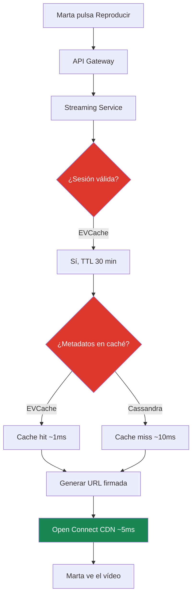
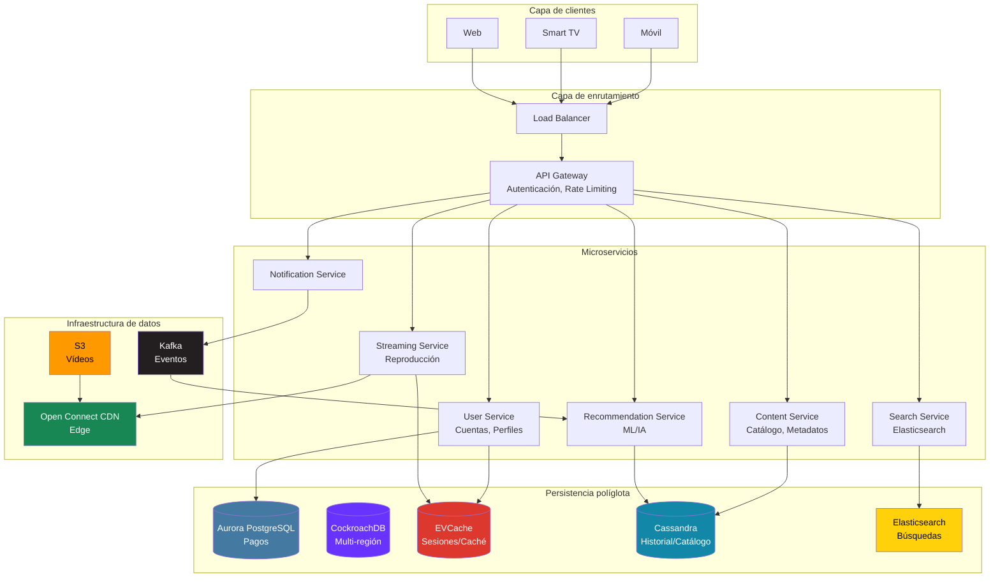
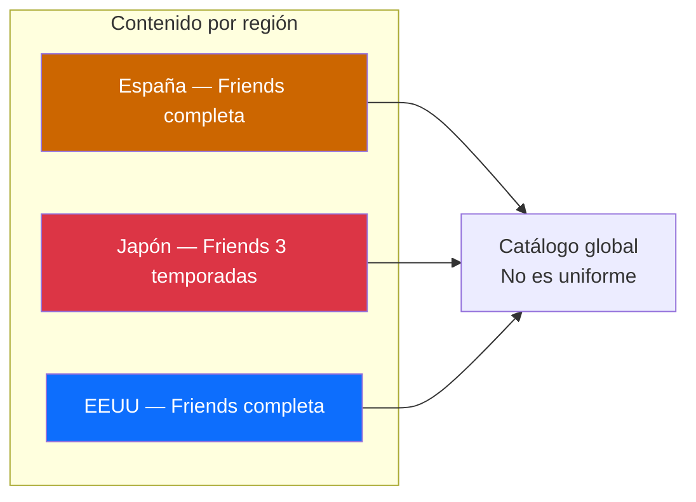
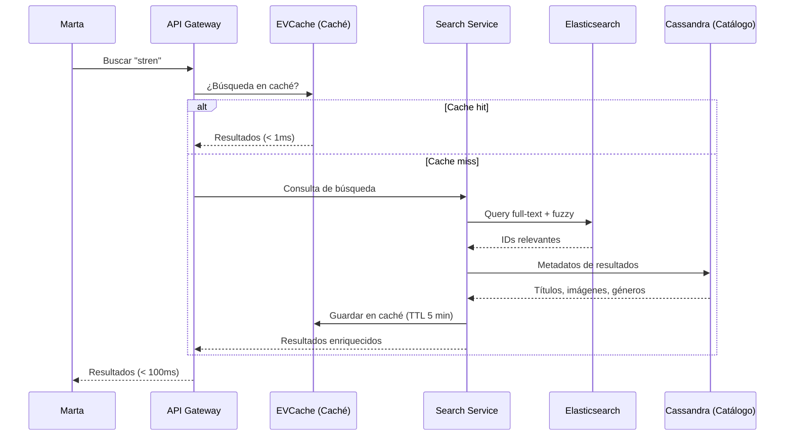
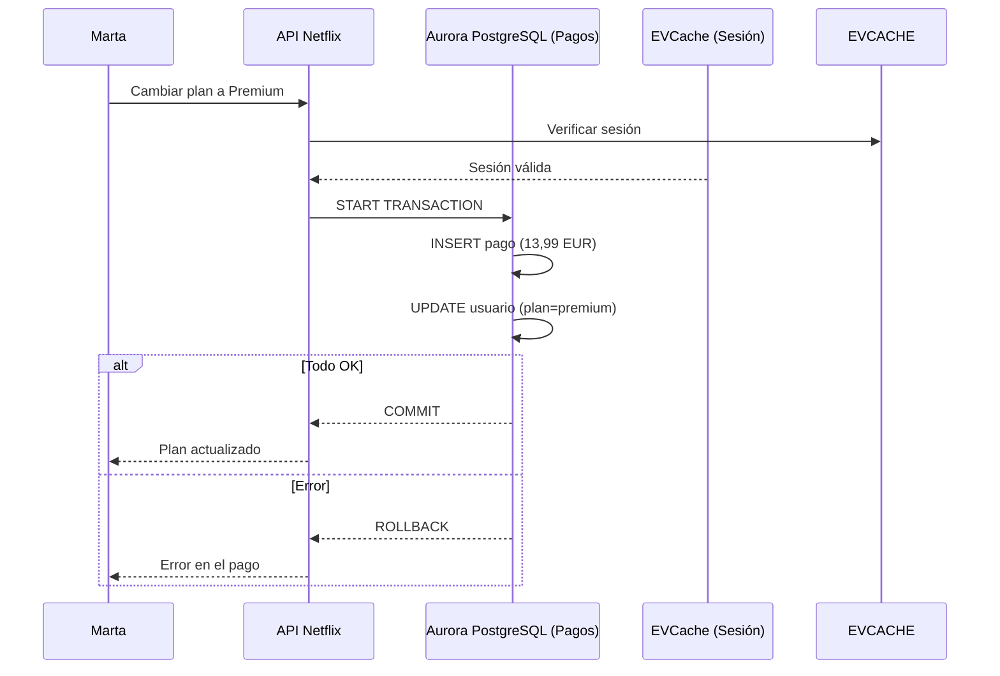
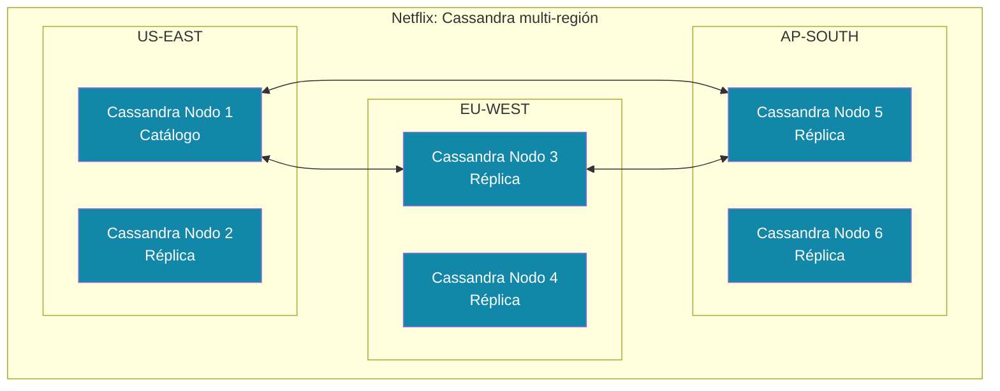
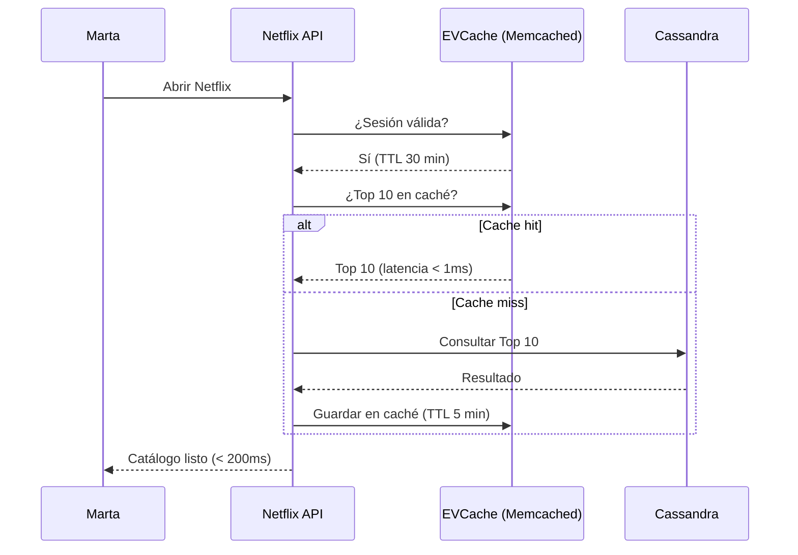
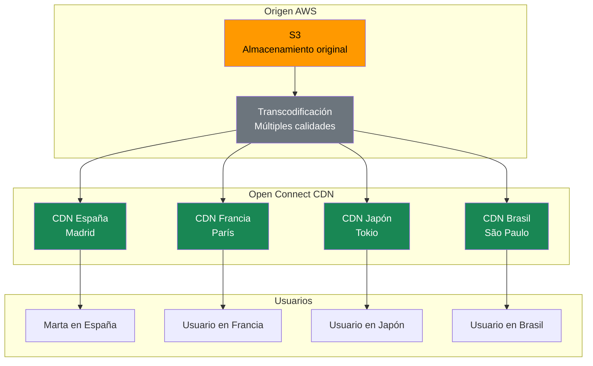
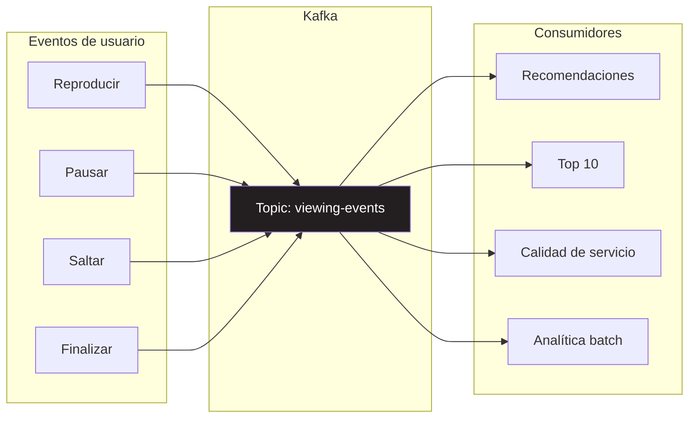
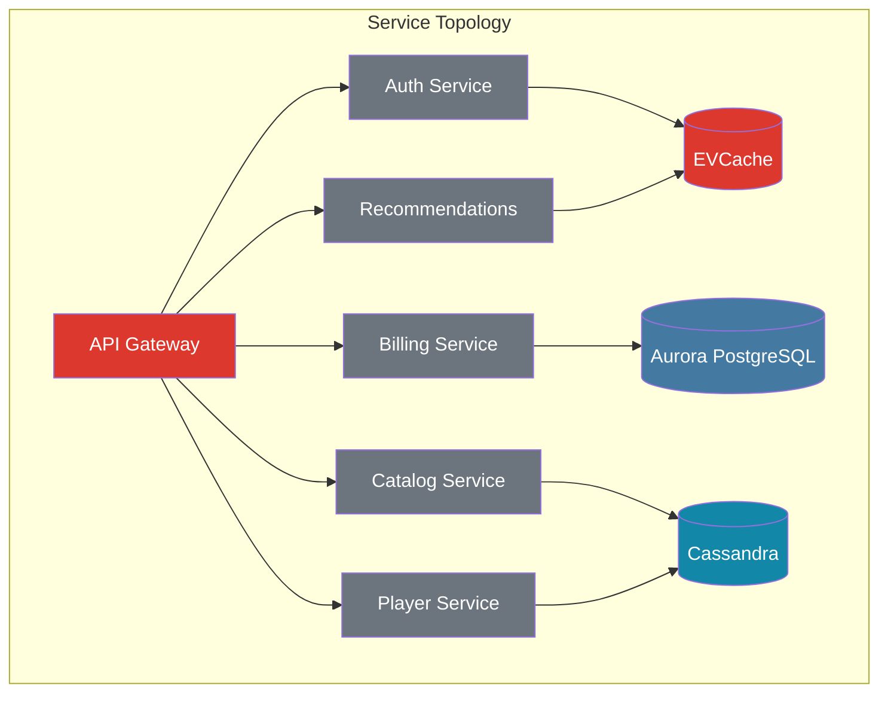

Suena el «tu-tum». Abres Netflix. En menos de un segundo ves las recomendaciones, el Top 10 y el catálogo completo. Pulsas «Reproducir» en Stranger Things y el vídeo empieza a cargarse sin *buffering*. ¿Alguna vez te has preguntado qué pasa detrás de esos 200 milisegundos?

No es magia. Son más de 6 servicios, 5 bases de datos y una infraestructura que cuesta más que el PIB de muchos países. Hoy quiero explicarte qué pasa cuando pulsas ese botón. Y por qué Netflix no es una empresa de televisión: es una empresa de servicios y datos.

<!-- more -->

## El «tu-tum»: 200 milisegundos de pura arquitectura

Imagina a Marta. Viene de trabajar, se tira en el sofá y abre Netflix. En menos de un segundo ve las recomendaciones, el Top 10 y el catálogo completo. Pulsa «Reproducir» en Stranger Things y el vídeo empieza a cargarse sin *buffering*. ¿Alguna vez te has preguntado qué pasa detrás de esos 200 milisegundos?

La respuesta está en la arquitectura de datos de Netflix. Cuando Marta pulsa «Reproducir», pasa esto:

En menos de 200 milisegundos, Netflix verifica la sesión de Marta, busca los metadatos del vídeo, genera una URL firmada y la conecta al CDN más cercano. Todo esto mientras Marta se acomoda en el sofá.

::: tip
¿Por qué tan rápido? Porque la mayor parte de los datos están en caché. EVCache almacena sesiones, Top 10 y recomendaciones con latencia sub-milisegundo. Si tuviera que consultar Cassandra en cada petición, el «tu-tum» se convertiría en un «tu... tu... tu... tum».
:::

## Netflix no es TV. Es datos

Netflix tiene 260 millones de usuarios en más de 190 países. Genera 4 petabytes de datos al día. Procesa 100.000 peticiones por segundo en horario punta. Para que te hagas una idea, eso es como si cada persona en España hiciera una consulta a Netflix cada dos segundos, sin parar.

| Métrica | Valor | Lo que implica |
|---------|-------|----------------|
| Usuarios | 260M+ en 190+ países | Datos distribuidos globalmente |
| Horas vistas/mes | 150 millones | Eventos de reproducción masivos |
| Datos generados/día | 4 petabytes | Pipeline de datos escalable |
| Servidores CDN | 4.000+ en 1.000+ ubicaciones | Contenido preposicionado en el borde |
| Peticiones/segundo (pico) | 100.000+ | Latencia sub-milisegundo obligatoria |
| Inversión en contenido | 17.000 millones USD | Cada dólar se optimiza con datos |

Cada decisión que toma Netflix —qué serie producir, qué *thumbnail* mostrar, qué posición en el Top 10— se basa en análisis de datos a escala masiva. Netflix no es exitoso por usar Cassandra o EVCache. Es exitoso por entender qué datos necesita y por qué.

::: tip
Dato *wow*: Netflix ejecuta más de 1.000 experimentos A/B simultáneos. Cada vez que ves un *thumbnail* diferente en un amigo, es porque Netflix está probando qué imagen genera más clics. Cada pixel se optimiza con datos.
:::

## La arquitectura completa de Netflix

Antes de meternos en cada componente, veamos el panorama completo. Esta es la arquitectura que Netflix usa para servir contenido a 260 millones de usuarios en 190 países:

Como ves, no es un sistema monolítico. Cada componente tiene un rol específico y una base de datos diseñada para su caso de uso. Vamos a desglosarlo.

## El sueño del catálogo regional

Viajas a Japón. Abres Netflix. ¿Ves lo mismo que en España? No. Puede que Friends solo tenga 3 temporadas allí, mientras que en España está completa. O que el anime tenga un catálogo muchísimo más amplio. ¿Por qué?

Las licencias de contenido se negocian por región. Una serie puede estar completa en un país, pero solo parcial en otro. Cada país tiene su propia vista del catálogo. Netflix invierte 17.000 millones de dólares en contenido original adaptado a cada mercado: «La Casa de Papel» es español, «Sacred Games» es indio, «Dark» es alemán.

Esto tiene implicaciones enormes para la arquitectura de datos:

::: warning
Si Netflix usara una sola base de datos para todo el catálogo, tendría que verificar la disponibilidad regional en cada consulta. Con 260 millones de usuarios y miles de títulos, eso sería un cuello de botella imposible. Por eso usan Cassandra: permite réplicas por región con consistencia eventual.
:::

## Las bases de datos de Netflix

Netflix usa lo que se llama **persistencia políglota**: cada tipo de dato se almacena en la tecnología que mejor se adapta a sus necesidades. No hay una base de datos que haga todo bien. De hecho, Netflix descartó MongoDB por su complejidad operativa: *«Consideramos y experimentamos con MongoDB, pero la sobrecarga operativa y la complejidad lo hacían ingobernable, así que nos apartamos rápidamente de él»* — Christos Kalantzis y Jason Brown, ingenieros de Netflix.

| Tecnología | Componente | ¿Por qué? |
|------------|------------|-----------|
| **Aurora PostgreSQL** | Pagos, facturación | Integridad referencial, transacciones ACID |
| **CockroachDB** | Transacciones multi-región | SQL global, ACID distribuido |
| **EVCache (Memcached)** | Sesiones, caché, Top 10 | Latencia sub-milisegundo, expiración automática |
| **Cassandra** | Historial, perfiles, catálogo distribuido | Escritura masiva, multi-región, consistencia eventual |
| **Elasticsearch** | Búsqueda y descubrimiento | Índice invertido, búsqueda *fuzzy* |
| **Kafka** | Eventos de reproducción en tiempo real | *Streaming* masivo, durabilidad, *replay* |

**Analogía:** En tu cocina tienes un horno para asar, una freidora para freír, una encimera para cortar y un microondas para calentar rápido. No intentas hacer todo con una sola herramienta. Lo mismo ocurre con las bases de datos.

::: tip
El patrón de persistencia políglota no es un defecto de diseño: es una decisión arquitectónica consciente. Si Netflix usara solo Aurora PostgreSQL, las sesiones serían lentas. Si usara solo EVCache, no tendría transacciones ACID. Si usara solo Cassandra, las búsquedas serían lentas. La combinación es la clave.
:::

## El buscador: ¿cómo localiza Netflix series tan rápido?

Cuando Marta escribe «stren» en el buscador de Netflix, en menos de 100 milisegundos aparece «Stranger Things». ¿Cómo es posible? La respuesta está en **Elasticsearch**, un motor de búsqueda basado en índices invertidos, combinado con **EVCache** para cachear las búsquedas más populares.

### Índice invertido: por qué las búsquedas son instantáneas

Un **índice invertido** es como el índice al final de un libro: en lugar de buscar palabra por palabra en todo el texto, tienes una lista que te dice en qué páginas aparece cada palabra. Elasticsearch construye este índice para cada campo del catálogo: títulos, géneros, actores, descripciones.

| Concepto | Funcionamiento | Ejemplo en Netflix |
|----------|----------------|-------------------|
| **Índice invertido** | Mapea cada término a los documentos que lo contienen | «thriller» → [Breaking Bad, Money Heist, Dark...] |
| **Autocomplete (Trie)** | Árbol de prefijos para sugerencias en tiempo real | «stran» → «Stranger Things», «Stranded» |
| **Búsqueda *fuzzy*** | Tolerancia a errores de escritura y tildes | «stren» → «Stranger Things» |
| **Caché de búsquedas** | EVCache almacena las consultas más populares | «netflix top 10» se cachea 5 min |

### Por qué es tan rápido

Elasticsearch no busca en los documentos: busca en el índice invertido, que es una estructura en memoria optimizada. Buscar «thriller» en 100.000 títulos con un índice invertido toma ~5 ms. Sin índice, tomaría varios segundos. Además, EVCache cachea las búsquedas más populares, evitando incluso la consulta a Elasticsearch.

::: tip
El truco del buscador de Netflix no es solo Elasticsearch. Es la combinación de índice invertido (búsqueda rápida), búsqueda *fuzzy* (tolerancia a errores) y caché EVCache (respuestas instantáneas para consultas populares). Los tres juntos consiguen menos de 100 milisegundos.
:::

## Aurora PostgreSQL: Los pagos que no pueden fallar

Cuando Marta cambia su plan de Básico a Premium, Netflix ejecuta una transacción ACID en Aurora PostgreSQL. Si el pago falla, toda la operación se revierte. No hay margen para inconsistencias.

¿Por qué Aurora PostgreSQL y no Cassandra? Porque Cassandra no tiene transacciones ACID completas. Si un pago falla a mitad de la operación en Cassandra, no puedes revertir todo de forma automática. Para datos financieros, la consistencia fuerte es innegociable.

::: tip
Netflix también usa **CockroachDB** para transacciones multi-región que requieren ACID distribuido. Mientras Aurora PostgreSQL trabaja en una región, CockroachDB permite transacciones consistentes entre múltiples regiones. Son más de 100 *clusters* en producción.
:::

## Cassandra: El historial masivo

Cassandra es la columna vertebral del catálogo de Netflix. Con 2.000+ millones de peticiones al día, maneja la carga más pesada de toda la plataforma.

Si un usuario en España busca «Stranger Things», la consulta se resuelve en EU-WEST sin necesidad de cruzar el Atlántico. Si EU-WEST falla, AP-SOUTH o US-EAST asumen el tráfico con latencia admissible.

El modelo de datos en Cassandra se diseña por consulta, no por entidad. Cada tabla está desnormalizada para una *query* específica. Esto es lo opuesto a la normalización SQL, pero es lo correcto a escala masiva.

## EVCache: La velocidad

Cuando Marta abre Netflix, en menos de 200 milisegundos ve las recomendaciones, el Top 10 y su historial. ¿Cómo es posible? **EVCache** reduce un 95 % las llamadas a Cassandra. Sin esa caché, Netflix necesitaría 20 veces más servidores de Cassandra, lo que supondría cientos de millones de dólares al año en infraestructura.

EVCache es un sistema de caché distribuido **basado en Memcached**, no en Redis. Aunque conceptualmente similar —ambas son cachés en memoria con expiración automática— EVCache está optimizado para el entorno de AWS de Netflix. La diferencia clave: Redis es un almacén de datos rico ( *strings*, *hashes*, *sorted sets*, *lists* ), mientras que Memcached/EVCache se centra en caché *key-value* simple con alta disponibilidad.

| Dato | TTL | Por qué EVCache |
|------|-----|------------------|
| Sesiones de usuario | 30 minutos | Expiración automática, latencia sub-ms |
| Top 10 por país | 5 minutos | Lecturas ultrarrápidas |
| Recomendaciones personalizadas | 15 minutos | Reduce carga en el motor de recomendaciones |
| Detalles de perfil | 1 hora | Cachea información que cambia poco |

::: tip
EVCache es la extensión de Netflix basada en Memcached con extensiones propias para replicación y tolerancia a fallos. Gestiona automáticamente la distribución de datos entre múltiples nodos. Reduce un 95 % las llamadas a Cassandra, ahorrando millones de dólares en infraestructura.
:::

## Open Connect: El 90 % del tráfico

¿Sabías que el 90 % del tráfico de Netflix no se sirve desde AWS? Se sirve desde **Open Connect**, la red CDN de Netflix con más de 1.000 servidores instalados en proveedores de internet (*ISPs*) de todo el mundo.

Cuando Marta ve Stranger Things en España, el vídeo viene de un servidor de Netflix instalado en la sede de Telefónica en Madrid, no de un *data center* en Virginia. Esto reduce la latencia de ~200 ms a ~5 ms.

Netflix predice qué contenido será popular en cada región y lo envía por adelantado a los CDNs. Si sabe que La Casa de Papel va a ser tendencia en España, lo envía a Madrid antes de que nadie lo busque. Esto se llama **preposicionamiento de contenido**.

::: warning
Sin Open Connect, cada usuario tendría que descargar el vídeo desde un *data center* centralizado. Con 260 millones de usuarios, eso significaría cientos de terabytes cruzando el océano simultáneamente. El resultado: *buffering* constante y latencias de varios segundos. Open Connect resuelve esto distribuyendo el contenido en el borde de la red.
:::

## Kafka: Los eventos en tiempo real

Cada vez que Marta reproduce, pausa, salta o termina un vídeo, Netflix genera un evento. Estos eventos fluyen por Apache Kafka como un río de datos. Netflix genera **1 petabyte de datos de eventos al día**. Eso son unos 12.000 millones de eventos diarios, o lo que es lo mismo, más de 100.000 eventos por segundo en horario punta.

¿Para qué sirven estos eventos? Para tres cosas principales:

1. **Recomendaciones:** Si Marta ve mucho contenido de ciencia ficción, el algoritmo le recomienda más de lo mismo.
2. **Top 10:** Se actualiza en tiempo real según lo que está viendo la gente.
3. **Análisis de calidad:** Si muchos usuarios tienen *buffering* en un vídeo, Netflix investiga.

::: tip
Kafka no es solo una cola de mensajes. Es un sistema de *streaming* persistente. Los eventos no se pierden nunca: puedes re-leerlos, re-procesarlos y analizarlos después. Netflix usa esto para entrenar modelos de recomendación con historial completo de reproducción.
:::

## Service Topology: El mapa de tus microservicios

Si trabajas con microservicios, sabes que el mayor dolor de cabeza no es construir un servicio, sino entender qué pasa cuando algo falla. Netflix tiene más de 1.000 microservicios. Cuando algo cae, necesitas saber qué servicios dependen de ese componente para estimar el impacto. Esto es **Service Topology**: un mapa en tiempo real de todas las dependencias entre servicios.

Si EVCache cae, Netflix sabe inmediatamente que 3 servicios se ven afectados: Auth, Recommendations y Player. Si Cassandra cae, son Catalog y Player. Esto permite estimar el **blast radius** de cada fallo.

::: warning
Sin Service Topology, cuando un servicio falla, los ingenieros tendrían que revisar manualmente qué dependencias tiene. Con 1.000+ microservicios, eso puede tardar horas. Con el mapa en tiempo real, el impacto se evalúa en segundos.
:::

## Reflexión: Netflix como referencia

Netflix no inventó Cassandra, EVCache ni Kafka. Lo que hizo fue entender que cada problema tiene una solución técnica adecuada. Y que la combinación correcta de tecnologías es más poderosa que cualquier herramienta individual.

| Lección | Aplicación en Netflix |
|---------|----------------------|
| Persistencia políglota | 6+ tecnologías, cada una para un uso específico |
| Caché agresivo | EVCache reduce 95 % las llamadas a Cassandra |
| CDN en el borde | 90 % del tráfico se sirve desde Open Connect |
| Eventos en tiempo real | Kafka procesa 1 PB/día para recomendaciones y analítica |
| Topología de servicios | 1.000+ microservicios con mapa de dependencias en tiempo real |

¿Qué podemos aprender de esto? Que la arquitectura de datos y el desarrollo de servicios no es solo elegir una base de datos y una API REST. Es entender qué datos tienes, cómo fluyen, dónde necesitan estar y con qué latencia. Netflix demuestra que la escalabilidad no viene de una sola tecnología, sino de la combinación inteligente de muchas.

Y la próxima vez que escuches el «tu-tum» y veas a Marta cómoda en el sofá con el catálogo listo en menos de un segundo, sabrás que detrás de ese sonido hay una de las arquitecturas de datos y microservicios más sofisticadas del mundo.
