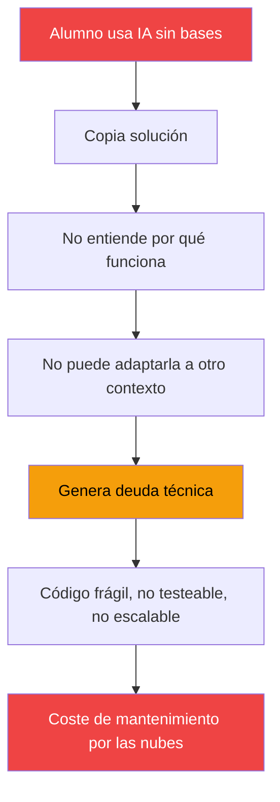

Septiembre. El verano se fue, el calor todavía no, pero el instituto ya ha puesto el calendario en el tablón y aquí estamos, preparando las clases como cada año. Pero este curso viene distinto. Y no porque haya cambiado el ratón (que sigo con el mismo de siempre), sino porque hay **nuevos retos que me hacen mucha ilusión** y mi "compi positivo" siempre está ahí para ayudarme a dar lo mejor de mi.

<!-- more -->

## FP: evolucionando el ecosistema .NET y la dualidad con Java

Empecemos por donde tengo la docencia más directa: la **Formación Profesional**. Sigo en el [IES Luis Vives](http://iesluisvives.es/) impartiendo Desarrollo de Aplicaciones Web, pero este año el enfoque cambia.

### El ecosistema .NET como eje vertebrador

En Programación ya hicimos el cambio a .NET el año pasado, como conté en [Regreso a .NET en DAW: 20 razones para el cambio](/posts/2025/2025-12-31-csharpnet_docencia_daw.html). Este año, .NET **consolida su papel como eje vertebrador** del ciclo, especialmente en Desarrollo Web en Entornos Servidor, donde se posiciona como stack principal por su facilidad para crear servicios de todo tipo, páginas web dinámicas y componentes, mientras Java seguirá viéndose solo en la parte de servicios backend y trabajar la dualidad entre ambos como comentaré más adelante.

No es solo una cuestión de tendencia. Cuando un alumno aprende a pensar en **patrones de diseño**, en **arquitecturas limpias**, en **separación de responsabilidades**, no está aprendiendo .NET: está aprendiendo a hacer bien su trabajo. Y eso después le servirá en cualquier otro stack.

::: tip Lo que imparto este curso
- **Programación** (1º DAW): Fundamentos, POO, programación genérica y funcional, estructuras de datos, ficheros y acceso a bases de datos.
- **Entornos de Desarrollo** (1º DAW): IDEs, Git, diseño con UML, patrones, documentación, testing (TDD) y refactorización.
- **Desarrollo Web en Entornos Servidor** (2º DAW): APIs REST, GraphQL, WebSockets, MVC, páginas dinámicas, componentes de servidor, asíncronia, reactividad, concurrencia, persistencia SQL y NoSQL.
:::

### La dualidad .NET / Java

Pero hay un matiz importante: en Desarrollo Web en Entornos Servidor no solo vemos .NET. También seguiremos con **Java y Spring Boot**. Y no es por complicar la vida al alumno, sino todo lo contrario.

La dualidad entre .NET y Java es una de las mejores herramientas pedagógicas que existen. Cuando un alumno ve que los mismos conceptos — APIs REST, patrones de diseño, acceso a datos, testing — se implementan de forma similar pero con sintaxis y herramientas distintas, **entiende que lo que está aprendiendo no es un framework, es ingeniería de software**. Y eso no tiene precio.

Pero hay un beneficio añadido que a veces se nos olvida: **los alumnos que dominan los dos grandes ecosistemas backend del sector son mucho más competitivos**. No solo aprenden a adaptarse a nuevos stacks tecnológicos con facilidad, sino que las empresas los demandan específicamente porque saben que pueden trabajar en proyectos con .NET, con Java, o con cualquier otra tecnología que aparezca mañana. Dominar dos grandes stacks no es duplicar esfuerzo: es multiplicar oportunidades. Además, ¿qué se va a esperar de mí si no? Soy un tío de backend, así que dos de los mejores, mejor que uno.

```
.NET (C#)                    Java (Spring Boot)
─────────────────────────    ─────────────────────────
ASP.NET Core Web API    ←→   Spring Boot REST
Entity Framework Core   ←→   Spring Data JPA
NUnit + Moq             ←→   JUnit + Mockito
LINQ                    ←→   Streams API
```

### Componentes y Blazor

Otra novedad este año es la introducción de **aplicaciones y componentes híbridos interactivos**, algo que el nuevo currículo de DAW remarca especialmente. Y Blazor es la mejor forma de llevarlo a cabo dentro del ecosistema .NET.

La tendencia de desarrollo web va hacia arquitecturas por componentes, y Blazor permite al alumno entender este paradigma desde dentro del ecosistema .NET, con la posibilidad de ejecutar C# tanto en servidor como en cliente (*WebAssembly*). Esto abre la puerta a crear interfaces **reutilizables, interactivas y con un rendimiento cercano a aplicaciones nativas**, sin abandonar el stack que ya están aprendiendo.

No es solo una herramienta más. Es una forma diferente de pensar la interfaz: **componentes reutilizables, estado gestionado, interoperabilidad con JavaScript**. El alumno que entienda esto ya estará preparado para lo que viene después.

### La FFE por fin en su sitio

Y por fin, una buena noticia legislativa. Gracias a la resolución de la Dirección General de Educación Secundaria, Formación Profesional y Régimen Especial, por la que se determinan los ciclos formativos de formación profesional en los que la fase de formación en empresa u organismo equiparado puede organizarse en un único periodo, los alumnos de primero de DAW **ya no tendrán que hacer la fase de formación en empresas en primer curso**.

Esto es algo que veníamos pidiendo desde hace años. La FFE en primero era un desastre: los alumnos llegaban sin bases, las empresas no sabían qué hacer con ellos, y el resultado era una experiencia que no aportaba nada. Ahora, aprovechando esas horas en segundo, con un total de 500 horas, los alumnos llegarán **más maduros, con más conocimientos y con la capacidad de profundizar en un nicho tecnológico y conceptual del desarrollo** que en primero era simplemente imposible.

## Universidad: vuelta a la docencia continua

Este año también vuelvo a la [Universidad Carlos III de Madrid](https://www.uc3m.es/). Y no es una colaboración puntual, sino docencia continua en el **Grado de Ingeniería Informática**. Como soy un culo inquieto, mis compis me han liado para sacarme de mi zona de confort y desempolvarme un poco para volver. ¡Ojo! Que yo también me dejo liar. Volver a la universidad es un reto que me hace mucha ilusión, para recordar y volver a experimentar experiencias pasadas que tanto me hicieron disfrutar.

### Arquitectura de Datos (4º curso)

Asignatura obligatoria donde vemos **almacenamiento estructurado y no estructurado, sistemas distribuidos, bases de datos NoSQL, gobernanza, escalabilidad y alta disponibilidad**. Es exactamente el tipo de contenido que ya he ido adelantando en artículos anteriores como [Arquitectura de Datos: Por qué elegir mal tu base de datos puede costarte el éxito](/posts/2026/2026-07-20-arquitectura-datos-mal-enfoque.html) o el caso de estudio de [Netflix](/posts/2026/2026-08-24-netflix-arquitectura-datos.html).

### Desarrollo de Software (2º curso)

También obligatoria. Se centra en **prácticas ágiles, TDD, pruebas funcionales y estructurales, integración continua, refactorización, arquitecturas y patrones de diseño**. La base para que un ingeniero escriba código que no solo funcione, sino que se pueda mantener, escalar y testear.

::: warning Importante
Ambas asignaturas están dentro del **Departamento de Informática** de la universidad. No son cursos complementarios: son asignaturas de verdad, con ECTS de verdad, con examen de verdad, con prácticas de verdad. Y de las cuales conozco perfectamente el contenido 😈.
:::

## La IA en la docencia: una gran oportunidad que se nos está escapando de las manos

Y ahora vamos con lo que me tiene pensando últimamente. La **inteligencia artificial** está en todas partes: en los IDEs, en los asistentes de código, en los chatbots, en los generadores de texto e imágenes. Y en el ámbito educativo es una **oportunidad brutal** para personalizar el aprendizaje, detectar carencias y ofrecer feedback inmediato.

Pero hay un problema. Y es gordo.

### El atajo que mata el aprendizaje

Cuando un alumno usa IA para **resolver ejercicios sin entender lo que está haciendo**, no está aprendiendo. Está copiando. Y lo peor es que lo hace con una apariencia de legitimidad que engaña tanto al alumno como, a veces, al profesor.

El alumno que busca atajos con IA **no está asentando las bases**. Y sin bases sólidas:

- No entiende **algoritmos** ni puede evaluar su complejidad
- No domina **patrones de diseño** ni sabe cuándo aplicarlos
- No comprende **arquitectura de información** ni puede diseñar servicios backend correctos
- No tiene **juicio profesional** para decidir qué necesita y cuándo se necesita

### La deuda técnica que genera la IA mal usada

Y aquí viene lo peor: si uno no domina estos conceptos de forma profunda, **cualquier solución de IA que aplique provocará deuda técnica**. Porque la IA te da una respuesta, sí, pero no te da el criterio para saber si esa respuesta es correcta, escalable o mantenible.

Sin saber usar la IA bien, ¿vas a saber si la estrategia de concurrencia es adecuada? ¿Si un enfoque optimista, pesimista o mixto es el correcto? ¿Cómo escalar para soportar un pico de tráfico como un *Black Friday*? ¿Si una transacción de Bizum tiene los mismos requisitos que una compra en Ticketmaster? No todo se resuelve igual, y saber analizar y tener las bases ayuda a saber qué quieres y cómo lo quieres. Tú conduces el vehículo, la IA puede ser un motor, pero si no sabes conducir, te puedes estrellar y algo que aparentemente funciona deje de hacerlo y no sepas por qué.



Es como construir un edificio sin entender estática. Puedes usar un generador de planos con IA, pero si no entiendes por qué cada viga está donde está, el edificio se cae. Y la IA no va a estar ahí para justificar cada decisión arquitectónica que tomaste.

### La solución: usar la IA como herramienta, no como sustituto

La IA es una **herramienta fantástica** para:

- **Aprender más rápido**: explicar conceptos, generar ejemplos, resolver dudas
- **Ser más productivo**: automatizar tareas repetitivas, generar código boilerplate
- **Explorar soluciones**: ver diferentes enfoques para un mismo problema

Pero solo funciona si el alumno **ya tiene las bases**. Un desarrollador que entiende patrones de diseño, que domina la arquitectura de datos, que sabe escribir pruebas, **usará la IA como un acelerador**. Un desarrollador sin esas bases **usará la IA como una muleta**.

::: tip Regla de oro
Si no sabes explicar por qué la solución que te dio la IA es correcta, **no estás listo para usarla en producción ni para acelerar el aprendizaje**. Primero aprende, luego acelera.
:::

## Reflexión

Cada año llega septiembre con la misma energía: ganas de enseñar, de aprender, de ver cómo el alumnado crece. Pero este año siento que el reto es mayor. No porque la tecnología sea más compleja, sino porque **las distracciones son más sofisticadas**.

La IA es una herramienta más, como lo es un IDE o un gestor de bases de datos. El problema no es la herramienta: es si sabemos usarla o nos usa a nosotros. Y el verdadero enemigo es la **impaciencia**. La creencia de que se puede llegar a buen puerto sin hacer el camino. Porque algo que aparentemente funciona puede dejar de hacerlo en cuanto el contexto cambie, y si no entendemos por qué, estamos perdidos.

Así que este curso, además de enseñar .NET, Java, bases de datos y arquitecturas, voy a intentar enseñar algo más difícil: **a pensar antes de copiar**. Que cada alumno sepa qué quiere, cómo lo quiere y por qué lo quiere. Porque el camino no es solo el destino: es lo que te convierte en un profesional de verdad.

¿Me ayudáis?

---

*¿Cada nuevo curso os ponéis nuevos retos que os ayuden a evolucionar y motivaros? Si ante esos retos tomáis atajos... Me encantaría conocer vuestra experiencia en los comentarios.*
