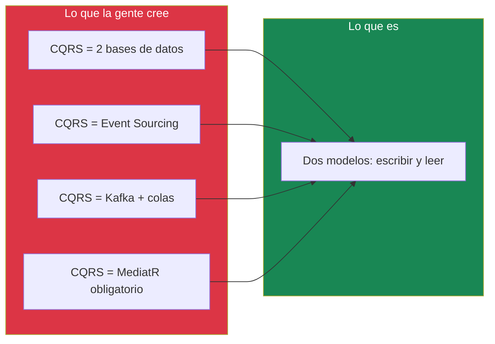
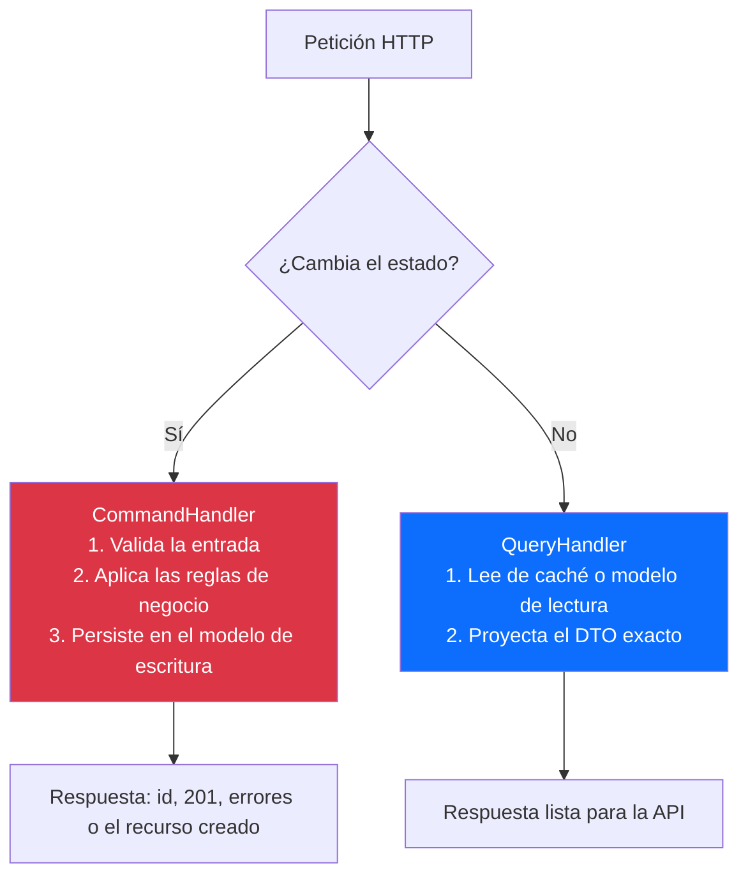
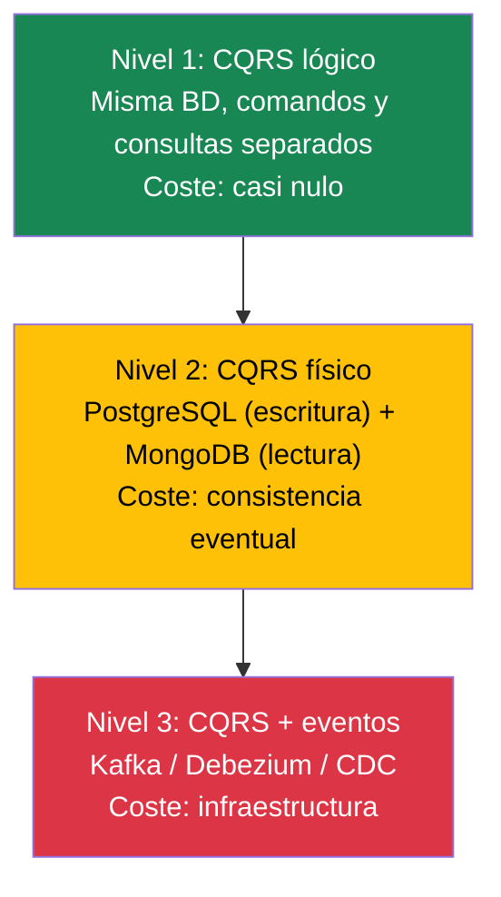
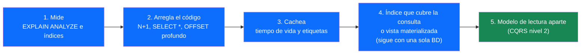
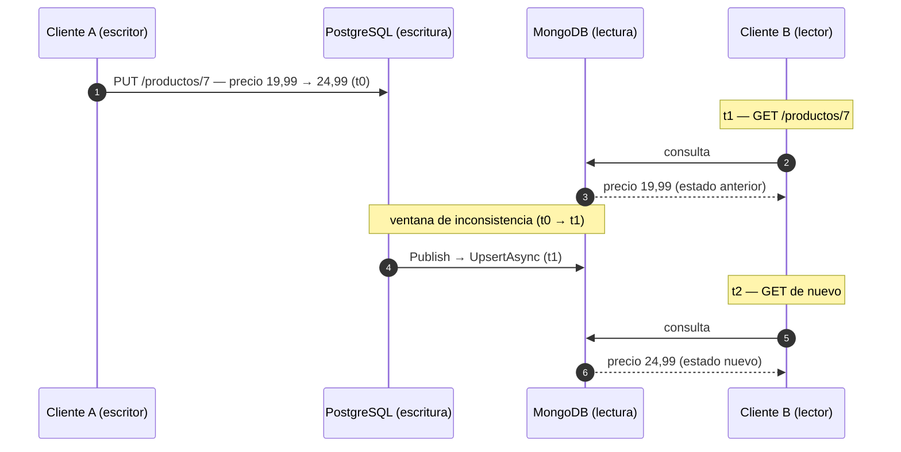
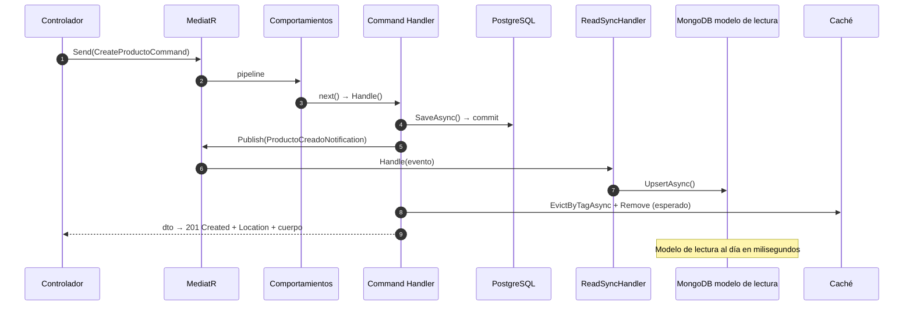

«¿CQRS necesita dos bases de datos?». «Nosotros no podemos usar CQRS, que eso es para microservicios». «Yo ya hago CQRS, porque uso MediatR». Tres frases que he escuchado esta última temporada en clase, en entrevistas de prácticas y hasta en hilos de Twitter/X. Y las tres son falsas.

Y ahí está lo curioso: **CQRS es uno de los patrones más sencillos que existen**, pero lo hemos convertido en un monstruo de siete cabezas. Su nombre ni siquiera menciona bases de datos, ni colas, ni eventos, ni microservicios. Y aun así, ahí va todo el mundo con un arsenal de Kafka y dos clústeres de MongoDB montados para «hacer CQRS» en una API con 40 usuarios.

Hoy quiero separar lo que es CQRS de lo que no lo es. ¿Es un mito? ¿Es una moda pasajera? ¿O es una realidad que ya tienes en tu código sin saberlo?

<!-- more -->

## El mito: las cuatro mentiras que circulan sobre CQRS

Antes de defender el patrón, hay que desmontar lo que se cuenta sobre él. Porque gran parte de la mala fama de CQRS no viene del patrón: viene de una conversación de WhatsApp desviada mil veces.

| Lo que la gente dice | Lo que dice el patrón |
|----------------------|----------------------|
| «CQRS = dos bases de datos» | CQRS no menciona ningún almacén. Puedes usar una tabla, un fichero o una hoja de cálculo |
| «CQRS = Event Sourcing» | Son patrones independientes. Se complementan, pero ninguno exige al otro |
| «CQRS = microservicios y Kafka» | CQRS funciona en un solo proceso, con llamadas a métodos directas |
| «CQRS = MediatR» | MediatR es una librería que *facilita* CQRS. El patrón es de 2010 y no depende de ningún paquete |



Oskar Dudycz lo dijo con una frase que debería ser obligatoria en todo curso de arquitectura:

> *«Dos bases de datos: una para escribir y otra para leer. Greg nunca dijo esto. Puedes hacer CQRS con una sola tabla si quieres.»*
> — Oskar Dudycz, [Architecture Weekly](https://www.architecture-weekly.com/p/my-thoughts-on-vertical-slices-cqrs) · *traducción propia*

Desmontar mentiras, eso sí, no explica qué es el patrón. Y el nombre no ayuda: suena a tesis doctoral. Para entenderlo hay que mirar de dónde viene, porque allí está la pista.

## La historia: un patrón nacido de una idea de los 80

Para entender por qué CQRS es tan simple de verdad y tan enrevesado en los artículos técnicos que lo explican, hay que volver atrás.

En los años 80, **Bertrand Meyer** —el padre de Eiffel y del principio *open/closed*— formuló el **CQS (Command Query Separation)**, y su definición cabe en dos líneas:

- Una **query** devuelve un resultado pero **no cambia** el estado del sistema.
- Un **command** **cambia** el estado pero **no devuelve** un resultado de lectura.

Eso es todo. Fíjate en lo que **no** aparece: la definición no menciona bases de datos, ni almacenes, ni réplicas. Meyer hablaba de *métodos* de objetos: no mezcles getters con setters con efectos secundarios, porque entonces no sabes qué hace tu código.

En agosto de 2008, **Udi Dahan** lleva la idea al diseño de sistemas distribuidos y en 2009 publica [*Clarified CQRS*](http://www.udidahan.com/2009/12/09/clarified-cqrs/). En febrero de 2010, **Greg Young** le pone nombre al subirlo de objeto a arquitectura: **Command Query *Responsibility* Segregation**. Fíjate en la palabra clave: *responsibility* (responsabilidad). No *storage*, no *database*. **Separar la responsabilidad de escribir de la de leer.**

Y en 2011, **Martin Fowler** lo populariza en su bliki con una frase que pocos citan entera:

> *«A pesar de estos beneficios, hay que tener **muchísimo cuidado** a la hora de usar CQRS. He visto casos en los que ha supuesto un lastre importante para la productividad y ha añadido un riesgo innecesario al proyecto, incluso en manos de un equipo competente.»*
> — Martin Fowler, [CQRS](https://martinfowler.com/bliki/CQRS.html) (14 de julio de 2011) · *traducción propia*

Es decir: el padre de los patrones modernos no dice «úsalo». Dice «ten mucho cuidado». Eso ya nos da la primera pista de que estamos ante algo que **se usa mal más a menudo de lo que se usa bien**.

::: warning
Fowler también pone un límite que se olvida constantemente: CQRS debería aplicarse a **porciones concretas** de un sistema (a un contexto acotado o *Bounded Context*, en lenguaje de DDD), nunca al sistema entero. Si tu aplicación entera es «CQRS», probablemente algo va mal.
:::

Si la palabra clave es *responsabilidad* y no *base de datos*, ¿qué separa CQRS exactamente? Pues lo que sigue: la explicación de primer día, la que doy antes de tocar una línea de código.

## CQRS desde cero: comandos, consultas y una petición

Lo primero que hago en clase es quitarle el miedo con una metáfora que funciona siempre: **el restaurante**.

En el restaurante pequeño, el chef hace de todo: cocina, atiende, cobra y lava los platos. Funciona… hasta que crece y el chef se quema. En un restaurante bien organizado, los **camareros solo atienden** (consultas: traen el menú, anotan, sirven) y los **cocineros solo cocinan** (comandos: reciben la orden y preparan el plato). Si el cocinero se enferma, los camareros siguen enseñando el menú. Si quieres optimizar los pedidos rápidos, contratas más cocineros sin tocar la sala.

Especialización. Eso es CQRS. Y fíjate: **no he mencionado ni una base de datos**.

Pasado ese símil, la idea cabe en **una sola pregunta**:

**Cuando llega una petición a tu API, ¿qué hace: leer o escribir?**

Ese es el invento entero, y solo tiene dos respuestas posibles:

| La petición... | Es un... | Ejemplos |
|----------------|----------|----------|
| **Cambia** el estado del sistema | **Command** (comando) | `CrearProducto`, `CambiarPrecio`, `CancelarPedido` |
| **Lee** el estado sin tocarlo | **Query** (consulta) | `ObtenerProducto`, `BuscarProductos`, `ContarPedidos` |

`GET /productos/7` es una query. `POST /productos` es un command. No hay un tercer tipo de petición.

Y un apunte antes de que aparezcan más adelante, porque descoloca: **los eventos de dominio no son un tercer tipo de petición**. No los manda el cliente; los lanzas tú como efecto secundario de un command, y se procesan aparte. Para lo que pide el cliente, seguimos con dos.

### Las dos reglas que lo sostienen todo

1. **Un command cambia el estado, y su respuesta sale de lo que acaba de escribir — nunca de una consulta.** Devuelve el resultado de la operación: el `id` creado, un `201`, la lista de errores de validación o, en la variante práctica, el propio recurso recién guardado que ya tiene en memoria. Lo que no hace es ir a leer al modelo de lectura para montar lo que responde.
2. **Una query devuelve datos y no cambia nada.** Ni un `UPDATE`, ni un evento, ni un correo, ni siquiera «actualizar la fecha de último acceso».

Suena a perogrullada, pero es donde veo que se rompe casi todo: métodos que hacen las dos cosas a la vez. Y ahí ya no sabes qué hace tu código sin leerlo entero, no puedes cachear su respuesta sin miedo, no puedes testearlo sin montar el mundo y no puedes repetir su lógica en otra parte sin copiar y pegar.

### El vocabulario mínimo

Para que las siglas dejen de ser un muro, este es todo el glosario que necesitas. Dejo en inglés los términos que la comunidad .NET usa tal cual, y a partir de aquí del texto usaré la forma en español:

| Término | Qué significa | Ejemplo |
|---------|---------------|---------|
| **Command** | La petición de escritura, un objeto con sus datos | `CreateProductoCommand(Nombre, Precio)` |
| **Query** | La petición de lectura, con sus filtros | `GetAllProductosQuery(Filtro, Página)` |
| **Handler** | Quien ejecuta *esa* petición concreta | `CreateProductoHandler` |
| **Resultado** (`Result<T>`) | Envoltorio para devolver éxito o errores tipados, sin excepciones | `Result<ProductoDto, DomainError>` |
| **Despachador** (*dispatcher*) | Quien enruta la petición hasta su handler: un `switch`, un servicio… o MediatR | `mediator.Send(cmd)` |
| **Modelo de escritura** (*write model*) | El esquema pensado para guardar con integridad | PostgreSQL normalizado |
| **Modelo de lectura** (*read model*) | El esquema pensado para responder rápido | Documento, vista o caché |
| **Proyección** | Cómo se transforma un dato de escritura en uno de lectura | `ProductoRead` con la categoría embebida |
| **Notificación** (*notification*) | El nombre que MediatR da a un evento de dominio | `ProductoCreadoNotification` |
| **Consistencia eventual** | El desfase entre escribir y verlo reflejado al leer | De milisegundos a segundos |

Fíjate en la fila del despachador, que es la que más discusiones ahorrará: **CQRS no exige ningún despachador**. Si mañana tiras de MediatR y luego lo cambias por un `switch` o por llamadas directas a los handlers, sigues haciendo exactamente lo mismo.

### Lo que ocurre cuando llega una petición



### ¿Y qué cambia frente al enfoque de siempre?

- **Antes**: un `ProductoService` de 30 métodos donde se mezclan `GetProducto`, `GuardarProducto` y `EnviarEmailStock`. El controlador llama al servicio, el servicio a repositorios, y todos comparten las mismas entidades. Si un día necesitas cambiar la forma de responder un listado, tienes que tocar el mismo fichero que gestiona las escrituras.
- **Después**: una carpeta por operación, con su comando o consulta, su handler y sus tests. **Escribir exige reglas de negocio; leer, no.** Esa asimetría es justo lo que CQRS convierte en estructura de código en vez de dejarla a criterio de cada desarrollador.

Hasta aquí todo cabe dentro del código: nada de colas, nada de clústeres. Pero llega el día en que leer y escribir no solo piden código distinto: **piden formas distintas en la base de datos**. Y ahí es donde CQRS se pone interesante —y donde empieza la parte más técnica del artículo.

## La realidad: CQRS tiene tres niveles

Vamos al grano. Lo toqué por encima hace unas semanas en [Arquitectura de Datos: Por qué elegir mal tu base de datos puede costarte el éxito](/posts/2026/2026-07-20-arquitectura-datos-mal-enfoque.html), y hoy toca verlo entero. CQRS es esto y nada más:

**Usar un modelo mental para escribir y otro distinto para leer.**

En un CRUD clásico, tu entidad `Producto` hace de todo: la validas, la persistes, la mapeas a un DTO, la filtras, la paginas, la metes en una tabla de 20 columnas. Un único modelo intenta servir a dos amos que quieren cosas opuestas: el que escribe quiere **integridad y normalización**, el que lee quiere **velocidad y la forma exacta de la respuesta**.

La buena noticia es que hay **niveles**, y el nivel 1 es gratis:

| Nivel | Implementación | Coste | Cuándo |
|-------|----------------|-------|--------|
| **1. CQRS lógico** | Misma base de datos, código separado: `Commands/` y `Queries/` | Bajo | Siempre tiene sentido |
| **2. CQRS físico** | Dos almacenes: escritura normalizada + lectura con la forma que necesite cada consulta | Medio | Miles de lecturas por escritura y proyecciones que ya no dan más de sí |
| **3. CQRS + eventos** | Se replica con eventos, colas o captura de cambios (CDC, por ejemplo Debezium) | Alto | Escala distribuida, multi-región, varios consumidores |



La propia documentación de Microsoft lo reconoce en su [patrón CQRS del Azure Architecture Center](https://learn.microsoft.com/en-us/azure/architecture/patterns/cqrs):

> *«Este enfoque representa el nivel fundacional de CQRS, en el que los modelos de lectura y de escritura comparten la misma base de datos subyacente, pero mantienen una lógica distinta para sus operaciones.»*
> — Microsoft, Azure Architecture Center · *traducción propia*

En cristiano: **una misma base de datos** con lógica distinta para leer y para escribir. Ni dos clústeres, ni un evento por segundo.

Milan Jovanović lo resumió igual de claro:

> *«¿Significa CQRS que necesito dos bases de datos? No. La mayoría de sistemas ejecuta CQRS sobre una única base de datos, con rutas de código distintas para las lecturas y para las escrituras.»*
> — Milan Jovanović · *traducción propia*

::: tip
Pista para saber si ya haces CQRS: si tienes un handler que **solo escribe** y otro que **solo lee**, y ninguno de los dos hace el trabajo del otro, ya estás aplicando CQRS. Lo que no sabías es el nombre. La probabilidad de que lo estés haciendo es alta: en los últimos años casi ningún proyecto .NET limpio se escapa de separar comandos de consultas.
:::

El salto del nivel 1 al nivel 2 es el que más discusiones provoca, porque en el fondo **no es todavía una decisión de CQRS: es una decisión de base de datos**. Antes de subir, hay que entender bien qué se gana y qué se pierde. Y para eso hay que hablar de joins.

## Leer y escribir piden formas distintas

> *Nota: a partir de aquí entramos en terreno de base de datos. Si solo te interesa el patrón, puedes saltar a «El precio» y luego a «¿Cuándo SÍ y cuándo NO?»; el resto es el porqué técnico de ese salto.*

La pregunta de CQRS no es «¿dos bases de datos?». Es: **¿qué forma necesita mi modelo para leer y qué forma necesita para escribir?** Y eso depende del problema, no del patrón.

### ¿Cuándo duele de verdad un JOIN?

Un join no es magia: es **combinar las filas de dos tablas por una clave**. Si al filtrar te quedas con 50 productos y la tabla de categorías tiene 40 filas, el motor compara cada producto con su categoría en memoria: unas pocas decenas de lecturas y listo.

Por eso el coste **no depende de cuántos joins hagas**, sino de dos cosas: **cuántas filas entren en juego** y **si el motor puede ir directo a ellas**:

- Con **índice** en la clave de unión: el motor busca, no recorre. Milisegundos o menos.
- **Sin índice**: tiene que ordenar o barrer las tablas enteras para encontrar coincidencias. Ahí es donde aparecen los segundos.
- Con **agregaciones** encima (sumas, conteos, medias) sobre tablas grandes: el coste es proporcional a las filas que hay que leer, y eso ningún índice lo arregla.

La respuesta honesta, por tanto: **un join bien hecho es baratísimo**. Si tu consulta con tres tablas tarda 2 ms, no necesitas CQRS; necesitas dejar de mirarla. Lo que sí duele, y mucho, son estas situaciones:

| Te cuesta el JOIN cuando... | No te cuesta cuando... |
|-----------------------------|------------------------|
| El ORM lanza una consulta por fila (el problema **N+1**) | Son 2 o 3 tablas con claves primarias y foráneas bien indexadas |
| Falta un índice que cubra el filtro o la ordenación | El plan de ejecución es estable y lo conoces |
| Paginas con `OFFSET 1000000` sobre un cruce de tablas | Paginas por clave, o *keyset* (`WHERE id > @ultimo`) |
| Arrastras columnas que no necesitas (`SELECT *`, binarios pesados) | Proyectas solo las columnas que van en la respuesta |
| Agregas sobre millones de filas en cada petición | El resultado se cachea por fila o por consulta |
| Llegan miles de peticiones por segundo y **cada una repite el mismo cruce** | Son pocas peticiones, o el resultado casi no cambia |

Fíjate en que casi todos los culpables son **decisiones de código**, no del modelo de datos. Y la mayoría se arreglan con un `AsNoTracking()`, una proyección a DTO, un índice que cubra la consulta o una caché. **Eso es nivel 1: CQRS lógico, sin mover un solo dato de sitio.**

```csharp
// El auténtico asesino no es el JOIN, es esto:
var productos = await db.Productos.ToListAsync();      // carga 10.000 filas
foreach (var p in productos)
    p.Categoria = await db.Categorias.FindAsync(p.CategoriaId); // N+1: +10.000 consultas

// El mismo resultado, una sola consulta y sin ruido:
var lista = await db.Productos
    .AsNoTracking()
    .Select(p => new ProductoListaDto(p.Id, p.Nombre, p.Precio, p.Categoria!.Nombre))
    .OrderByDescending(p => p.Id)
    .Take(50)
    .ToListAsync();
```

#### El ejemplo, con números: la lista de productos de la tienda

Para no quedarnos en abstracto, aterricemos con el endpoint de siempre: `GET /productos?pagina=1`, que devuelve 50 productos con su categoría y su proveedor. De fondo: `productos` con 120.000 filas, `categorias` con 40 y `proveedores` con 25.

| Situación | Qué está pasando | Cifra orientativa | Qué se hace |
|-----------|------------------|-------------------|-------------|
| Dos joins con índice, sobre tablas pequeñas | El motor resuelve categorías y proveedores en memoria | **~3 ms** | **Nada.** No hay problema |
| El ORM hace N+1: una consulta por producto | 1 consulta + 50 consultas | **~150 ms** | Una sola consulta con `AsNoTracking()` y proyección al DTO |
| Falta un índice en `activo + id` y paginas con `OFFSET 100.000` | Ordena 120.000 filas en cada petición | **~180 ms** | Índice compuesto + paginación por clave |
| El mismo listado se pide 40 veces por segundo | Se resuelve idéntico una y otra vez | **40 × 3 ms** cada segundo | Caché de 60 segundos con etiquetas |
| La ficha pide además valoraciones (1,2 millones de filas), media de valoraciones y stock por almacén | Agregaciones sobre tablas grandes en cada petición | **cientos de ms** | Aquí, y solo aquí, empieza a tener sentido un modelo de lectura |

Fíjate en la tabla entera: **las cuatro primeras filas no tienen nada que ver con CQRS**. Son rendimiento de consultas, y se arreglan en el nivel 1. La trampa clásica es atribuirle al join —y por extensión a CQRS— un problema que en realidad es de código o de índices.

La quinta fila es otra cosa: la respuesta ya no es «leer filas», es **leer una respuesta ya montada**. Ese es el momento en el que tiene sentido plantearse el nivel 2.

#### No es una consulta: son miles por segundo

Y ahora lo importante, porque hasta aquí he medido **una sola petición**. En producción la pregunta no es «¿cuánto tarda este GET?», sino: **¿cuántas veces por segundo lo ejecuto y cuánto le cuesta a la base de datos cada vez?**

Es una multiplicación, y es la que cambia el cuadro:

| Peticiones por segundo | Coste por consulta | CPU ocupada solo en repetir el mismo cruce |
|------------------------|--------------------|-------------------------------------------|
| 20 | 3 ms | ~6 % de un núcleo: irrelevante |
| 500 | 3 ms | ~1,5 núcleos |
| 2.000 | 3 ms | **~6 núcleos dedicados a recalcular lo mismo** |
| 2.000 | 0,2 ms (lectura directa de un documento ya montado) | **~0,4 núcleos** |

Fíjate que la consulta sigue siendo «barata» en las cuatro filas. El problema ya no es la latencia: es que **estás pagando el mismo cálculo una y otra vez**, con un resultado que casi no cambia.

Y el daño va más allá de la CPU:

- **Caché de la base de datos**: cada cruce trae y desplaza páginas en el *buffer pool*; lo que entra para las lecturas expulsa a lo que necesitan las escrituras.
- **Contención**: las avalanchas de lectura compiten con los `INSERT` y los `UPDATE` por E/S, por candados y por núcleos. Los comandos —los que de verdad importan— son los que acaban sufriendo.
- **Trabajo repetido**: vuelves a montar el mismo resultado 2.000 veces por segundo aunque la categoría no haya cambiado en tres semanas.

Por eso desnormalizar ayuda, y hay que decirlo con precisión: **no acorta una consulta, elimina el trabajo repetido**. El cruce se hace una vez —al escribir o al sincronizar— y cada lectura se convierte en una búsqueda directa por clave. Pasas de *calcular en cada petición* a *calcular una vez y leer muchas*.

Volvamos al restaurante de la sección anterior: si el cocinero rehace la guarnición en cada pedido aunque sea siempre la misma, con 20 comensales no se nota; con 200 por minuto, la cocina se para. Y la solución no es «cocinar mejor», es **tener la guarnición ya hecha**.

Ese es, en el fondo, el motivo real por el que en sistemas con mucha carga se separa el modelo de lectura: no por lujo, ni para «hacer CQRS», sino **para descargar a la base de datos transaccional** de un trabajo que no cambia. Y una vez descargada, si hace falta, puedes escalarla en horizontal con réplicas de solo lectura.

#### El ahorro en el escalado: primero baja el trabajo, después compra servidores

Cuando el tráfico crece, solo hay tres formas de aguantar: **hacer menos trabajo por petición**, **añadir hardware** o **repartir en varias réplicas**. Y la primera es la más barata precisamente porque es la única que multiplica: si bajas una consulta de 3 ms a 0,2 ms, para el mismo tráfico necesitas unas **15 veces menos capacidad** para servirla. La tabla de arriba ya lo decía: 6 núcleos frente a 0,4.

Las otras dos se pagan a precio de catálogo, y con un matiz que casi nunca se cuenta: **cada réplica que añades vuelve a calcular exactamente lo mismo que calculaba la anterior**. Si no reduces el trabajo por consulta, estás comprando hardware para repetir un cálculo que casi no cambia.

Y aquí hay que ser honestos, porque todo se paga: desnormalizar cuesta en escrituras y en consistencia; cachear, en invalidaciones; añadir réplicas o servidores, en factura —la tabla completa está más abajo, en «El precio»—. Lo que sí importa es el orden: **optimizar el trabajo es código y esquema que ya tienes; comprar servidores es tarjeta de crédito.** De ahí la regla: *escala el trabajo antes que las máquinas*.

Y un matiz para no venderte la moto: **no necesitas una segunda base de datos solo porque lleguen miles de peticiones por segundo**. Si el problema es la carga y la forma de la respuesta sigue siendo la de siempre, se resuelve con una caché, un índice que cubra la consulta o una réplica de solo lectura del mismo esquema. El almacén de lectura separado aparece cuando, junto con la avalancha, **la respuesta necesita otra forma** o cuando quieres dejar de pagar ese cálculo en cada lectura.

¿Y cuándo ocurre eso en la práctica? Con el dominio de siempre:

- **La respuesta necesita otra forma** cuando `GET /productos/7` no devuelve «una fila con sus dos foráneas», sino el producto con su categoría dentro, las cinco últimas valoraciones, la media de valoraciones y el stock desglosado por almacén. Son cuatro tablas y una agregación sobre un millón de valoraciones: montar eso en cada petición es el trabajo que estás repitiendo. En un modelo de lectura, ese montaje ya viene hecho dentro del documento: una lectura por clave y cero cruces.
- **Dejar de pagar el cálculo** cuando la respuesta sale de sumar, cruzar o aplicar reglas que no cambian de minuto a minuto: el total de stock de tres almacenes, el descuento de la campaña vigente, el precio con IVA redondeado. Eso se puede calcular al escribir —o al sincronizar— y que cada lectura sea una simple búsqueda.

Y el contraejemplo, que es lo más frecuente: si la respuesta es «una fila con sus dos foráneas y nada más», no necesitas un almacén de lectura. Te basta un índice que cubra la consulta y, si el tráfico sigue creciendo, una caché de 60 segundos.

Y una aclaración de orden, porque aquí es donde más gente se equivoca: si acabas con los datos repartidos en dos almacenes distintos, el join no es lento, es **imposible**. Pero ojo: eso **no es un argumento a favor de separar las bases de datos**, es lo que te encuentras *después* de haberlo decidido. Primero decides la forma; la frontera viene sola.

### Normalizado para escribir, desnormalizado para leer

Aquí está el meollo. Cada modelo tiene un objetivo distinto y **los dos están en lo correcto**:

| | Modelo normalizado (escritura) | Modelo desnormalizado (lectura) |
|---|---|---|
| **Verdad** | En un solo sitio | Repartida por N copias |
| **Escritura** | Un `UPDATE` de una fila | Puede tocar N filas o N documentos |
| **Lectura** | 1 consulta con joins | 1 consulta, 0 joins, fila completa |
| **Integridad** | Referencial, garantizada por la base de datos | La aplicas tú al sincronizar |
| **Redundancia** | Cero | Controlada y aceptada |
| **Escrituras** | Baratas | Caras |
| **Lecturas** | Caras | Baratas |

El intercambio es este: **ganas lecturas rápidas —el join desaparece de la consulta— y pagas con tres cosas: datos duplicados, escrituras que tienen que tocar más sitios y una sincronización que mantener.** Es un intercambio razonable… si el problema lo merece.

Y ojo, porque «lecturas rápidas» se queda corto: lo que de verdad compras con la desnormalización es **dejar de pagar el mismo cálculo en cada petición**. En un proyecto con veinte consultas por segundo no notarás nada; en uno con una avalancha de lecturas, cada consulta que deja de recalcular el cruce es CPU y caché que la base de datos transaccional se ahorra para lo que importa: escribir.

Y aquí viene el matiz que casi nunca se cuenta: **el espacio en disco es lo que menos importa**. Duplicar el nombre de una categoría en 500 productos no te llena el SSD. Lo que sí importa es:

1. **Memoria y caché**: esas 500 copias ocupan memoria que podría guardarte cosas útiles, y la caché se invalida por más claves.
2. **Escrituras amplificadas**: si «Electrónica» pasa a «Electrónica y Domótica», aquí haces **1 `UPDATE`**, allí **500 documentos**.
3. **Deriva**: si algún día una réplica falla o un proceso programado se rompe, tendrás productos que dicen una categoría y otros que dicen otra, *y sin saber cuál es el bueno*.

Vamos con números reales, con el dominio de siempre (productos, categorías y proveedores):

```sql
-- Normalizado: 3 tablas, join obligado, pero la verdad vive en un sitio
SELECT p.nombre, p.precio, c.nombre AS categoria, pr.nombre AS proveedor
FROM productos p
JOIN categorias  c ON c.id = p.categoria_id
JOIN proveedores pr ON pr.id = p.proveedor_id
WHERE p.activo = true
ORDER BY p.id DESC LIMIT 50;
```

```json
// Desnormalizado: un documento, cero joins, respuesta lista para la API
{ "_id": 7, "nombre": "Teclado Mecánico", "precio": 59.99,
  "categoria": { "id": 3, "nombre": "Periféricos" },
  "proveedor": { "id": 12, "nombre": "Keytron" },
  "syncAt": "2026-09-30T10:12:04Z" }
```

Cambiaron las reglas del juego: **la consulta deja de ser un montaje y pasa a ser una lectura**. Pero fíjate en el precio: `categoria` está escrita una vez por producto.

### Ojo: el modelo de lectura no tiene por qué estar desnormalizado

Esto es lo que más me mosquea de cómo se enseña CQRS. **Desnormalizar es *una* opción, no una obligación.** Si tus lecturas son exploratorias —un panel de negocio, un listado con filtros arbitrarios, un informe que cruza seis tablas—, desnormalizar el modelo de lectura es un desastre: no puedes anticipar todas las consultas posibles. En esos casos, lo correcto es **seguir normalizado**, una vista materializada o directamente una réplica de solo lectura.

Y funciona también al revés: si tu fuente de verdad *ya* es un documento (MongoDB, un JSONB en Postgres), el modelo de escritura no lleva joins desde el principio. CQRS no te obliga a partirlas: **te obliga a decidir, conscientemente, qué forma tiene cada modelo.**

::: warning
**El error clásico: desnormalizar en el modelo de escritura.** Meter en la tabla transaccional las columnas que solo necesita la vista (`categoria_nombre`, `total_lineas`, `usuario_email`) es lo peor de los dos mundos: sigues con joins de escritura, ahora duplicas datos *en la fuente de verdad* y le acoplas el esquema a los DTOs de la API. Si vas a desnormalizar, que sea **fuera**, en un modelo de lectura que puedas reconstruir desde cero sin miedo.
:::

### La escalera: cinco pasos de optimización antes de la segunda base de datos

Antes de montar un clúster, sube la escalera de menor a mayor coste:



Y las preguntas que van dentro de cada escalón, por si prefieres leerlas así:

1. **¿Has medido?** Si no, no hables conmigo de rendimiento: ejecuta `EXPLAIN ANALYZE` y mira el plan.
2. **¿Sigue lento?** Entonces revisa el código: N+1, `SELECT *`, paginación con `OFFSET` profundo.
3. **¿Se puede cachear?** Si la respuesta es estable durante unos segundos, ahí tienes tu solución gratis.
4. **¿El dato cambia poco y se lee mucho?** Entonces un índice que cubra la consulta o una vista materializada, y **sigues con una sola base de datos**.
5. **¿Necesitas cero joins y una forma distinta de respuesta?** Ahí, y solo ahí, está justificado el modelo de lectura aparte.

Casi ningún proyecto llega de verdad al quinto. Y el que llega, llega con métricas en la mano, no con un «en YouTube lo hacían así».

::: tip
**Regla práctica:** desnormaliza **lo que cambia poco y se lee mucho** (categorías, nombres, descripciones, jerarquías). Con **lo que cambia a cada momento** (stock, precio, saldo), mide primero: o aceptas la ventana de inconsistencia, o lo dejas normalizado. Y si dudas, recuerda que **cualquier modelo de lectura desnormalizado es una caché**: si no puedes regenerarlo, no tienes un modelo de lectura, tienes un problema sin respaldo.
:::

Con esto ya sabemos qué se gana y qué se pierde al subir al nivel 2. Pero la factura no acaba ahí: hay un coste que aparece en cuanto separas los caminos de lectura y escritura, y es el que más sorprende en producción.

## El precio: lo que cuesta subir de nivel

El principal se llama **consistencia eventual**.

En cuanto separas el camino de escritura del de lectura, aparece una ventana en la que **el dato ya existe en la fuente de verdad pero aún no en el modelo de lectura**:



Dos clientes hacen la misma petición en dos instantes distintos y reciben respuestas distintas. **Y es correcto.** Es el precio de no transaccionar dos bases de datos a la vez.

La lista completa de la factura, por si te la cobran:

| Coste | Qué implica |
|-------|-------------|
| **Consistencia eventual** | Ventana entre escritura y lectura; hay que comunicarla o gestionarla |
| **Redundancia** | El dato se duplica: memoria en caché, escrituras amplificadas y deriva posible entre copias |
| **Consultas no previstas** | El modelo de lectura solo responde lo que proyectaste; para explorar (BI, filtros libres) te hace falta otra vía |
| **Dos sistemas** | Dos copias de seguridad, dos monitorizaciones, dos formas de caerse |
| **Sincronización** | Eventos, sondeo, CDC o colas: alguien tiene que mover los datos |
| **Reparación** | Si la réplica falla, hace falta una recarga inicial o un reproceso |
| **Complejidad cognitiva** | El equipo nuevo tarda más en entender «por dónde entra un GET» |

Y fíjate: **los tres primeros son exactamente los que asumes si decides montar ese modelo de lectura aparte**, que es el último paso de la escalera de la sección anterior. Si no puedes justificarlos con métricas, no estás comprando rendimiento, estás comprando complejidad.

Y ojo con la trampa más silenciosa: **la caché**. Si una lectura concurrente se cuela entre la invalidación de caché y la réplica del modelo de lectura, puede repoblar la caché con el dato antiguo y mantenerlo hasta su tiempo de vida. En proyectos como el de este artículo, la ventana PostgreSQL → MongoDB dura milisegundos —el `Publish` se espera antes de devolver el `201`—, y la que más puede doler es la de la caché: 60 segundos de caché de salida y hasta 10 minutos en la caché de fachada. Por eso el tiempo de vida no es un accesorio: es la red de seguridad final.

Con esta factura encima de la mesa, la pregunta es evidente: si esto cuesta tanto, ¿por qué se usa tanto? Pues precisamente porque se ha convertido en costumbre, y ahí está la moda.

## La moda: por qué CQRS se usa donde no toca

Si CQRS es tan simple, ¿por qué tiene fama de complicado? Porque **ha dejado de ser un patrón para convertirse en una acreditación**: «en nuestro proyecto hacemos CQRS» suena a que allí dentro sabe alguien lo que hace. Y eso, tanto en una entrevista como en la documentación de un proyecto, se vende muy bien.

La moda tiene tres síntomas fáciles de reconocer:

1. **Se aplica al sistema entero**, en vez de a las porciones donde de verdad hay tensión entre leer y escribir. Fowler lo advertía en 2011 y sigo viéndolo cada trimestre.
2. **Se empieza por la infraestructura y no por el problema**: primero se discute si Mongo o Postgres para las lecturas y después se busca un motivo. El orden correcto es el contrario: se parte del nivel 1 (misma base de datos, código separado) y solo se sube de nivel cuando hay métricas en la mano que lo justifiquen.
3. **Se confunde el patrón con su equipaje.** Las dos reglas de «CQRS desde cero» *son* CQRS. Lo demás —cómo enrutas las peticiones, cuántas bases de datos montas, si replicas con eventos o con un proceso programado— son decisiones posteriores, independientes y opcionales.

Y aclaremos la tercera de una vez, porque es la que más ruido genera: **CQRS no es una librería ni un framework**. MediatR es una forma cómoda de despachar comandos y consultas —y es la que uso en el ejemplo de más abajo—, pero puedes lograr exactamente lo mismo con un `switch`, con un servicio plano o con lo que traiga el lenguaje del proyecto. Cambias de herramienta y sigues siendo igual de CQRS; usas MediatR y mezclas lecturas y escrituras en los mismos métodos, y no lo eres.

Lo que de verdad hace la moda es ponernos la venda en los ojos: nos cuesta mucho más decir «a esto aquí no le hace falta» que justificar por qué sí. Y ese es el terreno donde mejor crece la sobreingeniería: proyectos con dos bases de datos, tres colas de replicación y cuarenta usuarios.

Dicho esto —y porque un patrón sin código es solo una opinión—, vamos a ver cómo se ve esto montado de verdad.

## CQRS en .NET, con código de verdad

Esto es como se ve CQRS en un proyecto real de los que enseño en clase: la [API de tienda con CQRS y MediatR](https://github.com/joseluisgs/TiendaDawApi-Cqrs-MediatR-NetCore) —PostgreSQL de escritura, MongoDB de lectura y Redis de caché—. Y para que la comparación sea justa, esa misma tienda existe en una segunda versión, [**el gemelo sin CQRS**](https://github.com/joseluisgs/TiendaDawApi-NetCore): mismo dominio, mismos endpoints, resuelto con los servicios CRUD clásicos —ese `ProductoService` de 30 métodos que describí como «antes». Dos repos, una tienda: compara las carpetas y verás la diferencia sin leer una línea.

La estructura de carpetas ya es medio patrón:

```
Features/
└── Productos/
    ├── Commands/
    │   ├── CreateProductoCommand.cs
    │   ├── UpdateProductoCommand.cs
    │   └── DeleteProductoCommand.cs
    ├── Queries/
    │   ├── GetAllProductosQuery.cs
    │   └── GetProductoByIdQuery.cs
    ├── Notifications/
    │   └── ProductoCreadoNotification.cs
    └── Sync/
        └── ProductoReadSyncHandler.cs
```

**1. El command solo escribe, y devuelve el resultado de la operación — no una lectura.** El *handler* valida, persiste y publica, y responde con el objeto recién guardado que ya tiene en memoria —con su categoría cargada—, sin tocar el modelo de lectura para construir la respuesta (esa es la primera de las dos reglas que vimos antes). Y el orden manda: persiste *antes* de publicar nada, y **espera** a replicar antes de invalidar la caché.

```csharp
public record CreateProductoCommand(ProductoRequestDto Dto)
    : IRequest<Result<ProductoDto, DomainError>>;

public class CreateProductoCommandHandler(
    IProductoRepository repository,
    ICategoriaRepository categorias,
    IValidator<ProductoRequestDto> validator,
    IMediator mediator,
    ICacheService cacheService,
    IOutputCacheStore outputCacheStore)
    : IRequestHandler<CreateProductoCommand, Result<ProductoDto, DomainError>>
{
    public async Task<Result<ProductoDto, DomainError>> Handle(
        CreateProductoCommand request, CancellationToken ct)
    {
        // Las reglas de negocio, antes de tocar la base de datos
        var validacion = await validator.ValidateAsync(request.Dto, ct);
        if (!validacion.IsValid)
        {
            var errores = validacion.Errors
                .GroupBy(e => e.PropertyName)
                .ToDictionary(g => g.Key, g => g.Select(e => e.ErrorMessage).ToArray());
            return Result.Failure<ProductoDto, DomainError>(
                ProductoError.ValidacionConCampos(errores));
        }

        if (await categorias.FindByIdAsync(request.Dto.CategoriaId) is null)
            return Result.Failure<ProductoDto, DomainError>(
                ProductoError.CategoriaNoEncontrada(request.Dto.CategoriaId));

        // 1. Persistir PRIMERO: si falla, salta y no se publica nada
        var saved = await repository.SaveAsync(request.Dto.ToEntity());
        var dto = saved.ToDto(); // la categoría ya viene cargada del guardado

        // 2. Replicar el modelo de lectura y esperar a que termine el sync…
        await mediator.Publish(new ProductoCreadoNotification(dto), ct);

        // 3. …y SOLO ENTONCES invalidar la caché. Si se lanzara en segundo
        //    plano, un lector podría repoblarla con el modelo todavía viejo
        await cacheService.RemoveAsync($"productos:categoria:{dto.CategoriaId}");
        await outputCacheStore.EvictByTagAsync("productos", ct);

        return Result.Success<ProductoDto, DomainError>(dto); // resultado de la operación
    }
}
```

El detalle del paso 3 es el que más se ignora: **replicar primero, invalidar después y esperar**. Los listados paginados no se pueden enumerar uno a uno para invalidarlos, así que caducan solos con su TTL —o se cierran del todo con claves versionadas—; si un lector concurrente llegara a rellenar la caché con datos viejos en esa ventana diminuta, el TTL pone el techo del daño.

**2. El modelo de lectura se replica con el propio evento** — sin una consulta de vuelta, porque la notificación ya viaja con el DTO. Y con una decisión importante en el codo: **PostgreSQL es la fuente de verdad**. El *handler* envuelve la réplica en un `try/catch`: si MongoDB falla, la escritura ya está commiteada y no se tumba — la réplica atrasada la repara algo de mantenimiento, y más abajo verás cómo se arregla sola incluso sin reiniciar. Lo mismo con los actualizados, los eliminados y los cambios de categoría.

```csharp
public class ProductoReadSyncHandler(
    IProductoReadRepository readRepository,
    ILogger<ProductoReadSyncHandler> logger)
    : INotificationHandler<ProductoCreadoNotification>
{
    public async Task Handle(
        ProductoCreadoNotification evt, CancellationToken ct)
    {
        try
        {
            // El DTO ya trae la categoría embebida: 0 JOINs al leer
            await readRepository.UpsertAsync(evt.Producto.ToRead());
        }
        catch (Exception ex)
        {
            // PG ya commiteado: un fallo de Mongo no tumba la escritura.
            // En producción aquí irían reintentos (Polly) y el outbox
            logger.LogError(ex, "Fallo al replicar producto {Id}", evt.Producto.Id);
        }
    }
}
```

**3. La query solo lee**: entra por la fachada de lectura —caché primero, MongoDB después— y devuelve el DTO exacto que pidió el cliente. Ni validaciones de negocio, ni escrituras, ni efectos secundarios:

```csharp
public record GetProductoByIdQuery(long Id)
    : IRequest<Result<ProductoDto, DomainError>>;

public class GetProductoByIdQueryHandler(IProductoService service)
    : IRequestHandler<GetProductoByIdQuery, Result<ProductoDto, DomainError>>
{
    public async Task<Result<ProductoDto, DomainError>> Handle(
        GetProductoByIdQuery query, CancellationToken ct)
    {
        // La fachada decide: caché → MongoDB. Los documentos ya vienen
        // con la categoría embebida, así que 0 JOINs
        var dto = await service.GetByIdAsync(query.Id);

        return dto is null
            ? Result.Failure<ProductoDto, DomainError>(ProductoError.NotFound(query.Id))
            : Result.Success<ProductoDto, DomainError>(dto);
    }
}
```

**4. Los comportamientos de canalización** (*pipeline behaviors*) son el sitio donde va lo transversal —registro, validación, caché— sin tocar los *handlers*: un middleware para MediatR. Y CQRS no depende de ninguno: si mañana lo cambias por decoradores, el patrón sigue igual.

Y el flujo completo, con el canalizar (*pipeline*) alrededor:



::: tip
**En producción, esto no basta.** Si el proceso muere justo entre guardar y publicar, el evento se pierde y la réplica se queda atrás. La solución profesional es el patrón ***outbox***: no publicar el evento, sino **escribirlo** —una fila más en una tabla `outbox_events`, en la misma transacción que el dato— y que un servicio en segundo plano lo lea, lo publique y lo marque como enviado. Para enseñar, persistir-primero-y-publicar-después es suficiente; para producción, no.
:::

### El paso intermedio: réplica que se repara sola

Hay un escalón entre «publicar y rezar» y el outbox, y es justo el que tiene implementado el proyecto del enlace: el **grado 1.5**. El command no cambia ni una línea —sigue publicando en memoria tras el commit—; lo que se añade es un proceso de fondo que cada cinco minutos vuelve sobre «lo que se quedó atrás» y lo vuelca en la réplica con un *upsert* por id, así repetir no rompe nada. Si el `Publish` falló —MongoDB caído, proceso muerto—, la réplica **se repara en minutos, no en el próximo arranque**. Y en clase queda demostración para rato: «mata el Mongo a mano, espera cinco minutos, vuelve a mirar».

Esto **no** es subir de nivel de CQRS —el patrón sigue siendo el mismo—, es darle más fiabilidad a la réplica. Los tres grados, de menor a mayor:

| Grado de la réplica | Qué hace | Cuándo |
|---|---|---|
| **1. Publicar en memoria** | El evento se pierde con una caída; la réplica la repara el seeder al arrancar | Aprendizaje y prototipos |
| **1.5. + job reparador** | Un proceso de fondo vuelca cada pocos minutos lo que se quedó atrás | Cuando quieras demostrar consistencia eventual y auto-reparación |
| **2. Outbox transaccional** | El evento se guarda como fila en la misma transacción que el dato; un despachador lo publica con reintentos | Cuando estés perdiendo eventos de verdad en producción —no en teoría— |

El criterio es el de siempre: **sube de grado cuando te duelan los datos, no cuando te suene la teoría**. En una tienda de clase, el 1.5 es suficiente; el outbox llega con la producción.

::: warning
**Antes de que abras el repo, la nota de honestidad:**

El mapa real del proyecto es este —solo Productos sube al nivel 2—:

| Dato | Se escribe en | Se lee en | ¿Ventana de inconsistencia? |
|------|---------------|-----------|------------------------------|
| **Productos** | PostgreSQL | MongoDB `productos_read` + caché | **Sí**: PG → Mongo → caché |
| **Categorías** | PostgreSQL | PostgreSQL + caché | Solo la caché |
| **Pedidos** | MongoDB | MongoDB, misma fuente | No |
| **Usuarios** | PostgreSQL | PostgreSQL | No |

El proyecto hace justo lo que defiende este artículo: CQRS por porciones, no de sistema entero. Y el resto de detalles que conviene saber antes de compararlo con el texto:

- Ese nivel 2 es sobre todo **didáctico**: con el volumen de un aula no lo pide el rendimiento. Lo que demuestra de verdad es la forma —documento ya montado, 0 JOINs— y cómo un command reparte efectos sin que el *handler* sepa quién escucha.
- Las invalidaciones de caché ya siguen el mismo orden que el código de arriba —replicar, invalidar después y esperar—, y lo que se pierde en caliente no depende del próximo arranque: el *job reparador* del grado 1.5 lo cura en minutos. Lo que sigue sin estar es el ***outbox***, que es lo que convierte «se repara solo» en «no se pierde nunca» — en producción, obligatorio.
- Un riesgo conocido que el TTL tapa: al renombrar una categoría, los productos cacheados siguen enseñando el nombre antiguo hasta que caduquen — invalidar esas claves una a una no es viable. Justo por eso la caché no es un adorno: es la red de seguridad final.
:::

Con el código a la vista, la última pregunta es la que de verdad importa en un proyecto: ¿cuándo lo pongo en marcha y cuándo no?

## ¿Cuándo SÍ y cuándo NO usar CQRS?

Aquí es donde hay que ser honesto: he perdido la cuenta de los proyectos en los que he visto CQRS aplicado sin que hiciera falta.

Pero antes de las advertencias, la otra mitad del examen, porque hasta aquí el artículo ha sido avisarte de los riesgos: **CQRS, cuando le toca, no es sobreingeniería. Es la única forma de separar dos problemas que de otro modo van siempre pegados.** Esto es lo que gana tu proyecto cuando aplicas el patrón donde toca:

### Qué te compra CQRS (la defensa)

| Si tu problema es... | ...CQRS te compra |
|----------------------|-------------------|
| La base de datos no da abasto con las lecturas | Escalarlas por su cuenta —caché, réplicas, otro almacén— **sin tocar ni arriesgar la escritura** |
| El frontend cambia la forma de la respuesta cada dos por tres | Cambiar **solo** el modelo de lectura: los comandos, sus validaciones y la integridad no se enteran |
| Un listado que cruza seis tablas y nadie se atreve a tocar porque rompe algo | Que esa consulta **desaparezca**: respuesta ya montada, leída por clave |
| El equipo pisa la lógica de negocio cada vez que toca una consulta | Dos rutas de código que se evolucionan y se prueban por separado |
| Las consultas lentas se arreglan tocando el mismo sitio donde vive el dinero | Aislar el riesgo: optimizar el lado de lectura **no puede** romper una escritura |

Y lo decisivo: **en el nivel 1, todo eso es solo código separado en carpetas.** Sin infraestructura, sin consistencia eventual, sin coste de operación. El retorno empieza en el primer commit; los problemas —que son reales— solo aparecen en el nivel 2, y solo si decides subir.

**Usa CQRS cuando:**

- Tienes **muchas más lecturas que escrituras** (el clásico 90 % / 10 %) y necesitas escalarlas por separado —o directamente descargar a la base de datos transaccional—.
- Tus DTOs «montan» datos de 3 o más tablas **y ya probaste lo de antes** —índice que cubre la consulta, proyección al DTO, caché—, y la consulta sigue costando lo que no debe.
- El modelo de lectura y el de escritura **quieren formas distintas** (documento anidado vs. normalizado).
- El dominio es complejo y las operaciones traen validaciones, reglas y efectos secundarios.
- Un equipo grande trabaja sobre el mismo código y necesitas aislar responsabilidades.

**No uses CQRS cuando:**

- Es un **CRUD simple** con pocos endpoints. Una capa de servicio bien hecha es suficiente.
- Estás en un **prototipo o proyecto pequeño**: es matar moscas a cañonazos.
- El equipo **no domina el patrón** y no hay tiempo de aprenderlo (la curva es real).
- Un problema de rendimiento que ya resuelve una **caché** con un tiempo de vida sensato.
- No puedes asumir una **ventana de inconsistencia** en tu dominio (pagos, inventario crítico).

::: tip
**La regla del pulgar:** si tienes que explicarle a tu cliente qué es CQRS para justificarlo en su proyecto, probablemente no lo necesite. CQRS es una herramienta, no un objetivo. El objetivo es escribir código mantenible y testeable.
:::

Sobre casos públicos conviene ir con cuidado, porque se repiten en los artículos sin fuente: lo que sí está documentado es el patrón. **Amazon** sirve las búsquedas de catálogo desde índices y almacenes pensados para leer, no desde las tablas donde escribe; **LinkedIn** ha explicado en charlas cómo combina CQRS con Kafka para que un cambio de perfil alimente búsqueda, cachés y recomendaciones. La proporción es la que manda: esas plataformas tienen millones de lecturas por cada escritura. Una tienda con 100 productos y 40 usuarios no es Amazon, y montarle dos bases de datos es un error de proporciones.

## Desde el aula: lo que descubren los alumnos

La metáfora del restaurante no la he puesto por decorado en la sección de «desde cero»: es literalmente por dónde empiezo cada año, y no falla. Después llega el código, y ahí los alumnos descubren algo que les sorprende: **que ya lo hacían**. `CreateProductoCommand`, `GetAllProductosQuery`, un *handler* por operación. Lo nuevo no es el concepto, es **ponerle nombre y llevarlo con disciplina**.

Donde ya se complica es cuando añades el segundo almacén. Entonces el reto que les pongo es el mismo: separa escritura y lectura, añade consistencia eventual y **documenta la ventana de inconsistencia** en la API. Porque el día que alguien pregunte «¿por qué veo el precio antiguo?», la respuesta tiene que estar escrita, no improvisada.

Y si algo quiero que se lleven de la unidad, no es la sintaxis de MediatR: es la idea de que **cada decisión de arquitectura es un intercambio, no un botón**.

## Veredicto: ¿mito, moda o realidad?

Vamos al fallo del tribunal:

| Veredicto | Por qué |
|-----------|---------|
| **MITO** ✗ | Que necesites dos bases de datos, Kafka o Event Sourcing. Ninguna de esas tres cosas menciona el patrón. |
| **MODA** ✓ | Se ha convertido en un título de mérito: se aplica al sistema entero, se empieza por elegir la infraestructura y se confunde el patrón con las herramientas que lo acompañan. Fowler ya lo avisó en 2011: en manos de equipos competentes le ha costado proyectos serios. |
| **REALIDAD** ✓ | La separación de responsabilidades entre leer y escribir es real, útil y demostrable. Y en su nivel fundacional —misma base de datos, código separado— es casi gratis. |

La respuesta, como casi todo en arquitectura de datos, es **«depende»**. Pero depende de algo concreto: de que sepas *qué* estás aplicando y *por qué*.

## Y ahora, ¿qué hago yo?

Tres puertas de salida, según por dónde hayas entrado:

**Si eres alumno:** no montes CQRS todavía —da un paso gratis primero: separa `Commands/` y `Queries/`, un *handler* por operación. Después compara las carpetas `Features/` y `Services/` de los dos repos del enlace: ahí está todo el artículo.

**Si eres profesor:** úsalo como pre-lectura y pon el reto que falta: *implementa el nivel 1 y defiende por qué no subes al 2*. La demo que no falla en clase: rompe la réplica y esperad cinco minutos.

**Si eres desarrollador:** mide antes de tocar nada —cuánto tarda la consulta y cuántas veces por segundo la ejecutas—; sube la escalera —índice, proyección, caché— antes que el nivel; y si dudas, no lo hagas: un CRUD con caché bien hecha gana, casi siempre, a un CQRS mal llevado.

## Reflexión

CQRS no es una moda que haya que arrinconar, ni un mito que haya que desterrar. Es una idea de los 80 que alguien subió a arquitectura en 2010 y que vendimos con un nombre imposible de cinco palabras. El problema nunca fue el patrón: fue **confundirlo con su equipaje** —dos bases de datos, eventos, colas, carpetas concretas de código— y usarlo como acreditación de «arquitectura avanzada» en proyectos que necesitaban una caché y un buen índice.

Y hay una reflexión más grande detrás, la de siempre: **el valor no está en la herramienta, está en el criterio**. El alumno que aplica CQRS porque lo vio en un tutorial tendrá dos bases de datos y un problema nuevo. El que entiende *por qué* separar leer de escribir sabrá responder, delante de cualquier proyecto, tres preguntas: ¿qué necesito escribir con integridad? ¿qué necesito leer con velocidad? ¿y cuánto desfase puedo permitirme entre ambas?

Porque al final, arquitectura de datos no es elegir entre PostgreSQL y MongoDB. Es saber **qué va dónde, por qué y con qué consecuencias**. El resto es vocabulario.

---

*¿Y tú? ¿Has aplicado CQRS de verdad en un proyecto, o solo has separado comandos de consultas sin llamarlo así? ¿Te has encontrado con el «necesitas dos bases de datos» en una entrevista? Cuéntamelo en los comentarios.*
